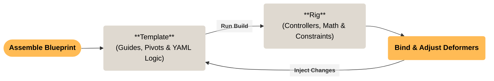

# Mikan Rigging Framework

Welcome to the Mikan documentation.

**Mikan** is a procedural rigging framework developed for **Autodesk Maya** and **Tangerine** (TeamTO's high-performance animation platform). It allows technical artists to create robust, software-agnostic rig blueprints, from initial guide placement to advanced deformation setups, using a non-destructive workflow.

## Core Philosophy

Mikan shifts the rigging paradigm from "building a rig" to "authoring a blueprint."

- **Software-Agnostic Blueprints:** Rigs are described as a hierarchy of standard DAG nodes and metadata. This blueprint can be exported natively as an Alembic file and interpreted by any compatible DCC.
- **Non-Destructive Round-Trip:** Mikan relies on a continuous `Template > Rig > Template` loop. You can build the rig, manually paint skin weights or tweak deformers, and instantly *inject* those changes back into the blueprint. You never lose manual work.
- **High Performance:** The framework strictly generates modern, matrix-based hierarchies optimized for Maya's Parallel Evaluation and Tangerine's proprietary engine.
- **Procedural Modularity:** Using YAML-based modifiers, riggers can declare complex behaviors (like Spline IK, Muscle setups, or Spaces) dynamically, making components highly reusable across different assets.

## The Authoring Loop

Creating a rig with Mikan is an iterative process. The blueprint remains your single source of truth.

1. **Assemble:** Define the rig’s structure using `Templates` and add procedural logic via `Modifiers`.
2. **Build:** Mikan generates the fully functional mechanical rig (controllers, math nodes, constraints).
3. **Bind:** Perform manual, geometry-specific deformation work directly on the built rig (e.g., painting skin weights, adding correctives).
4. **Inject:** Push all manual changes back into the blueprint.

From here, you can safely delete the built rig, tweak your skeleton guides, and hit **Build** again. Your skin weights and custom logic will be perfectly reapplied.

## Pipeline Integration

Because a Mikan blueprint is ultimately just a DAG hierarchy (exportable to Alembic or USD), it becomes a highly deployable artifact.

Using Mikan's lightweight Python API, technical directors can easily integrate headless rig generation into their studio's publish systems, batch scripts, or asset managers. The system natively supports **Rig Variations**, allowing a single blueprint source file to generate different rig levels (e.g., Layout, Animation, Crowd, FX) depending on the
production's needs.

*Prerequisites: Basic knowledge of Maya rigging (joints, matrix math, deformations) is expected to fully utilize this framework.*

## Next Steps

Ready to dive in?

* Check out the **[Installation Guide](/introduction/installation.md)** to set up Mikan.
* Follow the **[Quickstart Tutorial](/introduction/quickstart.md)** to build your first rig.
* Read about the **[Blueprint Anatomy](/usage/blueprints.md)** to understand the core structure.

