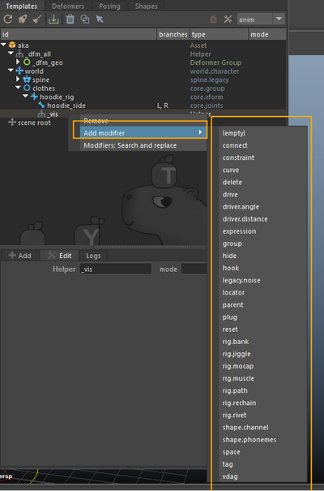

# Using Modifiers

## Definition

A **modifier** in Mikan is an instruction **defined on a helper node**.  
It is executed automatically **after the rig is built** and is used to customize and extend the rig's behavior.

Modifiers are the central tool that let you go **as far as you want** in customizing your rigs.  
They act like “logic blocks” that can be stacked, combined, and adapted endlessly.

👉 These are the tools of your experimentation ground: you are free to combine them to enrich your rigs with tailored logic.

Key characteristics:

- A helper can contain **any number of modifiers**.
- Modifiers are executed **in the order in which they appear**.
- Combining multiple modifiers makes it possible to build **complex, parameterized behaviors**.

Typical use cases include:

- setting default values,
- adding constraints,
- creating visibility menus,
- setting up hierarchies and complex connections.



👉 The full list of available modifiers, with their definitions and usage, can be found here:  
[Mikan Documentation – Modifiers](https://citrus-software.github.io/mikan-docs/)

## Adding a Helper and Modifiers

To define instructions with a modifier:

1. Right-click on a template > **Add Helper Node**.
2. Give the helper a clear name.
3. Right-click on the helper > **Add Modifier**.
4. Select the desired modifier type from the list.

:::info
Each helper can contain multiple modifier notes, which are executed sequentially when the rig is built.


:::

## Example: hoodie rig with follow + manual offset

The goal is to rig a hoodie that:

- follows the clavicle's movement,
- while still giving animators manual control.

### Main steps

1. Create a **group** for the hoodie controllers and add a visibility menu.
2. Attach the hoodie to the main rig.
3. Add a custom follow attribute (**follow_clav**).
4. Connect this attribute to the follow behavior using either a _drive_ or an _expression_.

### Step 1 : Group + visibility menu

First, create a **template module group** for the hoodie.  
Then:

1. Right-click on this module group > **Add Helper Node**.
2. Give the helper a clear name (e.g. _hoodie_rig_).
3. Right-click on the helper > **Add Modifier** > choose **group** from the list.

The group modifier creates a visibility menu that lets animators toggle the hoodie rig controllers on or off.

```yaml
[mod]
group:
  vis: neck::ctrls.neck0     # the controller that will display the right-click visibility menu
  nodes:                     # the controllers that will be shown/hidden through this menu
    - hoodie_side:::ctrls
  tag: vis.hoodie
  name: hoodie
```


### Step 2 : Attach the hoodie to the main rig

On the same helper, right-click > **Add Modifier > Parent**.  
The parent modifier is added after the group modifier.

This modifier attaches the hoodie to the main rig.

```yaml
[mod]
parent:
  - hoodie_rig::node
  - spine::skin.5
```


### Step 3 : Add a follow attribute

To create the custom **follow** attribute, we need it to appear on both hoodie controllers: left **L** and right **R**.  
For this, we add the note to a helper under the **hoodie_side** template module, which is already branched.

1. Right-click on the hoodie_side joint module > **Add Helper Node**. Give the helper a clear name.
2. On this helper, right-click > **Add Modifier > Plug**.

```yaml
[mod]
plug:
  node: hoodie_side.L::ctrls.0
  follow_clav:
    type: float
    set: 1
    keyable: on
    min: 0
    max: 1
```

👉 This creates a slider to control how much the hoodie follows the clavicle.

:::note  
Because the hoodie_side module has a branch `[L, R]`, the note only needs to be written once for the left side.  
Mikan will automatically duplicate the attribute for the right side.  
:::

### Step 4 : Trigger follow with a Drive

On the same helper, right-click > **Add Modifier > Drive**.  
This modifier creates a driven key so the hoodie follows the clavicle when it moves.

```yaml
[mod]
drive:
  node: arm.L::j.clavicle@r.z
  hoodie_side.L::poses.0@t.x:
    -10: 0
    0: 0
    30: -0.2
    pre: constant
    post: constant
  hoodie_side.L::poses.0@t.y:
    -10: -0.2
    0: 0
    30: 1.25
    pre: constant
    post: constant
    flip: on
  hoodie_side.L::poses.0@t.z:
    -10: 0
    0: 0
    30: 0.21
    pre: constant
    post: constant
```

:::note  
The drive is added after the plug modifier in the same helper.  
It links the clavicle’s rotation to the hoodie’s pose, while still allowing manual control.  
:::

### Step 5 : Connect the follow attribute

Edit the **drive** note to add a **weight** option.  
This connects the drive to the custom attribute `follow_clav`.

```yaml
[mod]
drive:
  node: arm.L::j.clavicle@r.z
  hoodie_side.L::poses.0@t.x:
    ...
  hoodie_side.L::poses.0@t.y:
    ...
  hoodie_side.L::poses.0@t.z:
    ...
  weight: hoodie_side.L::ctrls.0@follow_clav
```

The drive now responds to the `follow_clav` attribute.

:::note  
This setup allows animators to control how strongly the hoodie follows the clavicle using the custom attribute.  
:::

### Step 6 : Alternative with an Expression (recommended)

As an alternative, replace the drive with an **expression** modifier on the same helper.  
Expressions are usually preferred because they are lighter and more flexible than drives.

```yaml
[mod]
expression:
  op: y = lerp(0, flip*5*quat([rx, ry, rz], xyz).z, w)
  y: hoodie_side.L::poses.0@t.y
  rx: arm.L::j.clavicle@r.x
  ry: arm.L::j.clavicle@r.y
  rz: arm.L::j.clavicle@r.z
  w: hoodie_side.L::ctrls.0@follow_clav
```

:::tip  
With a single expression, both the clavicle follow and the connection to the custom attribute are handled.  
This approach is recommended over a drive for clarity and performance.  
:::

## Summary

Recap of the steps:

- Create a group for the hoodie + visibility menu,
- Attach the hoodie to the main rig with a parent modifier,
- Add a `follow_clav` attribute to the control,
- Implement the behavior with a **drive** or, preferably, an **expression**, connected to the follow attribute.

:::tip
Prefer `expression` over `drive`. It is easier to edit and slighly lighter in evaluation.
:::

:::info
When modifier notes are placed under **branches**, Mikan automatically duplicates them.  
You only need to write them once, on the left side. Mikan applies the same logic to the right side.

No need to copy and paste!
:::

## Conclusion

**Modifiers** make it possible to automate and customize rigs directly in Mikan.  
They allow you to:

- stack logic,
- parameterize behaviors,
- and enrich rigs in a consistent and maintainable way.
