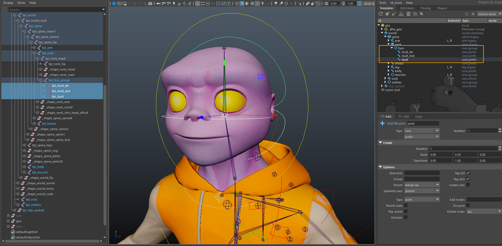
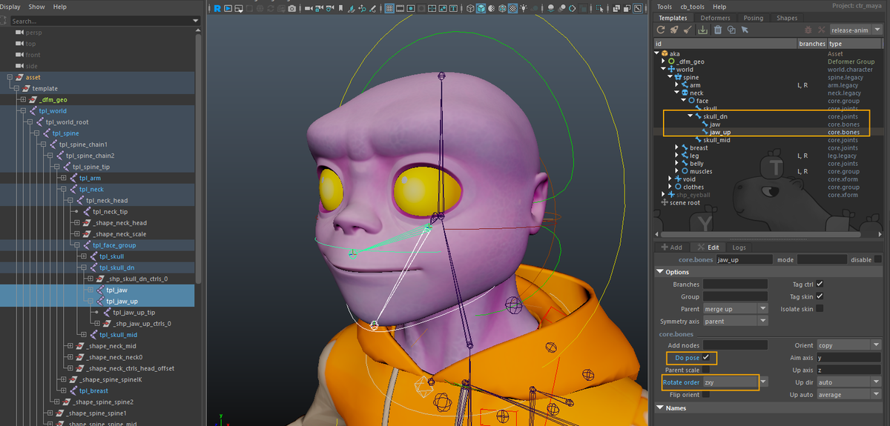
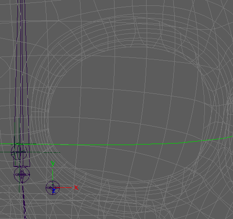
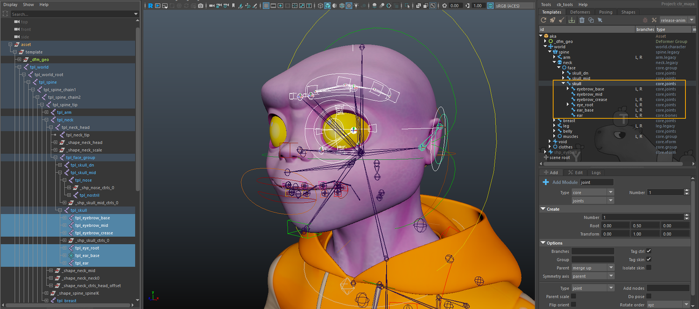

# Template Hierarchy

In this guide, we will build a facial rig based on skin joint deformation. This approach is generally more constrained than blendshape-based systems, but it offers significant advantages in terms of flexibility, robustness, and reusability. Historically, this type of setup has been well suited to television series production, where short schedules and
frequent model iterations require rigs that can adapt quickly.

Joint-based facial rigs are a proven solution. They have been used successfully on many productions and provide a solid, predictable foundation on which more complex behaviors can be layered. While they may require a bit more discipline in their construction, they tend to scale better across assets and episodes.

In the following chapters, we will go through the core steps required to assemble such a system using Mikan:

- Building a template module hierarchy for the facial rig and its animator interface
- Adding logic through modifiers to create the actual functioning of the rig
- Recording facial poses and linking them to the animator controls

:::note
Even if you are more familiar with blendshape-based facial rigs, following this guide is still relevant. The type of system presented here is fully compatible with blendshapes, and many of the concepts apply regardless of the deformation method. While some sections may not need to be followed in detail, the parts related to pose connections and the animator
interface remain essential.
:::

## Anchoring

Before building any facial structure, we first need to decide where the facial rig will attach to the rest of the character. It must be anchored to an existing part of the body hierarchy so that transforms, space, and evaluation remain consistent.

In our case, the body template is already set up. It consists of a simple biped, augmented with clothing modules and additional features. The head controller has already been created as part of the [`neck.legacy`](/references/tpl/neck/legacy.md) module, and it provides a natural attachment point for the facial rig.

This attachment point will serve as the root of the entire facial setup.

#### Using a Group Module as a Facial Root

Rather than connecting facial modules directly to the head controller, we introduce an intermediate [`core.group`](/references/tpl/core/group.md) module. This group acts as the root container for the facial rig.

Group modules serve several purposes:

- They provide a clean structural boundary for a rig subsystem
- They allow all facial controllers to be selected at once
- They help organize the animator interface hierarchy
- They are used by animator tools that operate on [controller groups](/usage/controllers.md) (mirror, select, key...)

In practice, this makes the group module an essential building block for both rig organization and animator workflow, even if it does not introduce any deformation or logic by itself.

#### Creating the Facial Group Module

To set up the facial template:

1. Select the head hook output of the [`neck.legacy`](/references/tpl/neck/legacy.md) module
2. Add a [`core.group`](/references/tpl/core/group.md) module at this connection point
3. Name the group module `face`

This face group now becomes the root of the facial rig hierarchy. All subsequent facial modules and controls will be created under this group, ensuring that the facial system remains clearly organized, easy to manage, and properly integrated with the existing body rig.

## Skull hierarchy

The facial base starts with three parallel modules: `skull`, `skull_mid`, and `skull_dn`. These form the foundation for controlling the overall shape and motion of the face. This separation gives you the flexibility to create subtle rotations, offsets, and squash/stretch without affecting unrelated areas.

These modules are created using [`core.joints`](/references/tpl/core/joints.md) with the following option:

- _Type_: `transform` 
  Each element is parented in a simple hierarchy and scales accumulate.

Once they are placed, enable toggle shapes to edit the controller shapes, then repeat the operation for each module.

## Lower face

### Jaws Controls

Next, we add two modules to open the mouth: `jaw` and `jaw_up`, parented under `skull_dn`.

These modules are created using [`core.bones`](/references/tpl/core/bones.md), which generate an FK-style joint segment. The following options are used:

- _Rotate order_: `zxy` 
  This reduces the risk of gimbal issues during jaw rotation.
- _Add pose node_: `on` 
  This anticipates the creation of facial poses related to mouth animation.

The [`core.bones`](/references/tpl/core/bones.md) module is used here primarily to create a visible joint segment. This is especially useful later during skin binding, both for clarity and for selecting the appropriate skin joints. Beyond that, these controls do not require complex orientation behavior.

In most cases, the jaw controllers can remain in world orientation rather than being explicitly oriented along the bone. This generally results in simpler and more predictable manipulation, although the exact setup may vary depending on personal or production preferences.

### Lips Deformation

We start by creating a global `mouth` controller. This controller acts as the top-level control for the entire mouth system and is used to apply broad transformations affecting all mouth and lip elements at once.

The `mouth` controller is created using a [`core.joints`](/references/tpl/core/joints.md) module, parented under `skull_dn`.

- _Type_: `transform` 
  Global controllers are expected to propagate scale in a simple and predictable way. Using a transform-based setup ensures clean scale transmission across the mouth system.

Next, under `skull_dn`, we create a `lips` group. Unlike the `mouth` controller, this group is not meant to drive deformation directly. Its role is organizational.

The mouth system is built in three conceptual layers, with the global `mouth` controller sitting above them.

#### Primary Lip Controls

Inside the `lips` group, we add the main directional controls using [`core.joints`](/references/tpl/core/joints.md) modules:

`lip_up` and `lip_dn`. These define the overall motion of the upper and lower lips.

- _Type_: `transform`
- _Add pose node_: `on`

`lips_corner`. This controller drives the corners of the mouth.

- _Flip orient_: `on` 
  For symmetric lip controls, translation consistency is preferred over rotational symmetry. Enabling flip orient ensures predictable behavior when manipulating paired controllers.
- _Type_: `transform`
- _Add pose node_: `on`

These controllers provide broad, readable motion and will later propagate their influence to more localized controls.

:::note
At this stage, none of these controls are connected to deformation logic. The goal here is to define the animator-facing structure first. All mechanical connections and behavior will be implemented in the next chapter.
:::

#### Mouth Segmentation Controls

We then add a set of mouth segmentation controllers using `core.joints` modules:

`mouth1_up`, `mouth2_up`, `mouth3_up`, `mouth4`, `mouth3_dn`, `mouth2_dn`, `mouth1_dn`

:::note
For the lip zone controllers, we’ve set up a default of `mouth1` > `mouth4` for segmentation. This provides a minimal setup that works for most cases.

You can of course add more tweakers depending on the character’s morphology and production requirements. If you choose to extend the number of lip controllers, remember to adapt the modifiers accordingly to ensure correct propagation of motion and poses.

In our demo character, we added a few extra tweakers to achieve more refined deformations. You’ll see how it works in practice.
:::

All of these controllers share the following options:

- _Flip orient_: `on` 
  Again, this favors consistent translation behavior when manipulating symmetric controller pairs.
- _Add pose node_: `on`

For `mouth2`, `mouth3`, and `mouth4`, we also enable:

- _Branches_: `[L, R]`

These controls split the mouth in a circular fashion and are used to shape the mouth globally. They are the primary layer for creating expressions such as smiles, frowns, stretches, and compressions.

:::info
Orientation and Position Matter!

Take care when placing these template joints. Both the orientation and initial position of each joint are critical: rotations and scales applied to these controllers will be used for facial poses, and accurate positioning is essential to achieve smooth lip roll in/out operations later.

Make sure the joints are aligned logically along the lip curve and follow the natural deformation flow.

:::

#### Lip Tweak Controls

For each mouth segmentation controller, we create a corresponding lip tweak controller. Each lip controller is parented to its respective mouth segmentation controller and positioned at the same location.

`lip1_up`, `lip2_up`, `lip3_up`, `lip4`, `lip3_dn`, `lip2_dn`, `lip1_dn`

- _Parent scale_: `on` 
  This allows lip controls to inherit scale from the mouth segmentation layer and can also be exploited for animation-specific behaviors.
- _Flip orient_: `on`
- _Add pose node_: `on`

They are dedicated to lip-only deformation and are primarily used for skinning and detailed effects such as lip roll. This separation allows precise control over lip behavior while keeping the overall mouth shaping clean and manageable.

### Teeth and Tongue

Under `jaw`, we first create the lower teeth controllers using `core.joints`.
The same setup will be mirrored for the upper teeth under `jaw_up`.

We create the following hierarchy:

- `teeth_dn` parented directly under `jaw`
- `teeth_tip_dn` child of `teeth_dn`
- `teeth_bend_dn` positioned at the side, near the root of the last molar
- `teeth_bend_tip_dn` child of `teeth_bend_dn`, placed on the edge of the corresponding teeth

The lower teeth controllers act like a lattice parented to the jaw. Animators can offset, rotate, or scale individual teeth segments independently, without affecting jaw motion directly. This provides fine control for teeth deformation while keeping the overall motion predictable.

- `teeth_dn` and `teeth_up` remain directly under their respective jaws without repositioning. This ensures that jaw rotation can be used to drive teeth motion in offset.
- `teeth_bend_*` controllers are placed at the back of the mouth at the root of the last molars.
- `*_tip_*` controllers sit on the front edge of each tooth segment, giving additional control over the tips.

`teeth_bend` options:

- _Branches_: `[L, R]`
- _Flip orient_: `on`
- _Parent scale_: `on` 
  This will allow riggers to choose whether scale is transmitted along the sides of the dental rows

and for the tips:

- _Type_: `transform` 
  Simple enough for translation/rotation without complex hierarchy

Next, we create the tongue chain.

To maintain control over the global scale and orientation of the tongue, we first add a `core.joints` controller: `tongue_base` parented under `teeth_dn`. This will allow neutral orientation and direct control over tongue scale.

We then create a `core.bones` chain for the `tongue` with 3 joints by default (more can be added if needed)

Options for the tongue modules:

- _Do pose_: `on`

And to auto-orient the chain:

- _Orient_: `auto`
- _Up axis_: `x`
- _Up dir_: `+x` 
  Explicitly setting the direction ensures consistent rotation, especially important given the tongue’s curved shape

:::info
Throughout the lower face, we’ve added a variety of controllers that can be used to define facial poses and shapes.

Don’t hesitate to add additional elements if you feel more control is needed. For example, if you want finer control over the chin, you can create a new controller parented under the jaw.

By following this approach, you have all the building blocks to construct the hierarchy that fits your production needs. This philosophy applies not only to the lower face but also to other areas of the rig: start with a solid base, then add controllers as needed to give animators precise control over facial deformation.
:::

## Mid face

The `skull_mid` module is used as the connection layer between the upper and lower parts of the skull. Later, using modifiers, we will define how constraints propagate between `skull`, `skull_dn`, and the `jaw` modules. This setup is especially useful for cartoon-style rigs, where a high level of flexibility is required to bend the head shape or manage
squash and stretch effects across the face.

At this stage, however, we are not building that logic yet. Here, we focus on the elements that are parented under `skull_mid` and act as simple offsets.

In practice, this mainly concerns the nose rig. Anything related to broader, surface-level deformations such as cheeks or facial volume will be handled later using a secondary skin layer, once the primary structure is in place.

For now, we keep things intentionally simple. The goal is to add a few lightweight controllers that can be used later for posing and skin deformation, without introducing complex mechanics.

All modules in this section are created using `core.joints`, which provides everything needed to drive skin joints and record poses.

Under `skull_mid`, you can add the following modules: `nose` and `nostril`.

The exact placement of these controllers depends on the type of deformation you want to give animators access to, as well as any specific needs you may have for facial poses later on. There is no single correct layout here, only informed choices.

Recommended options, depending on your needs:

- _Type_: `transform` 
  Use joint only if you explicitly need scale to affect deformation.
- _Branches_: `[L, R]` 
  For mirrored controls, such as nostrils.

At this point, these modules act purely as offset controllers. They are not yet connected to the rest of the facial logic. All interactions and constraints involving skull_mid will be implemented later, once the full facial hierarchy is in place.

## Upper Face

The upper face contains more moving parts than the previous sections. Here, we lay down the structural skeleton for eyes, eyelids, eyebrows, and ears. In this chapter, we focus primarily on the eye system, which requires a solid and carefully thought-out hierarchy.

The eyes usually involve several interacting layers: deformation of the skull around the socket, animation of the eyeball itself, and deformation of the eyelids. The goal here is not to fully rig everything yet, but to establish a robust base structure that will support animation and deformation later on.

### Eye hierarchy

We begin by creating a top-level controller that encapsulates the entire eye system. This controller allows animators to reposition the eye inside the skull without breaking the internal hierarchy.

Under skull, create a `core.joints` module named `eye_root` with the following options:

- _Branches_: `[L, R]`
- _Add pose node_: `on`
- _Flip orient_: `on` 
  Translation consistency is generally preferred over rotation for symmetrical eye controls.

This controller should be placed at a strategic location. If you intend to use it for squash and stretch, it is recommended to position it at the base of the eye opening and orient it following the general curvature of the skull.

The eye_root acts as a protective container for the entire eye rig and provides a clean offset layer for animation.

### Eyeball and Scale Space

In cartoon rigs, eyeballs often require non-uniform scaling. To support this while keeping rotations stable, we introduce a dedicated scale space.

First, create a `core.xform` module named `eye_socket`. This module defines a controlled scale space, typically matching the proportions coming from modeling.

Under `eye_socket`, add a `core.joints` module named `eyeball`. This controller will drive eye animation (look-at systems, poses, offsets, etc.). Special care must be taken to orient the eyeball correctly, especially if the eye is not aligned with the world axes or if it lives inside a non-uniformly scaled space.

Options for eyeball:

- _Add nodes_: `inf` 
  Adds intermediate transforms that can later receive constraints with identity matrices.
- _Add pose node_: `on`
- _Rotate order_: `zxy` 
  This order allows the eye twist to remain animatable regardless of orientation, which is especially useful when connecting eye poses later on.

This hierarchy allows both the eyeball and the eyelids to rotate correctly inside a scaled space, which is critical for clean deformation.

### Eyelids

In this guide, eyelids are driven using rotation-based controllers that deform the geometry through clusters. The structure is therefore built with rotation in mind.

All eyelid controllers are created using `core.joints` and are parented directly under `eye_socket`, with zeroed translations. This ensures they rotate cleanly around the eyeball center.

We create the following controllers:

- `eyelid_up`, `eyelid_dn` 
  Primary controllers for blinking.
- `eyelid_bend_up`, `eyelid_bend_dn` 
  Parented respectively under the main eyelid controllers, used to offset and shape blinks.
- `eyelid_corner_ext`, `eyelid_corner_int` 
  Controls for the outer and inner corners of the eyelids.
- `eyelids_socket_up`, `eyelids_socket_dn` 
  Used to adjust the position of the eyelid crease.

For all eyelid controllers, use:

- _Rotate order_: `yzx` 
  This order is optimized for the vertical movement of the blink.

At this stage, these controllers are not yet connected to deformation logic. They simply establish the control structure that will later be wired through modifiers and skinning.

### Eyebrows

The last elements to set up in the upper face are the eyebrows. In this guide, we deliberately keep the setup simple: a global controller combined with a small set of tweak controls.

Start by adding a `core.joints` module named `eyebrow_base`. Place it slightly toward the inside of the face, taking into account the rotations you may want to perform later. Its position should anticipate the range of motion required for eyebrow expressions.

Next, we add the tweak controllers. While eyebrows are often built using fully independent controllers, here we can still rely on `core.joints`. This allows us to create all eyebrow controls in a single module and separate them using an option.

Create a chain of 3 or 4 joints named `eyebrow` with the following options:

- _Unchain_: `on` 
  Separates the joints into independent tweak controllers.
- _Add pose node_: `on`
- _Flip orient_: `on` 
  Favors consistent translation for symmetrical manipulation.

This setup provides enough control to shape eyebrow expressions while keeping the hierarchy lightweight and easy to extend if needed.

### Ears

Ears follow a structure similar to the tongue, with a clear separation between a global control and a deformation chain.

First, create a base controller for the ear using `core.joints` named `ear_base`. Unlike other facial elements, the pivot of this controller can be placed slightly inside the head. This allows the ear to rotate or slide along the skull, which can produce useful secondary motion if the character design allows it.

Then, add a deformation chain using `core.bones` named `ear`. The number of joints depends entirely on the character’s morphology. For human characters, one or two joints are usually enough.

At this stage, option choices are mostly left open. You should select what best fits your needs, as the guide does not impose a strict setup for ear deformation.

:::info
Controller shapes and visual design are not covered in this guide. You will need to define colors and shapes that make sense for animators. A common convention is to visually distinguish global controllers from tweak controls. Curved shapes often suggest rotational behavior, while angular shapes can indicate translation. How far you take this is entirely up
to you.
:::

## Secondary offset layer

In this section, we add a secondary offset layer dedicated to skin deformation, primarily for the cheek area. These controllers are used to add localized surface detail on top of the main facial rig. This approach allows you to sculpt subtle deformations such as cheek compression, sliding, and secondary motion, without overloading the primary expression
controls or compromising their readability.

We start by creating a `core.group` module named `cheeks`, parented directly under `skull_mid` with the following option:

- _Branches_: `[L, R]` 
  Using branches at the group level allows left and right cheek controls to be mirrored automatically. This avoids having to manage symmetry on a per-module basis and keeps the setup cleaner as the system grows.

Under the `cheeks` group, we add several pairs of controllers using `core.joints`. The exact number and placement depend on the character’s morphology and the level of refinement required, but a small, well-placed set is usually sufficient.

Adjust the options as needed:

- _Flip orient_: `on`
- _Add pose node_: `on`

These controllers will later be constrained to the main facial rig through dedicated modifiers, allowing them to function as a true secondary skin layer. There are many valid ways to implement this kind of system, depending on how much influence you want these offsets to have over the final deformation.

We will cover the required constraints and setup strategies in the next chapter, where this secondary layer will be fully integrated into the facial rig.
