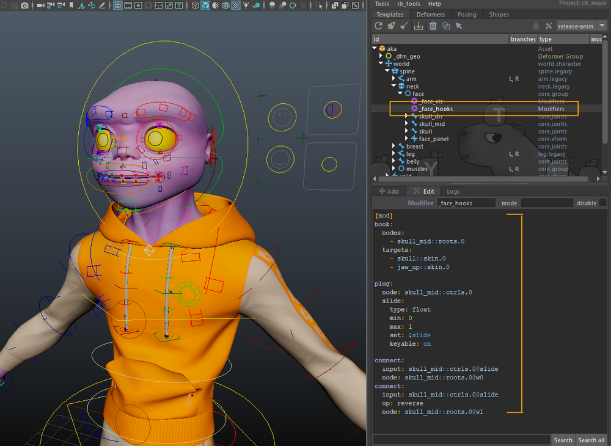
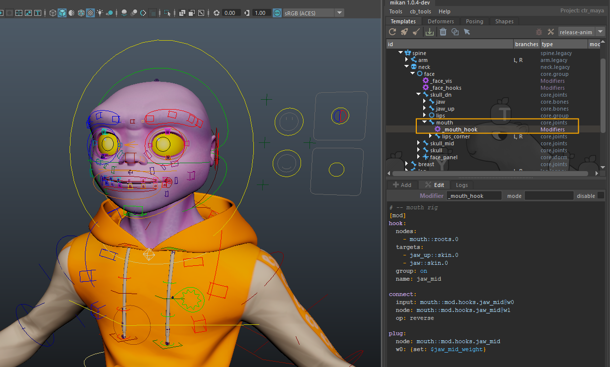

# Adding Modifiers

Now that the hierarchy is in place, we move on to the most interesting part: adding all the mechanics with the modifiers.

:::note
Reminder: in Mikan, we do not use direct constraints in Maya.
We use modifiers, which are instructions read by Mikan during the rig build.
This keeps the template clean and flexible.
:::

## Visibility groups

Let's start with simple modifiers to add visibility groups to the facial-rig controllers.

Groups in the hierarchy gather controllers for select/mirror/flip, but they do not create visibility menus.
So we add a **helper node** named `_face_vis` on the face group, then a [group](/references/mod/group.md) modifier to create the visibility menus.

```yaml
[mod]
# -- facial visibility groups
#?neck::ctrls.head

group: 
  vis: neck::ctrls.head 
  nodes:  
    - face:::ctrls 
  tag: vis.face

group: 
  vis: neck::ctrls.head 
  nodes:  
    - mouth1*::ctrls  
    - mouth2*::ctrls  
    - mouth3*::ctrls  
    - mouth4*::ctrls 
  tag: vis.mouth

group: 
  vis: neck::ctrls.head 
  nodes:  
    - lip1*::ctrls  
    - lip2*::ctrls  
    - lip3*::ctrls  
    - lip4*::ctrls 
  tag: vis.lips

group: 
  vis: neck::ctrls.head 
  nodes:  
    - cheeks:::ctrls   
  tag: vis.cheeks
```

A few important points to keep in mind when working with controller groups:

The command `#?neck::ctrls.head` ensures that the block only executes if the specified object exists. At first glance, it may seem unnecessary, but it becomes very useful when you want to reuse or extend this template for different characters, allowing you to safely run commands without affecting other rigs that may not share the same hierarchy.

Another option is to declare a variable like that: `#>ctrl: neck::ctrls.head`. This lets you replace all occurrences of this controller in the block with `<ctrl>`, making it easy to edit all commands at once using a single variable.

The triple-colon notation in `face:::ctrls` is used to select the group and all of its children. Using `face::ctrls` (double colon) would select only the direct members of the face group, but in our setup, the face group itself contains no controllers. Extending the selection with `:::` ensures that all controllers within the hierarchy are included in the operation.


## Skull hooks

We now move on to the constraints used to deform the skull. The goal here is to allow the face to **bend and adapt** as the upper and lower parts of the head move independently. To achieve this, we define two constraint targets: `skull` for the upper part of the head, and `jaw_up` for the lower part.

The actual constraint is created using the [hook](/references/mod/hook.md) modifier, which internally works as a matrix-based constraint. This allows `skull_mid` to interpolate cleanly between its two parents and provides a stable foundation for flexible head deformation.

To do this, create a **helper node** named `_face_hooks` on the face group and add the following commands:

```yaml
[mod]
# -- skull mid hooks
hook:
  nodes:
   - skull_mid::roots
  targets: 
   - skull::skin.0
   - jaw_up::skin.0
  self: on
```

For cartoon rigs in particular, it is often useful to give animators control over how malleable the middle of the face is. Depending on the shot, you may want the mid-face to follow the skull rigidly, follow the jaw more closely, or blend between the two. To support this, we add a **blend control on the constraint weights**.

Using the [plug](/references/mod/plug.md) command, we add an animation attribute to the `skull_mid` controller. The `hook` modifier creates two weight attributes, `w0` and `w1`, corresponding to the two constraint targets. By default, both weights are set to **1**. We then connect the animator-facing slider so that a value of **0** drives `w0` to **1** and `w1` to **0**, and a value of **1** does the opposite. This effectively allows the animator to switch, or smoothly blend, the parent influence between `skull` and `jaw_up`.

This setup gives direct artistic control over mid-face deformation while keeping the underlying rig structure simple and predictable.

```yaml
plug:
  node: skull_mid::ctrls.0
  slide: {k: on, min: 0, max: 1, set: $slide}

connect:
  input: skull_mid::ctrls.0@slide
  node: skull_mid::roots.0@w0
connect:
  input: skull_mid::ctrls.0@slide
  node: skull_mid::roots.0@w1
  op: reverse
```

  

## Mouth

### Hooks

We can now move on to the **mouth deformation rig**. In this section, we install the system that allows the jaws to drive the lip controllers and the various mouth tweakers that shape the deformation.

We start by constraining the main `mouth` controller between `jaw` and `jaw_up` using a [hook](/references/mod/hook.md) modifier, following the same approach used earlier with `skull_mid`. As before, we add a switch on this controller to define how it is attached by default, allowing us to blend or switch its parent influence.

In addition, we introduce an **adjustable variable** on the helper node. This variable can be used directly inside the command, making it possible to expose only the default switch value to the artists responsible for assembling the rig, without requiring them to dig into the command logic.

To do this, we simply declare a `$variable` in the command in place of a numeric value. The rig builder will automatically look for the corresponding attribute named `gem_var_variable` on the helper node. If the attribute does not exist, it will be created automatically and initialized to **0**.

This approach keeps the commands flexible while making default behavior easy to adjust at build time.

Create a **helper node** named `_mouth_hook` under `mouth` module and add the following commands:

```yaml
[mod]
# -- mouth rig
hook:  
  nodes: mouth::roots.0  
  targets:   
    - jaw_up::skin.0   
    - jaw::skin.0  
  group: on  
  name: jaw_mid

connect:
  input: mouth::mod.hooks.jaw_mid@w0
  node: mouth::mod.hooks.jaw_mid@w1
  op: reverse

plug:
  node: mouth::mod.hooks.jaw_mid
  w0: {set: $jaw_mid_weight}
```

  

### Lips rechain

Now that the mouth controller is properly constrained, we can see that the main lip controllers (`lip_up`, `lip_dn`) and the mouth corners (`lips_corner.L`, `lips_corner.R`) do not automatically follow it. A straightforward solution would be to parent everything directly under `mouth`, but that would be too limiting. In practice, we want `lip_up` and `lip_dn` to continue following their respective jaws, while still being influenced by the global mouth control.

To achieve this, we introduce the concept of a **virtual hierarchy** using the [`rig.rechain`](/references/mod/rig/rechain.md) modifier. This modifier can be a bit unintuitive at first, but once properly understood, it becomes a very powerful tool.

The idea is simple: the physical hierarchy remains driven by the jaws, while an additional virtual parent allows the lips to inherit motion from the `mouth` controller.

We first create a helper node to host all commands related to the lip rig. This helper is parented under the `lips` group and named `_lips_rig`.

We then add commands to parent `lip_up` under `jaw_up` and `lip_dn` under `jaw`. This ensures that each lip controller follows its corresponding jaw by default. Once this physical hierarchy is in place, we use `rig.rechain` to make both lip controllers also follow the `mouth` controller, effectively inserting it as a virtual parent.

This is also a good opportunity to introduce the notion of **execution priority**. The build process does not strictly follow a deterministic order based on hierarchy. While parent-child relationships define dependencies, the order in which sibling nodes are parsed cannot be guaranteed. When a specific sequence is required, timing offsets must be used to enforce it.

In this case, we want to make sure that all constraint-related setup for the lips has already been built before applying the rechain logic. We therefore delay execution slightly using `#!-10`.

The resulting setup allows the lips to correctly inherit motion from both the jaws and the global mouth controller, without compromising the underlying hierarchy.

```yaml
[mod]
#!-10
parent: lip_up::roots.0 jaw_up::skin.0
parent: lip_dn::roots.0 jaw::skin.0

rig.rechain:
  roots:
   - mouth::roots.0
  ctrls:
   - mouth::skin.0
  nodes:
   - lip_up::roots.0

rig.rechain:
  roots:
   - mouth::roots.0
  ctrls:
   - mouth::skin.0
  nodes:
   - lip_dn::roots.0
```

### Lips hooks

On the same helper node, we add modifiers to hook the c_mouth controllers with weight attributes, so we can manage the follow between mouth and lip_up / lip_dn.

The intended behavior is:

- **mouth1** fully follows the lips,
- **mouth4** stays entirely on mouth,
- **intermediate controllers** have **progressive follow values**.

This gives a coherent and smooth deformation across the entire mouth line.

```yaml
[mod]
# -- lips up/dn hooks
#> n: ['2', '2b', '3']
#> side: [up, dn]

hook:
  node: mouth1_<side>::roots.0
  targets:
   - lip_<side>::skin.0
  group: on
  name: lip1_<side>
hook:
  node: mouth<n>_<side>::roots.0
  targets:
   - lip_<side>::skin.0
   - mouth::skin.0
  group: on
  name: lip<n>_<side>
hook:
  nodes: mouth4::roots.0
  targets:
   - mouth::skin.0
  group: on
  name: lip4

connect:
  input: lips::mod.hooks.lip<n>_<side>@w0
  node: lips::mod.hooks.lip<n>_<side>@w1
  op: reverse

plug:
  node: lips::mod.hooks.lip<n>_<side>
  w0: {set: $mouth<n>_<side>_weight}
```

### Lips corner pinch

Still on the same helper, we add the modifiers to build a **sticky corner** system.
We create a **corners_pinch attribute**, then connect it to the **weights** of the hooks for mouth2 and mouth3.

```yaml
[mod]
# -- sticky corner switch
#> n: ['2', '2b']
#> side: [up, dn]
plug:
  node: mouth::ctrls.0
  corners_pinch: {set: 0, k: on, min: -1, max: 1}

drive:
  node: mouth::ctrls.0@corners_pinch
  lips::mod.hooks.lip<n>_<side>@w0:
    1: $mouth<n>_<side>_weight
    0: $mouth<n>_<side>_weight
    -1: 1

drive:
  node: mouth::ctrls.0@corners_pinch
  lips::mod.hooks.lip3_<side>@w0:
    1: 0
    0: $mouth3_<side>_weight
    -1: 1
```

### Teeth rechain and teeth grab

Following the same logic, we rig the **teeth** so they can **follow (or not) c_mouth**.
We create a **virtual hierarchy** between c_mouth and c_teeth, using the weight option to enable or disable the transform constraint.

We then add an attribute on c_mouth to control the weight of this constraint.

```yaml
[mod]
# -- teeth subtransform

rig.rechain:
  roots:
   - mouth::roots.0
  ctrls:
   - mouth::skin.0
  nodes:
   - teeth_up::roots.0
  weight: on

rig.rechain:
  roots:
   - mouth::roots.0
  ctrls:
   - mouth::skin.0
  nodes:
   - teeth_dn::roots.0
  weight: on

plug:
  node: mouth::ctrls.0
  grab_teeth:
    k: on
    min: 0
    max: 1

connect:
  input: mouth::ctrls.0@grab_teeth
  node: teeth_up::roots.0@weight
connect:
  input: mouth::ctrls.0@grab_teeth
  node: teeth_dn::roots.0@weight
```

### Combining lips corner tweakers

We now set up the connections so that mouth3 up/dn and mouth4 are driven by both c_mouth and c_corner, while still following lip_up and lip_dn.

To do this, we again use rig.rechain, which allows us to build a virtual hierarchy without breaking existing dependencies.

The order of the constraints is essential:
the mouth controllers must follow c_corner first, then lip_up/dn.

We proceed as follows:

1. Create locators under sk_mouth.
2. Create additional locators under the hooks of mouth3 and mouth4, replacing the controllers.
3. Reparent the mouth controllers under c_corner.
4. Rebuild the hierarchy between the hooks and controllers using rig.rechain.

```yaml
[mod]
# -- mouth corner rig (subtransforms)

#!-10
#> lip: ['3_up', '4', '3_dn']

locator:
  node: mouth<lip>.L::ctrls.0
  parent: mouth::skin.0
  name: orig_mouth_<lip>

locator:
  node: mouth<lip>.L::ctrls.0
  parent: lips::mod.hooks.lip<lip>
  name: mouth_<lip>

parent:
  - mouth<lip>.L::roots.0
  - lips_corner.L::skin.0

rig.rechain:
  roots:
   - lips_corner.L::mod.loc.orig_mouth_<lip>
  ctrls:
   - lips_corner.L::mod.loc.mouth_<lip>
  nodes:
   - mouth<lip>.L::roots.0
```

### Sticky lips

We start by creating the sticky attributes on **shp_lips**, which will later be connected to chan_face for animator access.

```yaml
[mod]
# -- sticky lips settings
#!10

plug:
 m_sticky_L: {add: float, k: on, set: 0, min: 0, max: 2}
 m_sticky_R: {add: float, k: on, set: 0, min: 0, max: 2}
```

We then set up the **sticky rig** by creating a helper **node** under the Lips group.

We first create **midpoint locators** between up and dn for **lip1, lip2, and lip3**, then reference locators for up/dn positions.

```yaml
[mod]
# -- sticky lips rig
#!-5

locator:
  parent: lips::mod.hooks.jaw_mid
  name: lip1_mid
locator:
  parent: lips::mod.hooks.jaw_mid
  name: lip2_mid.L
locator:
  parent: lips::mod.hooks.jaw_mid
  name: lip2b_mid.L 
locator:
  parent: lips::mod.hooks.jaw_mid
  name: lip3_mid.L
locator:
  parent: lips::mod.hooks.jaw_mid
  name: lip2_mid.R
locator:
  parent: lips::mod.hooks.jaw_mid
  name: lip2b_mid.R
locator:
  parent: lips::mod.hooks.jaw_mid
  name: lip3_mid.R


constraint:
  type: point
  maintain_offset: off
  node: lips::mod.loc.lip1_mid
  targets:
   - mouth1_up::poses
   - mouth1_dn::poses
constraint:
  type: point
  maintain_offset: off
  node: lips::mod.loc.lip2_mid.L
  targets:
   - mouth2_up.L::poses
   - mouth2_dn.L::poses
constraint:
  type: point
  maintain_offset: off
  node: lips::mod.loc.lip2b_mid.L
  targets:
   - mouth2b_up.L::poses
   - mouth2b_dn.L::poses
constraint:
  type: point
  maintain_offset: off
  node: lips::mod.loc.lip3_mid.L
  targets:
   - mouth3_up.L::poses
   - mouth3_dn.L::poses
constraint:
  type: point
  maintain_offset: off
  node: lips::mod.loc.lip2_mid.R
  targets:
   - mouth2_up.R::poses
   - mouth2_dn.R::poses
constraint:
  type: point
  maintain_offset: off
  node: lips::mod.loc.lip2b_mid.R
  targets:
   - mouth2b_up.R::poses
   - mouth2b_dn.R::poses
constraint:
  type: point
  maintain_offset: off
  node: lips::mod.loc.lip3_mid.R
  targets:
   - mouth3_up.R::poses
   - mouth3_dn.R::poses

locator:
  node: lip1_up::roots.0
  parent: lips::mod.loc.lip1_mid
  name: lip1_up
locator:
  node: lip2_up.L::roots.0
  parent: lips::mod.loc.lip2_mid.L
  name: lip2_up.L
locator:
  node: lip2b_up.L::roots.0
  parent: lips::mod.loc.lip2b_mid.L
  name: lip2b_up.L
locator:
  node: lip3_up.L::roots.0
  parent: lips::mod.loc.lip3_mid.L
  name: lip3_up.L
locator:
  node: lip2_up.R::roots.0
  parent: lips::mod.loc.lip2_mid.R
  name: lip2_up.R
locator:
  node: lip2b_up.R::roots.0
  parent: lips::mod.loc.lip2b_mid.R
  name: lip2b_up.R
locator:
  node: lip3_up.R::roots.0
  parent: lips::mod.loc.lip3_mid.R
  name: lip3_up.R

locator:
  node: lip1_dn::roots.0
  parent: lips::mod.loc.lip1_mid
  name: lip1_dn
locator:
  node: lip2_dn.L::roots.0
  parent: lips::mod.loc.lip2_mid.L
  name: lip2_dn.L
locator:
  node: lip2b_dn.L::roots.0
  parent: lips::mod.loc.lip2b_mid.L
  name: lip2b_dn.L
locator:
  node: lip3_dn.L::roots.0
  parent: lips::mod.loc.lip3_mid.L
  name: lip3_dn.L
locator:
  node: lip2_dn.R::roots.0
  parent: lips::mod.loc.lip2_mid.R
  name: lip2_dn.R
locator:
  node: lip2b_dn.R::roots.0
  parent: lips::mod.loc.lip2_mid.R
  name: lip2b_dn.R
locator:
  node: lip3_dn.R::roots.0
  parent: lips::mod.loc.lip3_mid.R
  name: lip3_dn.R


hook:
  node: lip1_up::infs.0
  target: lips::mod.loc.lip1_up
  weights: [1]

hook:
  node: lip1_dn::infs.0
  target: lips::mod.loc.lip1_dn
  weights: [1]

hook:
  node: lip2_up.L::infs.0
  target: lips::mod.loc.lip2_up.L
  weights: [1]

hook:
  node: lip2_dn.L::infs.0
  target: lips::mod.loc.lip2_dn.L
  weights: [1]

hook:
  node: lip2b_up.L::infs.0
  target: lips::mod.loc.lip2b_up.L
  weights: [1]

hook:
  node: lip2b_dn.L::infs.0
  target: lips::mod.loc.lip2b_dn.L
  weights: [1]

hook:
  node: lip3_up.L::infs.0
  target: lips::mod.loc.lip3_up.L
  weights: [1]

hook:
  node: lip3_dn.L::infs.0
  target: lips::mod.loc.lip3_dn.L
  weights: [1]

hook:
  node: lip2_up.R::infs.0
  target: lips::mod.loc.lip2_up.R
  weights: [1]

hook:
  node: lip2_dn.R::infs.0
  target: lips::mod.loc.lip2_dn.R
  weights: [1]

hook:
  node: lip2b_up.R::infs.0
  target: lips::mod.loc.lip2b_up.R
  weights: [1]

hook:
  node: lip2b_dn.R::infs.0
  target: lips::mod.loc.lip2b_dn.R
  weights: [1]

hook:
  node: lip3_up.R::infs.0
  target: lips::mod.loc.lip3_up.R
  weights: [1]

hook:
  node: lip3_dn.R::infs.0
  target: lips::mod.loc.lip3_dn.R
  weights: [1]
```

Finally, we set up the drives and expressions controlling the sticky behavior.

Start with values that seem reasonable. You can adjust them as you test the rig.

```yaml
drive:
  node: shp_lips::node@m_sticky_L
  shp_lips::node@s3l:
    0: {v: 0, tan: linear}
    0.25: {v: 0.5, ox: 0.25, oy: 0.5}
    1: {v: 1, tan: flat}
    pre: constant
    post: constant
  shp_lips::node@s2bl:
    0: {v: 0, tan: flat}
    0.375: {v: 0.5, ox: 0.25, oy: 0.5}
    1.25: {v: 1, tan: flat}
    pre: constant
    post: constant
  shp_lips::node@s2l:
    0: {v: 0, tan: flat}
    0.5: {v: 0.5, ox: 0.25, oy: 0.5}
    1.25: {v: 1, tan: flat}
    pre: constant
    post: constant
  shp_lips::node@s1:
    0.25: {v: 0, tan: flat}
    1: {v: 0.5, ox: 0.25, oy: 0.5}
    1.75: {v: 1, tan: flat}
    pre: constant
    post: constant
  shp_lips::node@s2r:
    0.75: {v: 0, tan: flat}
    1.5: {v: 0.5, ox: 0.25, oy: 0.5}
    2: {v: 1, tan: flat}
    pre: constant
    post: constant
  shp_lips::node@s2br:
    0.75: {v: 0, tan: flat}
    1.625: {v: 0.5, ox: 0.25, oy: 0.5}
    2: {v: 1, tan: flat}
    pre: constant
    post: constant
  shp_lips::node@s3r:
    1: {v: 0, tan: flat}
    1.75: {v: 0.5, ox: 0.25, oy: 0.5}
    2: {v: 1, tan: linear}
    pre: constant
    post: constant

drive:
  node: shp_lips::node@m_sticky_R
  shp_lips::node@s3r:
    0: {v: 0, tan: linear}
    0.25: {v: 0.5, ox: 0.25, oy: 0.5}
    1: {v: 1, tan: flat}
    pre: constant
    post: constant
  node: shp_lips::node@m_sticky_R
  shp_lips::node@s2br:
    0: {v: 0, tan: flat}
    0.375: {v: 0.5, ox: 0.25, oy: 0.5}
    1.25: {v: 1, tan: flat}
    pre: constant
    post: constant
  shp_lips::node@s2r:
    0: {v: 0, tan: flat}
    0.5: {v: 0.5, ox: 0.25, oy: 0.5}
    1.25: {v: 1, tan: flat}
    pre: constant
    post: constant
  shp_lips::node@s1:
    0.25: {v: 0, tan: flat}
    1: {v: 0.5, ox: 0.25, oy: 0.5}
    1.75: {v: 1, tan: flat}
    pre: constant
    post: constant
  shp_lips::node@s2l:
    0.75: {v: 0, tan: flat}
    1.5: {v: 0.5, ox: 0.25, oy: 0.5}
    2: {v: 1, tan: flat}
    pre: constant
    post: constant
  shp_lips::node@s2bl:
    0.75: {v: 0, tan: flat}
    1.625: {v: 0.5, ox: 0.25, oy: 0.5}
    2: {v: 1, tan: flat}
    pre: constant
    post: constant
  shp_lips::node@s3l:
    1: {v: 0, tan: flat}
    1.75: {v: 0.5, ox: 0.25, oy: 0.5}
    2: {v: 1, tan: linear}
    pre: constant
    post: constant

expression:
  op: s = clamp(x, 0, 1)
  s: lip3_up.L::infs.0@w0
  x: shp_lips::node@s3l

connect:
  input: lip3_up.L::infs.0@w0
  node: lip3_dn.L::infs.0@w0

expression:
  op: s = clamp(x, 0, 1)
  s: lip2b_up.L::infs.0@w0
  x: shp_lips::node@s2bl
connect:
  input: lip2b_up.L::infs.0@w0
  node: lip2b_dn.L::infs.0@w0

expression:
  op: s = clamp(x, 0, 1)
  s: lip2_up.L::infs.0@w0
  x: shp_lips::node@s2l

connect:
  input: lip2_up.L::infs.0@w0
  node: lip2_dn.L::infs.0@w0

expression:
  op: s = clamp(x, 0, 1)
  s: lip1_up::infs.0@w0
  x: shp_lips::node@s1

connect:
  input: lip1_up::infs.0@w0
  node: lip1_dn::infs.0@w0

expression:
  op: s = clamp(x, 0, 1)
  s: lip2_up.R::infs.0@w0
  x: shp_lips::node@s2r

connect:
  input: lip2_up.R::infs.0@w0
  node: lip2_dn.R::infs.0@w0

expression:
  op: s = clamp(x, 0, 1)
  s: lip2b_up.R::infs.0@w0
  x: shp_lips::node@s2br

connect:
  input: lip2b_up.R::infs.0@w0
  node: lip2b_dn.R::infs.0@w0

expression:
  op: s = clamp(x, 0, 1)
  s: lip3_up.R::infs.0@w0
  x: shp_lips::node@s3r

connect:
  input: lip3_up.R::infs.0@w0
  node: lip3_dn.R::infs.0@w0
```

### Sticky teeth

The principle is the **same** as with the sticky lips, except the sticky should **activate uniformly** across all teeth.
We create a **_sticky_teeth helper node** under the Lips group to store these modifiers.

```yaml
[mod]
locator:
  node: teeth_dn::skin.0
  parent: jaw::skin.0
  name: teeth_mid

hook:
  self: on
  targets:
    - teeth_up::skin.0
    - teeth_dn::skin.0
  node: lips::mod.loc.teeth_mid
  weights: [0.5, 0.5]

#> y: [up, dn]
#> x: [L, R]
locator:
  node: teeth_bend_<y>.<x>::poses.0
  parent: lips::mod.loc.teeth_mid
  name: copy_teeth_tip_<y>_<x>
  copycat: on

locator:
  node: teeth_tip_<y>::hooks.0
  parent: lips::mod.loc.teeth_mid
  name: teeth_tip_<y>
locator:
  node: teeth_bend_tip_<y>.<x>::hooks.0
  parent: lips::mod.loc.copy_teeth_tip_<y>_<x>
  name: teeth_tip_<y>_<x>

hook:
  target: lips::mod.loc.teeth_tip_<y>
  node: teeth_tip_<y>::roots.0
  weights: [1]
hook:
  target: lips::mod.loc.teeth_tip_<y>_<x>
  node: teeth_bend_tip_<y>.<x>::roots.0
  weights: [1]


plug:
  node: shp_lips::node
  t_sticky: {type: float, k: on}

connect:
  input: shp_lips::node@t_sticky
  node: teeth_tip_<y>::roots.0@w0
connect:
  input: shp_lips::node@t_sticky
  node: teeth_tip_<y>::roots.0@w1
  op: reverse

connect:
  input: shp_lips::node@t_sticky
  node: teeth_bend_tip_<y>.<x>::roots.0@w0
connect:
  input: shp_lips::node@t_sticky
  node: teeth_bend_tip_<y>.<x>::roots.0@w1
  op: reverse
```

## Cheeks

Next, we rig the **cheeks** by attaching their controllers to the facial structure.
We add **hook** modifiers on a helper node placed under skull_mid.

```yaml
[mod]
parent:
  - chin::roots
  - jaw::hooks.0

hook:
  nodes:
   - cheek1::roots
   - nasolabial1::roots
  targets:
   - jaw_up::skin.0
   - jaw::skin.0
  parent: neck::hooks.head
  name: cheek_mid

hook:
  nodes:
   - cheek2::roots
   - cheek3::roots
  targets:
   - skull::skin.0
   - skull_mid::skin.0
   - jaw_up::skin.0
  weights: [0.35, 0.5, 0.15]
  parent: neck::hooks.head
  name: cheek_nose

hook:
  nodes:
   - nasolabial2::roots
   - lip_upper::roots
  targets:
   - jaw_up::skin.0
   - skull_mid::skin.0
  weights: [0.65, 0.35]
  parent: neck::hooks.head
  name: jaw_up_nose
```


## Eyebrows

We finish with the eyebrows rig.
We add a **hook** constraint so the eyebrows can either **follow or ignore** the eyeroots.
We use a helper node on eyebrow_base, with a **hook** modifier and a **follow plug**.

```yaml
[mod]
hook:
  self: on
  node: eyebrow_base.L::roots.0
  target: eye_root.L::skin.0
  weight: 1

plug:
  node: eyebrow_base.L::ctrls.0
  follow_skull: {set: 0, k: on, min: 0, max: 1}

connect:
  input: eyebrow_base.L::ctrls.0@follow_skull
  op: reverse
  node: eyebrow_base.L::roots.0@w0
```

