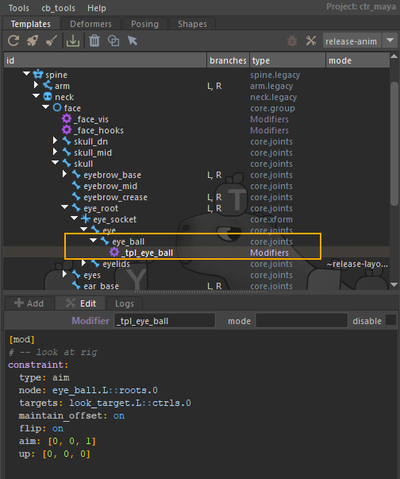

# Animator Interface

## Look-at System

Next, we add a hierarchy to manage the **look-at system** with:

- an **eyes** module: core>joints, type transform, skin tag unchecked, placed between the two eyes,
- a **look_at** module, identical but placed in front of the face, controlling the gaze direction of both eyes,
- a **look_target** module, used to control each eye individually.


### Constraints

We add a **constraint** modifier to create an aim constraint between eye_ball and look_target.

```yaml
[ mod ]
# -- look at rig

constraint:
  type: aim
  node: eye_ball.L::roots.0
  targets: look_target.L::ctrls
  maintain_offset: on
  flip: on
  aim: [ 0, 0, 1 ]
  up: [ 0, 0, 0 ]
  ```



### Space switch

We add a **space** modifier to implement a space switch for the look-at control.

```yaml
[ mod ]
space:
  node: look_at::ctrls.0
  rest_name: eyes
  targets:
    - "*::space.world"
    - "*::space.move"
```


## Facial UI

To set up the **facial interface** intended for animators, we start with:

- a **face_panel**, created using a **core>xform** module, with the **parent = parent** option so that the panel group is attached to the face group.

We then create the rigger section and the animator interface.

### Rigger section

- **shp_lids**: core>xform module where all blink and eyelid-movement parameters will be stored.
- **shp_lips**: module for lip-related settings.
- **chan_face**: centralizes and manages all facial-rig connections, in the spirit of the BCS plugin, by aggregating all attributes onto a single controller.
- **shp_face**: node on which the facial poses will be recorded.

### Animator section

On the animator side, we set up the hierarchy used to build the interface:

- **frame_look**, a core>xform module providing a 2D interface for eye animation.
    - a look **core>joints** module for the global movement of both eyes,
    - a look_eye **core>joints** module for the individual movement of each eye,
    - a loc_look **core>xform** used to collect the movements of both c_look and c_look_eye.
- **frame_lipsync**, a core>xform module for the 2D mouth-movement interface.
    - a **lipsync** core>joints module to handle mouth opening.
- **face_up**, a core>joints module grouping all upper-face poses (eyes, eyebrows).
- **face_dn**, a core>joints module grouping all lower-face poses (mouth, teeth, cheeks).


### Connect 2d eyes rig

Now let's create the 2D eye rig.
We connect the **frame_look** (look + look_eye) interface to the eyes, and add two attributes: **cross** and **dizzy**.

We create a helper on look, add a plug, then drive modifiers.

```yaml
[ mod ]
# -- 2d eyes rig

plug:
  t.x: { min: -1, max: 1 }
  t.y: { min: -1, max: 1 }
  t.z: { l: on, k: off }
  r: { k: off, l: on }
  s: { k: off, l: on }
  cross: { k: on }
  dizzy: { k: on }

drive:
  plug: look::ctrls.0@cross
  eye_ball.L::poses.0:
    r.y: { 0: 0, -1: $amp_ry }
  eye_ball.R::poses.0:
    r.y: { 0: 0, -1: $amp_ry }

drive:
  plug: look::ctrls.0@dizzy
  eye.L::poses.0:
    r.z: { 0: 0, -1: 30 }
  eye.R::poses.0:
    r.z: { 0: 0, 1: 30 }


drive:
  plug: loc_look.L::node@t.x
  driven:
    eye_ball.L::poses.0:
      r.y: { 0: 0, 1: $amp_ry }
drive:
  plug: loc_look.R::node@t.x
  driven:
    eye_ball.R::poses.0:
      r.y: { 0: 0, -1: $amp_ry }

drive:
  plug: loc_look.L::node@t.y
  driven:
    eye_ball.L::poses.0:
      r.x: { 0: 0, -1: $amp_rx }
drive:
  plug: loc_look.R::node@t.y
  driven:
    eye_ball.R::poses.0:
      r.x: { 0: 0, -1: $amp_rx }

  [ mod ]
#!~dev, ~debug
#!-10
plug:
  cross: $cross
```

If you look at the notes, you will see the introduction of **gem_var variables**, which we will set as follows:

gem_var_amp_Rx : 30
gem_var_amp_Ry : 30
gem_cross_var : 0.15

:::tip
You do not need to manually create `gem_var` attributes. Mikan automatically generates missing ones using the proper naming convention during the build process.
:::

And we add a **constraint** modifier on **loc_look**:

```yaml
[ mod ]
constraint:
  type: point
  node: loc_look.L::node
  target: look_eye.L::ctrls.0
```
