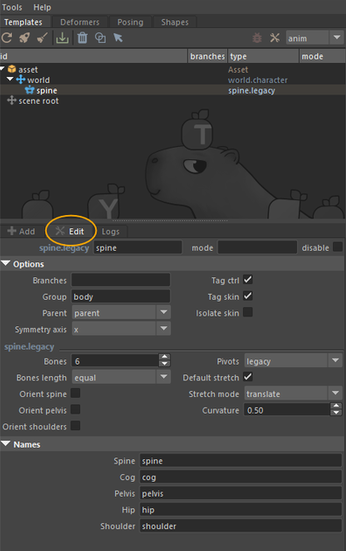

# Building a Basic Rig

---

## Main Interface Overview

Mikan's interface is divided into **four main tabs**:

- **Templates** – create rig template modules and edit their options.

  

- **Deformers** – manage deformation data for your meshes.

  

- **Posing** – create and edit poses for your rig.

  

- **Shapes** – edit the appearance of rig controllers.

  

### Templates Tab in Detail

- **ACTION Section** – buttons to build or delete a rig, edit shapes, or select elements.
- **OUTLINER Section** – hierarchy of the rig currently being built.
- **CONSTRUCTION Section**:
  - **ADD** – choose template modules to add to the rig and set their initial options (these can be modified later).
  - **EDIT** – update options after a module has been created.
  - **LOGS** – track progress and messages during the build process.

---

## Creating Your First Rig

### Setting Up the First Modules

The first step is to create the **top node of the rig**: the **asset node**.  
This acts as the **rig container**. It stores all template data (module hierarchy, modifiers, deformation info) and manages their execution.

To create it:

- go to the **Add** tab in Templates,
- fill in the **Asset** field with your rig's name,
- then click the **orange plus button** on the left.

With the top node in place, you can begin building your module hierarchy.

We typically start by adding a **WORLD module**, the base module used to move the entire rig within the scene.

This creates the **c_world** controller, along with:

- **c_move** – for managing the asset's trajectory,
- **c_fly** _(optional)_ – similar to move but with a pivot centered on the character's center of gravity,
- **c_scale** _(optional)_ – for scaling the asset, with squash options and an adjustable pivot.

Click the **Toggle Shapes** icon to display controllers directly in Maya's viewport:

From there, you can continue adding the modules required for your rig.

---

### Example 1 : A Simple FK Chain

From the **Add Template** dropdown menu:

- select the **Core** type,
- then choose the **Bones** module.

**Main options include**:

- number of joints,
- root placement relative to the parent,
- chain orientation.

Click **Add Template** to create the module.

:::tip

when you modify an option, it turns **blue**.  
👉 Right-click **Reset** to restore the default value.

:::

---

### Example 2 : Spine Module for a Character

From the **Add Template** dropdown menu:

- select the **Spine** type.

As with the Bones module, you'll find general options (branch, symmetry), plus module-specific options such as:

- number of bones,
- controller orientation,
- pivot of the first IK controller,
- stretch.

---

### Placing and Adjusting Modules

After creating a module, you can position it relative to your geometry.

👉 No need to worry about joint orientation – **Mikan automatically adjusts this during the build, based on your chosen options**.

You can also **rename a module** and **update its options** by double-clicking it in the outliner (this opens the Edit tab).

At any time, you can test the rig by running a **build** via the rocket icon at the top of the Templates tab.  
Build logs are displayed in the **Logs** tab.

---

## 🔹 Customizing Controller Shapes

To display all controller shapes:

1. select the **asset top node**,
2. click the **Toggle Shapes** icon.

Then, select the shapes you'd like to customize and either:

- use the **Shapes** tab,
- or modify them directly in the scene.

The **Shapes** tab provides:

- a library of preset shapes,
- a color library,
- resizing tools.

ℹ️ **Recommendation**: customize shapes on the **template**.  
👉 If you edit shapes after a build, you can push those changes back into the template using the **Rig to Tpl** button.

---

## 🔹 Binding

Once your template is ready, the next step is **binding** – linking the rig to the model.

👉 The rig must be **built before binding**.

In complex hierarchies, skin joints can be hard to select.  
From the **Mikan outliner**: right-click → **Select skin joints**.

Then skin your geometry as you normally would.

⚠️ **Important**:  
Anything added manually (skinning, clusters, deformers, etc.) will be removed with each **rebuild**, unless those changes are saved in the **blueprint**.

### Backing Up Deformers

1. Open the **Deformers** tab.
2. Select the **top node** of your modeling hierarchy.
3. Click **Create Backup Group** → this generates a transform node containing your deformation data.

   

4. Parent this node under the **template group**.

   

This ensures the **blueprint** preserves your deformation data and reapplies it with every rebuild.

You can safely adjust your template, rebuild the rig, and keep your deformations intact.

:::info

### Good to Know

The Add tab gives you access to a set of default template modules provided by Mikan. These modules act as the basic building blocks for creating rigs.

👉 By combining these modules and enhancing them with modifiers, you can go far beyond simple setups. This allows you to design more complex and customized templates, perfectly suited to your production needs.

✨ Once created, these templates can be exported and easily reused across different assets, ensuring consistency and saving valuable time throughout the rigging process.

:::

## ✅ Conclusion

You've now covered the basics of rigging with Mikan:

- the **template / blueprint / rig** workflow,
- and the seamless process of **building, customizing, and iterating**.
