# Building a Basic Rig with Mikan

---

## 🔹 Main Interface Overview

Mikan’s interface is divided into **four main tabs**:  

- **Templates** – create rig modules.  

  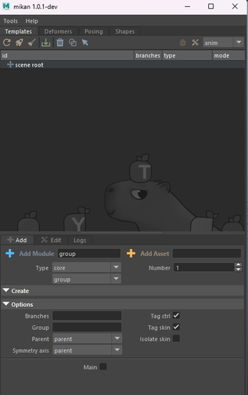  

- **Deformers** – manage deformation data for your meshes.  

  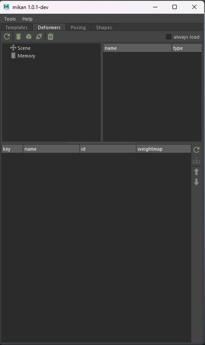  

- **Posing** – create and edit poses for your rig.  

  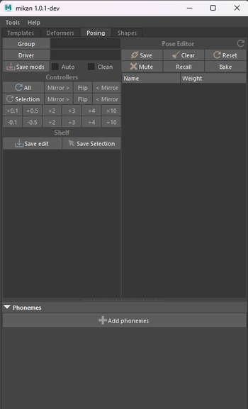  

- **Shapes** – edit the appearance of rig controllers.  

  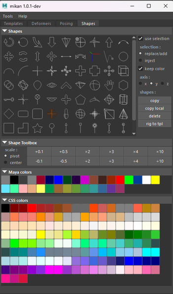  

---

### Templates Tab in Detail

  

- **ACTION Section** – buttons to build or delete a rig, edit shapes, or select elements.  
- **OUTLINER Section** – hierarchy of the rig currently being built.  
- **CONSTRUCTION Section**:  
  - **ADD** – choose modules to add to the rig and set their initial options (these can be modified later).  
  - **EDIT** – update options after a module has been created.  
  - **LOGS** – track progress and messages during the build process.  

---

## 🔹 Creating Your First Rig

### Setting Up the First Modules

The first step is to create the **top node of the rig**: the **asset node**.  
This acts as the **rig container**. It stores all template data (module hierarchy, modifiers, deformation info) and manages their execution.  

To create it:  

- go to the **Add** tab in Templates,  
- fill in the **Asset** field with your rig’s name,  
- then click the **orange plus button** on the left.  

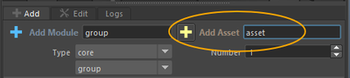  

With the top node in place, you can begin building your module hierarchy.  

We typically start by adding a **WORLD module**, the base module used to move the entire rig within the scene.  

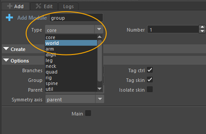  

This creates the **c_world** controller, along with:  

- **c_move** – for managing the asset’s trajectory,  
- **c_fly** *(optional)* – similar to move but with a pivot centered on the character’s center of gravity,  
- **c_scale** *(optional)* – for scaling the asset, with squash options and an adjustable pivot.  

Click the **Toggle Shapes** icon to display controllers directly in Maya’s viewport:  

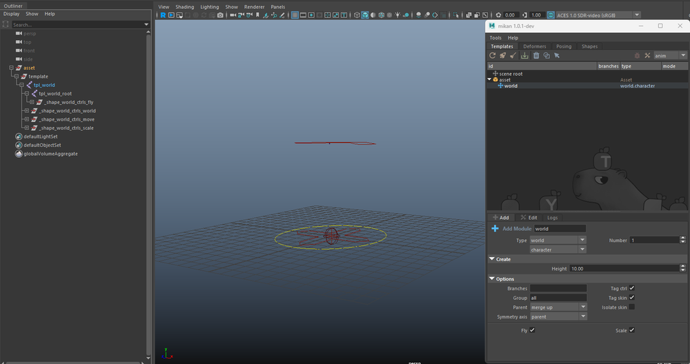  

From there, you can continue adding the modules required for your rig.  

---

### Example 1 — A Simple FK Chain

From the **Add Template** dropdown menu:  

- select the **Core** type,  
- then choose the **Bones** module.  

  

**Main options include**:  

- number of joints,  
- root placement relative to the parent,  
- chain orientation.  

Click **Add Template** to create the module.  

ℹ️ **Tip**: when you modify an option, it turns **blue**.  
👉 Right-click **Reset** to restore the default value.  

  

---

### Example 2 — Spine Module for a Character

From the **Add Template** dropdown menu:  

- select the **Spine** type.  

As with the Bones module, you’ll find general options (branch, symmetry), plus module-specific options such as:  

- number of bones,  
- controller orientation,  
- pivot of the first IK controller,  
- stretch.  

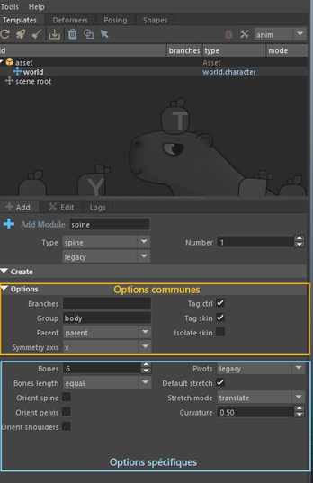  

---

### Placing and Adjusting Modules

After creating a module, you can position it relative to your geometry.  

👉 No need to worry about joint orientation – **Mikan automatically adjusts this during the build, based on your chosen options**.  

You can also **rename a module** and **update its options** by double-clicking it in the outliner (this opens the Edit tab).  

  

At any time, you can test the rig by running a **build** via the rocket icon at the top of the Templates tab.  
Build logs are displayed in the **Logs** tab.  

  

---

## 🔹 Customizing Controller Shapes

To display all controller shapes:  

1. select the **asset top node**,  
2. click the **Toggle Shapes** icon.  

Then, select the shapes you’d like to customize and either:  

- use the **Shapes** tab,  
- or modify them directly in the scene.  

The **Shapes** tab provides:  

- a library of preset shapes,  
- a color library,  
- resizing tools.  

  

ℹ️ **Recommendation**: customize shapes on the **template**.  
👉 If you edit shapes after a build, you can push those changes back into the template using the **Rig to Tpl** button.  

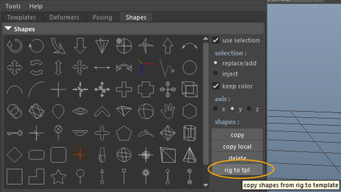  

---

## 🔹 Binding

Once your template is ready, the next step is **binding** – linking the rig to the model.  

👉 The rig must be **built before binding**.  

In complex hierarchies, skin joints can be hard to select.  
From the **Mikan outliner**: right-click → **Select skin joints**.  

  

Then skin your geometry as you normally would.  

⚠️ **Important**:  
Anything added manually (skinning, clusters, deformers, etc.) will be removed with each **rebuild**, unless those changes are saved in the **blueprint**.  

### Backing Up Deformers

1. Open the **Deformers** tab.  
2. Select the **top node** of your modeling hierarchy.  
3. Click **Create Backup Group** → this generates a transform node containing your deformation data.  

   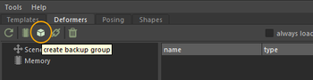  

4. Parent this node under the **template group**.  

   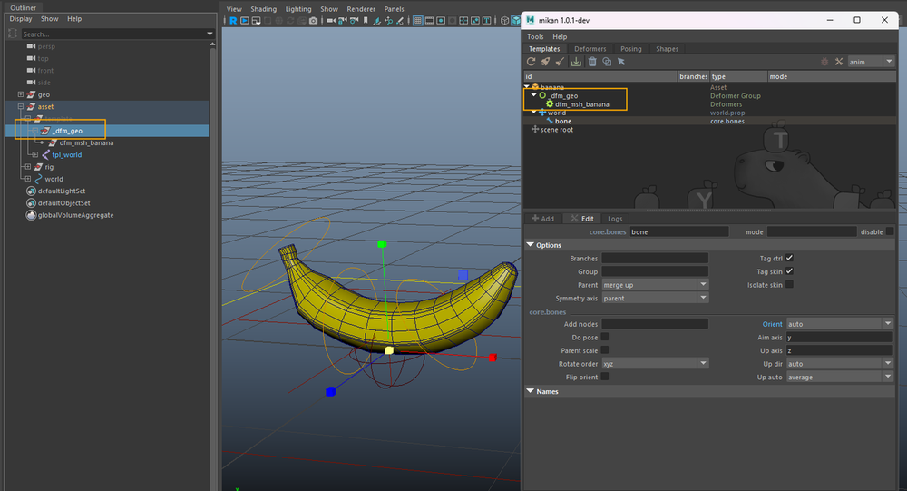  

This ensures the **blueprint** preserves your deformation data and reapplies it with every rebuild.  

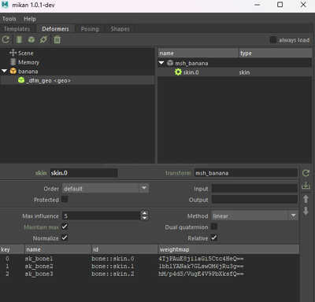  

You can safely adjust your template, rebuild the rig, and keep your deformations intact.  

---

## 🔹 Good to Know

The **Add** tab only provides the basic building blocks.  

👉 You can **combine** these modules, **save** your own custom templates, and **reuse** them across different assets.  

---

## ✅ Conclusion

You’ve now covered the basics of rigging with Mikan:  

- the **template / blueprint / rig** workflow,  
- and the seamless process of **building, customizing, and iterating**.  
