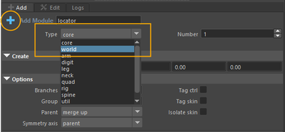
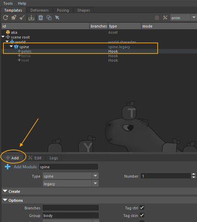
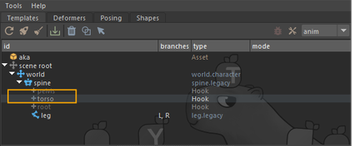
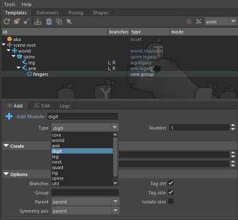
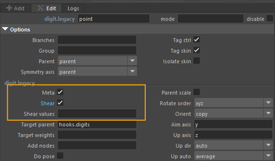
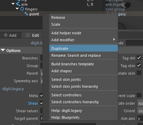
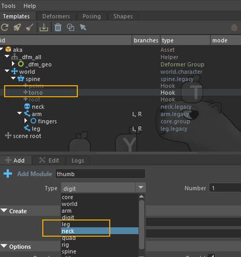

# Creation and Placement

## Template Assembly

Every rig assembly must start with an **Asset** node.  
This is the root of the blueprint: it contains all module data and manages the rig building process. Once in place, we can start adding template modules.

In the **Template** tab, fill in the **Add Asset** field with the name of your asset, then click the orange cross.

### Setting up the base controls: WORLD and ROOT

Before adding body modules, we need to establish the foundation of the rig hierarchy. We start by creating the **WORLD** module.  
This is the top-level control: it allows you to move, rotate, or scale the entire character in the scene.

To do this, select the **WORLD** type in **Add Template**.

With Mikan, the WORLD template is automatically positioned at the center of the scene. Then we place the **ROOT**, usually around the pelvis.  
The ROOT will be the main control driving the rest of the body (spine, legs, arms): everything will be parented under this control.

👉 Building the WORLD module not only creates a **World** control, but also a **Move** controller.

If you leave the **Fly** and **Scale** options enabled, it will also create:

- **Fly**: placed at the pelvis level. It has the same functionality as Move, but with a pivot centered on the pelvis.
- **Scale**: allows you to scale the character with a squash option, and to define the pivot of the scaling.

:::note

The WORLD control is mainly used to position the character in the scene.  
Animation usually starts from the ROOT.

:::

:::info
If you want to resize the control shapes, click the **Toggle Shapes** icon in Mikan after selecting the template.

:::

### Spine

Now let's add the **Spine** module.

Let's take a closer look at the creation options:

First, you'll see the common options available for all Mikan modules (branches, symmetry), and below, the spine-specific options:

- **Bones**: number of bones in the spine
- **Bones Length**: how the joints are distributed
- **Orient Spine / Pelvis / Shoulders**: by default, controllers are oriented like the WORLD. When enabled, they will orient according to the spine.
- **Pivot**: defines the placement of the first IK controller of the spine

#### 📍 Placement spine

Once the spine module has been created, you need to place its joints inside the character mesh.

### Legs

To add the legs, select the parent template (here the **Spine**) and choose the **pelvis hook**.

:::tip
Hooks are only visible in **Add** mode, under Template/Add.
:::

Default options are usually sufficient (joints for bending and twisting, forks already set up).  
Looking deeper, a few interesting options:

- **Add Chain**: creates secondary chains (e.g. for floating clothing that should not fully follow the limb twists). This additional chain behaves like the main one but lets you configure twist and shear differently.
- **Advanced Twist**: adds a corrective twist rig, very useful for smoother deformations in the thigh or shin.

#### 📍 Placement legs

After creating the leg module, position the joints so they follow the geometry of the character’s leg:  
pelvis > knee > ankle > ball > toe.

### Arms

Now let’s move on to the arms.  
The logic is the same as for the legs, except this time we attach them to the upper part of the spine via the **torso hook**.

By default:

- The effector plane is set on the **Z axis**, which makes sense for arms and hands.
- The **Clavicle** option is enabled.
- The **Auto Clavicle** option lets you decide if the clavicle automatically follows the arm.

:::info
This is a good time to adjust the position and size of the control shapes to keep the rig clean.
:::

:::note
👉 There is no manual placement for pole vectors.  
Mikan generates them automatically based on joint positions. After building, a **Twist** attribute lets you adjust the pole vector direction during animation if needed.
:::

#### 📍 Placement arms

Once the arm module has been created, place its joints following the character's geometry:  
shoulder > elbow > wrist > hand.

### Fingers

First, create a **Group** module to organize the fingers.  
This allows you to later add a **modifier** that provides animators with a visibility menu (via right-click).

- Select the **Arm** module and the **Hand** hook.
- Add a module of type **Core > Group**.

Name this group **fingers**.

Next, create the first finger (point) with the **Digit** module. Rename it **point**.

Available options:

- Classic settings (length, number of joints)
- **Meta**: metacarpal bones (can be enabled)
- **Shear**: a small corrective rig that helps preserve volume during bending.

:::tip

👉 Finger placement takes time. Save your biped template once fully configured to reuse it later.

:::

To create the other fingers (except the thumb), duplicate the index by right-clicking on the **point** module > **Duplicate**. Rename the duplicated modules to middle, ring, and pinky.

  

⚠️ Since the thumb has one less phalanx, create a new Digit module specifically for it.

Finally, adjust the control shapes around the mesh.  
You should now have something like this:

### Neck and Head

Let's add the **Neck** module.  
One or two joints are usually enough. The default options work fine for a standard neck.

The **Rigidity** option controls the spline orientation between the torso and neck:

- A **rigidity_dn = 1** value helps avoid harsh breaks between the chest and neck.

To add the neck module: select the Spine module and the **Torso** hook.

Then simply adjust the placement to fit the mesh.

