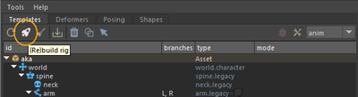
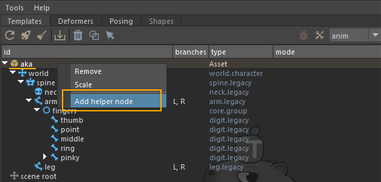
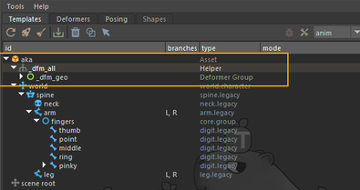
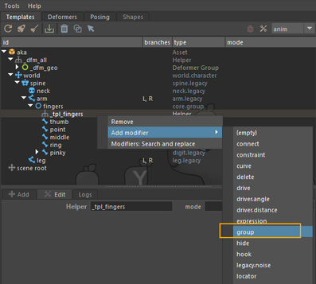
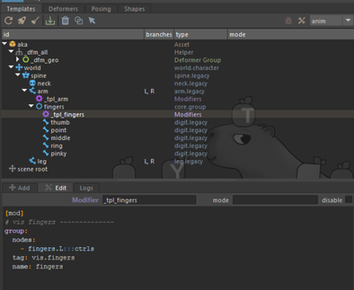

# Binding and Modifiers

## Rig Building and Binding

### Binding

After building our template hierarchy, let's move on to constructing the rig and binding the character.  
To bind your character, the rig must first be built.  
To do this, simply click on the **rocket** icon.



The binding is then done in Maya as usual: select the influence joints and your mesh.  
Mikan makes it easier to select skin joints: right-click on the template and choose:

- **Select Joints**: to select only the joints of the chosen module,
- **Select Joints Hierarchy**: to select the joints of the module as well as those of its child modules.


Then you can bind the mesh as usual.

### Saving Binding Information

Once you're satisfied with the skinning, save it and parent it under the template group.  
To save your binding, go to the **Deformers** tab in Mikan and click on **Create Backup Group**.  
This will create a transform node **dfm_geo** (if the top node of your modeling hierarchy is named **geo**) containing all deformation data.


Then parent this node under your template hierarchy, usually under a **helper** node created just below the top **Asset** node, named **dfm_all**.





This way, the skinCluster data is preserved and won't be lost during a future rebuild — only the nodes placed under the **template group** are kept between builds.

## Rig Customization with Modifiers

**Modifiers** allow you to customize your template beyond the base hierarchy by injecting actions during the build — similar to procedural rigging.  
They are executed after the rig is built and let you adjust or extend the result.  
You can add constraints, driven keys, re-parenting, visibility setups — any kind of logic you want on top of your rig.

### Example 1 : Finger Visibility

In this example, we'll add a modifier to create a right-click menu for animators to switch the visibility of the finger controls.

:::tip

👉 Build the rig beforehand, as you'll then have access to the **IDs** of the rig elements selected in Mikan's **Edit** tab. This makes writing modifier notes much easier.

:::

You can also refer to the [Mikan documentation](https://citrus-software.github.io/mikan-docs/).

To add the modifier:

- Right-click on the **fingers** group,
- Choose **Add Helper Node** to create a node where we'll write the modifier note.

Since we're working with a mirrored fork template, you only need to write the note on the left side — Mikan will handle the right side automatically.

Once the helper node is created and named:

- Right-click on it,
- **Add Modifier > Group**.

Mikan then adds a sample note that you just need to adapt. Here, we'll edit it to create the menu on the hand control and make it toggle the visibility of the finger controls.



```yml
[mod]
# vis fingers --------------
group:
  nodes:
    - fingers.L:::ctrls
  tag: vis.fingers
  name: fingers
```

Result once the note is written:



### Example 2 : Adjusting Arm Shear Attributes

If you explore the member attributes in a Mikan rig, you'll find **shear** attributes exposed in the IK controller's shape of the arm.  
These attributes allow you to cleverly adjust the silhouette of bends and compensate for volume loss.


By default, there's noticeable volume loss around the elbow (shear values are 0).  
We'll fix this in the template by creating a modifier that gives us a cleaner bend and better volume preservation.

Procedure:

- Select the **arm** template,
- Right-click → **Add Helper Node**,
- Then add a **plug** modifier, which will allow us to define shear values when the rig is built.


```yml
[mod]
# -- arm settings
plug:
 node: arm.L::weights.0

 shear_up_base_0: {set: $shear_up_base_0}
 shear_up_tip_3: {set: $shear_up_tip_3}
 shear_dn_base_0: {set: $shear_dn_base_0}
 shear_dn_tip_3: {set: $shear_dn_tip_3}
```

As you can see in this note, I'm introducing GEM variables (e.g. **$shear_up_base_0**).  
These are custom attributes created directly on the Helper node where the modifier note is written.

:::warning
To be recognized by Mikan, they must be prefixed with **gem_var**.
:::


:::tip

👉 instead of manually creating the attributes on the Helper node, just build the rig.  
Mikan will automatically create the attributes, and you'll only need to set their values.

:::

Once your custom attributes are edited, you can rebuild the rig.  
The shear values will then be correctly updated in the final rig.

Thanks to modifiers, you can customize every aspect of your rig template.

You now know how to set up a simple biped rig and start adapting it to your needs.  
👉 Your turn!
