# Using branches

## Introduction

A **branch** in Mikan is a parameter that allows you to create multiple variants of the same template module.

Typical examples:

- left/right symmetry for arms and legs,
- duplication of repeated elements such as tentacles or legs.

👉 Branches ensure **consistency** and simplify rigging by avoiding manual duplication.

## Basics

### Defining a branch

The **Branches** field is located in the template module options.

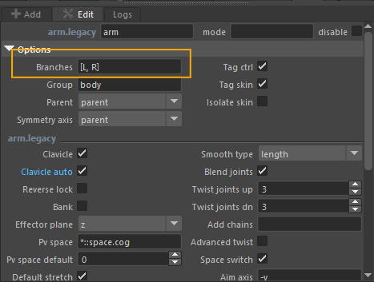

1. Manually type a list of labels separated by commas.
   - Example: `[L, R]`, `[up, dn]`, `[1, 2, 3, 4]`
2. Or, **right-click** to access **predefined labels**:

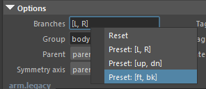

:::note
If the field is empty, Mikan creates **only one module**, without duplication or symmetry.  
For some template modules where symmetry is obvious (for example **arms** and **legs**), this field is already **pre-filled** with `[L, R]`. You can, of course, modify or replace these values.
:::

When building the rig:

- Each defined label automatically generates a variant of the module.
- Example: `[L, R]` → one module for the left side and one for the right side.

### Notes and Modifiers

When using branches, you don't need to repeat your notes or modifiers for each side.

Example:

1. You work on an arm module with a `[L, R]` branch.
2. Enter your notes using the **IDs of the left side** (for example, the left arm controllers).
3. Mikan will automatically mirror this logic for the right side when building.

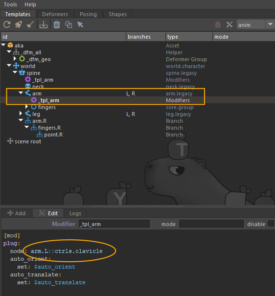

This means:

- no need to copy notes for the right side,
- a **clean, consistent, and easy-to-maintain** setup, even on complex rigs.

---

## Adapting branches to an asymmetric rig

Imagine a character whose right arm is bigger or longer.

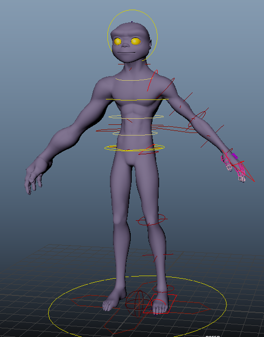

Even if both arms come from the **same module with branches**, you can edit the template module only for the **R** side:

1. Right-click on the module.
2. Select **Build Branches Template**.

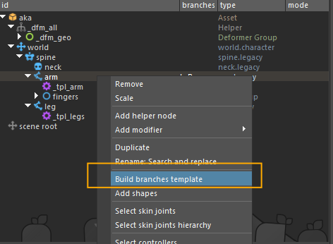

Mikan then generates a **branch module** (e.g. `R` if your branches are `[L, R]`).

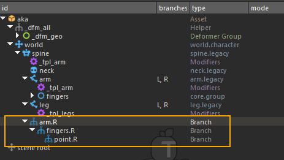

You can then directly edit:

- the **joint positions**,
- the **controller shapes**.

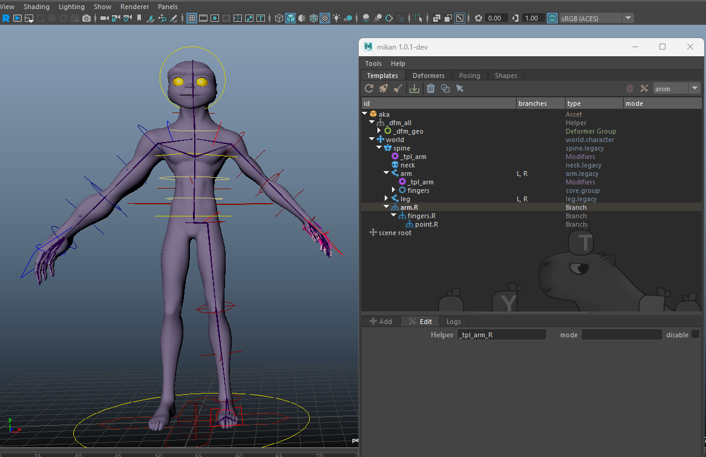

:::warning
Do not use branches if the variants are **structurally different**.  
Example: a robot where the left and right arms have completely different mechanics.  
👉 In this case, create **two separate template modules**, without branches.
:::

## Advanced example: the spider

Spider legs are a **typical case for using branches**: there are many of them, but they all share the same behavior.

### Step 1 : Set up the base template

Let's start with a very simple template made of:

- a **WORLD** module,
- a **joint** module for the body,
- a **bones** module for the back of the spider.

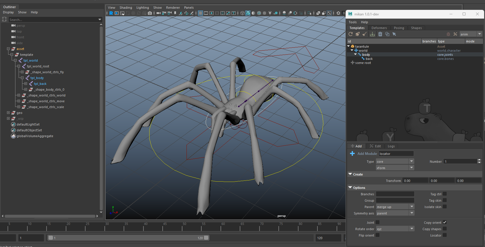

### Step 2 : Create a group for the legs

Next, create a **modules group** to gather all the legs.

1. Add a group named **legs**.
2. Define a set of branches: **A, B, C, D** for the four legs on the left side.

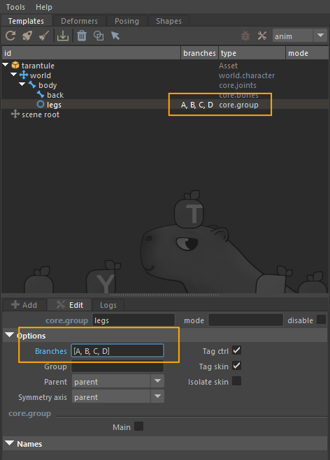

### Step 3 : Add a quad module

Now add a standard **quad module**, configured with the `[L, R]` branches.

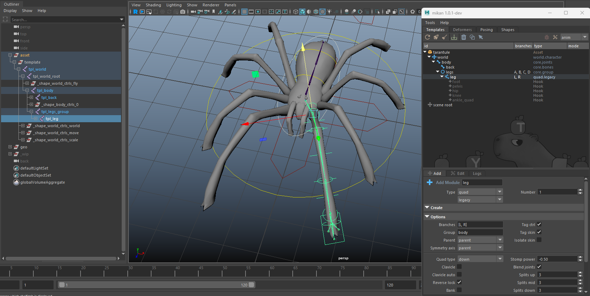

### Step 4 : Editing the branches

To edit the branches:

1. Right-click on the **legs** group.
2. Select **Build Branches Template**.

By default, Mikan generates branches for both sides `[L, R]`.  
But in this case, we only want to edit the branches on the left side (**A_L, B_L, C_L, D_L**) and keep the symmetry on the right side:

3. In the Outliner, select the branches on the **R** side.
4. Delete them using the **trash** 🗑️ icon.

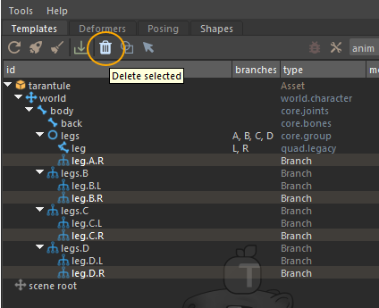

5. Then, place and adjust the branches on the left side.

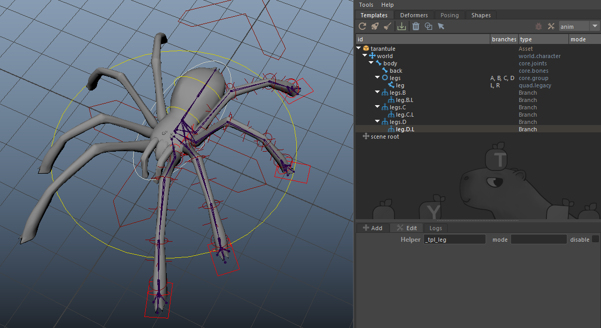

### Step 5 : Run a test build

Finally, run a build to check the result:

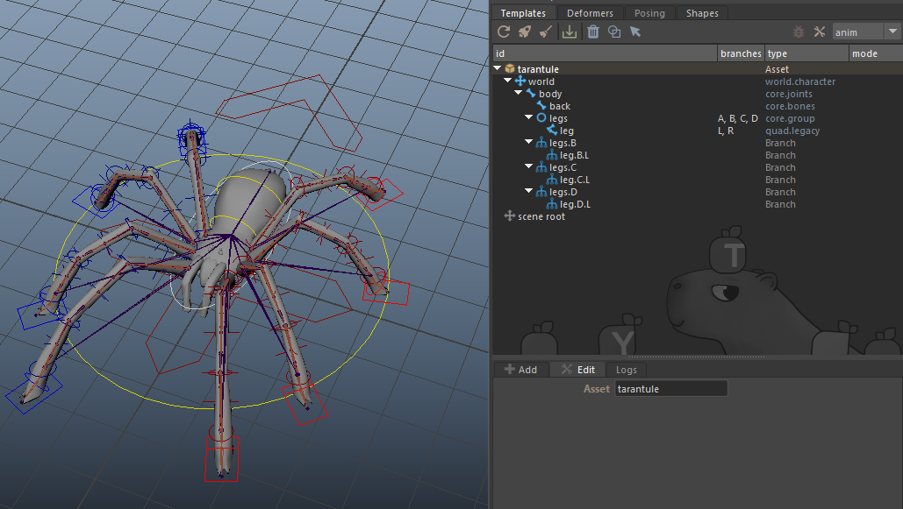

The rig is correctly generated on all legs, both left **and** right.  
And right-click features also work perfectly.

:::tip

- Use **clear and short** labels (`L/R`, `up/dn`, `1/2/3/4` …).
- Always test the build before moving to the next step.
- For complex rigs, branches are highly recommended > easier maintenance.
  :::

## Quick summary

- **Empty Branches field** > one single module.
- **Defined labels** > one variant per label.
- **Notes/modifiers** > defined once, automatically replicated.
- **Asymmetry** > use _Build Branches Template_.
