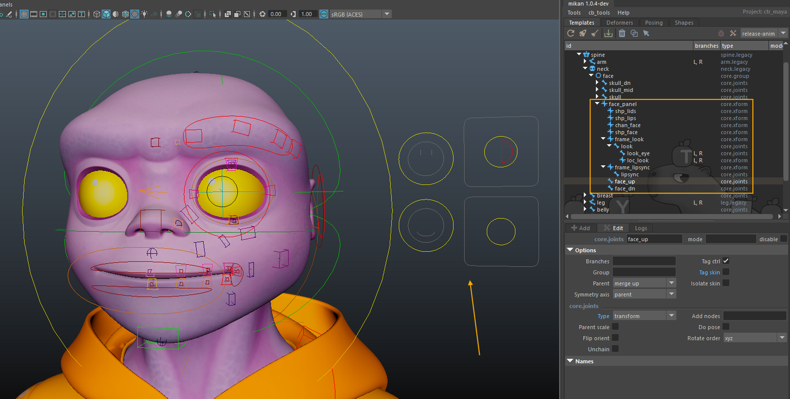

# Building the Facial Template

## Introduction

Using the base building blocks provided by Mikan, it is possible to create a simple facial rig based on skin joints.
Although this type of rig does not rely on shapes, it has been successfully used in many audiovisual productions and provides an excellent foundation.

The overall process consists of:

- building a template-module hierarchy for the facial rig and its animator interface,
- adding logic through modifiers to create the actual functioning of the rig,
- recording facial poses in the animator interface.

We begin by building the module hierarchy required for the facial rig. The body template is already in place (simple biped), enriched with clothing modules and extra features.

We will now set up the facial template.

On the **Neck** module, we add a **core>group** module named **face**.
To do this, select the **head hook** of the Neck module, then add a group module.

:::note
A group allows you to gather controllers and generate useful menus for animators (select, mirror, flip).
:::

## Skull, Skull_dn, Skull_mid

We begin by creating three modules placed in parallel: **SKULL**, **SKULL_DN**, and **SKULL_MID**, which form the base for manipulating the global shape of the face.

These modules are created using **core>joints** with the following options:

**type**: **transform**, each element is parented in a simple hierarchy and scales accumulate,
**parentScale**: **off**, unnecessary with the transform type.

Once they are placed, enable toggle shapes to edit the controller shapes, then repeat the operation for each module.

  

## Lower face

### Jaw, Jaw_up

Next, we add two modules to open the mouth: Jaw and Jaw_up, parented under skull_dn.

For this, we use **core>bones** modules, which create an FK hierarchy, with the following options:

**rotate order**: **ZXY** (to reduce gimbal issues);
**add pose node**: **on** (to anticipate the creation of facial poses for mouth opening).

 

### Lips group

Under skull_dn, we then create a Lips group.
Like the face group, this group is used to gather all mouth controllers in the animator's right-click menu.

Then we add:

- **lip_up, lip_dn**: core>joints, type transform, to handle upper and lower lip movements.
- tweakers: **mouth1, 2, 3 up and dn**, plus **mouth4**: core>joints, type joint, to give animators the ability to sculpt the mouth as they wish.
- second level: **lip1, 2, 3 up and dn + lip4**: core>joints, type joint, scaleParent > on.

### Tongue and teeth

Under **jaw**, we add the lower teeth:

- **teeth_dn**, **teeth_dn_tip**, **teeth_bend**, **teeth_bend_tip**
        - All created as **core>joints**, type joint, with parent scale enabled.
        - Flip orient enabled for the teeth bend L/R.

Then we create the tongue:

- **tongue_base**, type transform, to scale the entire tongue,
- a chain of **core>bones with 3 joints** for the rest of the tongue, auto-oriented, with up axis X and up dir +X.

The same logic as the **lower teeth** is used for the upper teeth, parented under **jaw_up**.

  

### c_mouth et c_corners

We add a global controller **c_mouth** as well as **c_corners** for the mouth corners, both using **core>joints** modules, type **transform**, with **flip orient** enabled for the **c_corners**.

:::notes
👉 They will be connected later through the modifiers to the rest of the rig.
:::

## Mid face

We add a nose module and nostrils modules.

- **nose**: **core>joints**, type **joint**, parent scale **off**
- **nostrils**: **core>joints**, type **joint**, parent scale **on**

They stabilize the nasal area and connect the upper and lower parts of the face.

  

## Upper Face

For the upper part of the face, we add:

- an **Eyeroot** module, **core>joint**, type **joint**, with:
    - L/R branches,
    - flip orient enabled,
    - rotate order : ZXY.

This module allows the eye to move and scale on the face.

Then :

- **eye_socket**, core>xform, placed at the eye pivot,
- **eye**, core>joint, type transform, rotate order zxy, used to control the rotation of the eye (ctrl and skin tags unchecked),
- **eyeball**, core>joint, type transform, in preparation for the look-at rig.

For the eyelids:

- **eyelid_up** and **eyelid_dn**, core>joints, rotate order YZX,
- **eyelid_bend_up** and **eyelid_bend_dn**, core>joints, type transform, rotate order YZX,
- **eyelid_corner_ext** and **eyelid_corner_int**, same type as the bend modules,
- **eyelids_socket_up** and **eyelids_socket_dn**, same modules as the bend ones.

Ears:

- **ear_base**: core>joint, type joint, used to slide the ear over the skull, and
- **ear**: core>bones, rotate order ZXY, auto-orient, to move the ear itself.

Eyebrows:

- **eyebrow_base**: core>joint, type transform, used to control the global movement of the eyebrow, then
- **eyebrow1, 2 and 3**: core>joints, type joint, nb : 3, unchain, flip orient, for finer control.

:::notes
👉 As always: for each template module, enable parent scale when needed, flip orient for branches, and do pose when required.
:::

  

## Secondary offsets

Adding modules to enrich the control over the cheek area:

- **core>joints**, type **transform**,
- **flip orient** enabled,
- **do pose** enabled (anticipation of facial poses).

  

## look at

Next, we add a hierarchy to manage the **look-at system** with:

- an **eyes** module: core>joints, type transform, skin tag unchecked, placed between the two eyes,
- a **look_at** module, identical but placed in front of the face, controlling the gaze direction of both eyes,
- a **look_target** module, used to control each eye individually.

  

## Facial interface

To set up the **facial interface** intended for animators, we start with:

- a **face_panel**, created using a **core>xform** module, with the **parent = parent** option so that the panel group is attached to the face group.

We then create the rigger section and the animator interface.

### Rigger section

- **shp_lids**: core>xform module where all blink and eyelid-movement parameters will be stored.
- **shp_lips**: module for lip-related settings.
- **chan_face**: centralizes and manages all facial-rig connections, in the spirit of the BCS plugin, by aggregating all attributes onto a single controller.
- **shp_face**: node on which the facial poses will be recorded.

### Animator section

On the animator side, we set up the hierarchy used to build the interface:

- **frame_look**, a core>xform module providing a 2D interface for eye animation.
        - a look **core>joints** module for the global movement of both eyes,
        - a look_eye **core>joints** module for the individual movement of each eye,
        - a loc_look **core>xform** used to collect the movements of both c_look and c_look_eye.
- **frame_lipsync**, a core>xform module for the 2D mouth-movement interface.
        - a **lipsync** core>joints module to handle mouth opening.
- **face_up**, a core>joints module grouping all upper-face poses (eyes, eyebrows).
- **face_dn**, a core>joints module grouping all lower-face poses (mouth, teeth, cheeks).

  
