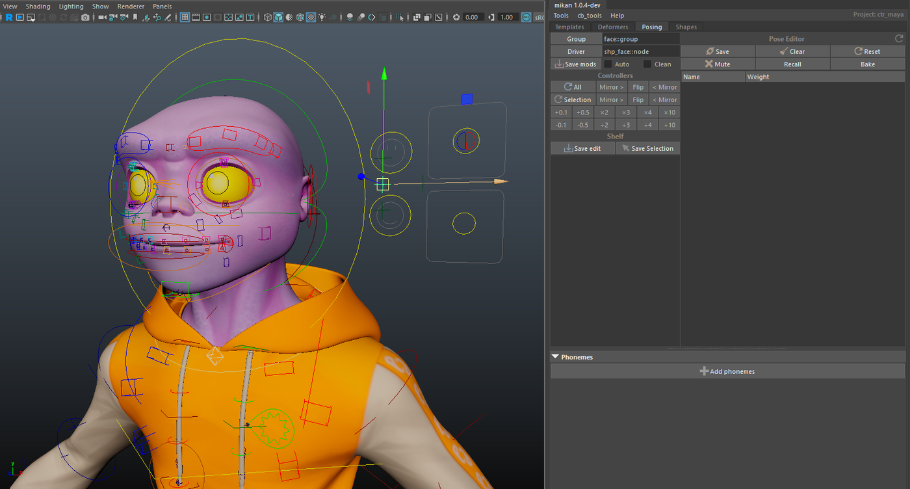
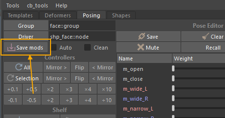

# Setting Up Facial Poses on the FACE UI

## Creating Poses on *shp_face*

Now that the hierarchy is in place and the modifiers have been added to introduce the necessary logic into the rig's behavior, we can move on to setting up the facial poses.

:::warning
Before anything else, check the facial module options to ensure that the pose nodes have been properly created in the rig hierarchy.
:::

All operations related to poses will be done in Mikan's **Posing** tab.  
Select the **shp_face** module, then click **Group** and **Driver**.



## Creating the Pose Channels

We can now begin creating the poses.

Two methods are available:

- use the **Posing** tab to create the poses directly;  
- or edit a **modifier plug** on a node, where you list all the poses you want to create.

### Method 1 — Creating Poses Through the Posing Tab

1. In the **Pose Editor** window, right-click under the pose editing buttons to create a pose.  
   Example: *open mouth*.


2. Repeat this operation for all the poses you want to add.


3. When finished, click **Save Mods** in the Posing tab to generate the corresponding note on the *shp_face* node.



### Method 2 — Creating Poses Using a Modifier Plug

Create a helper node on *shp_face* and add a **modifier plug**, where you will write the full list of poses to generate.


## Creating Poses on the Channels

Once all the channels are created, you can record the poses.

It is recommended to create **pose shelves** in order to:

- test the poses,  
- flip and mirror them,  
- and check combinations (e.g., Left/Right).

This makes pose editing much smoother.


## Procedure to Record a Pose

1. **Activate the pose** by clicking the corresponding shelf.  
2. **Select the channel** in the Pose Editor.  
3. Click **Save**.


## Saving to the Template

After recording all the poses, make sure to click **Save Mods** so the drives edited in the Pose Editor are saved into the template.

If you skip this step, you will lose your poses during the next rebuild.


## Connecting the Poses to the Face UI

To connect the facial poses to the Face UI, create a helper node on **chan_face**.

On this node, create a **shape.channel** modifier.  
Assign a negative priority to ensure that the connections occur after the pose setup.

```yaml
[mod]
# -- channel shapes
#!-100

shape.channel:
 node: chan_face::node
 sources:
  - shp_face::node
 target: face_dn::ctrls.0

 shapes:
  - mouth:
     sep: on
  - m_open:
     driven:
       m_open: 1
       m_close: -1
     min: -1
     max: 2
  - m_stretch:
     div: [L, R]
     min: -2
     max: 2
     driven:
       m_wide: 1
       m_narrow: -1
  - m_emote:
     div: [L, R]
     min: -2
     max: 2
     driven:
       m_smile: 1
       m_frown: -1

  - teeth:
     sep: on
  - t_roll_up
  - t_roll_dn
  - t_emote:
     div: [L, R]
  - t_stretch:
     div: [L, R]
  - t_shear:
     div: [L, R]

 combo:
   m_wd_sm:
    drivers:
      m_wide: 1
      m_smile: 1
    div: [L, R]
   m_nw_sm:
    drivers:
      m_narrow: 1
      m_smile: 1
    div: [L, R]
   m_wd_fn:
    drivers:
      m_wide: 1
      m_frown: 1
    div: [L, R]
   m_nw_fn:
    drivers:
      m_narrow: 1
      m_frown: 1
    div: [L, R]

shape.channel:
 sources:
  - shp_face::node
 target: face_up::ctrls.0

 shapes:
  - e_stretch:
     div: [L, R]
     min: -2
     max: 2

  - eyebrows:
     sep: on
  - eb_in:
     div: [L, R]
     driven:
       eb_up_in: -1
       eb_dn_in: 1
     min: -3
     max: 3
  - eb_out:
     div: [L, R]
     driven:
       eb_up_out: -1
       eb_dn_out: 1
     min: -2
     max: 2
  - eb_squeeze:
     div: [L, R]
     min: 0
     max: 2
  - eb_bend:
     div: [L, R]
     min: -2
     max: 2


  - eyelids:
     sep: on
  - el_blink:
     div: [L, R]
     min: -0.2
     max: 1
     clamp: on
  - el_roll_up:
     div: [L, R]
     min: -0.5
     max: 1.5
  - el_roll_dn:
     div: [L, R]
     min: -0.5
     max: 1.5

 combo:
   eb_sqz_dn:
    drivers:
      eb_squeeze: 1
      eb_dn_in: 1
    div: [L, R]    
```

## Connecting the Poses to *c_lipsync*

On the **lipsync** node, set up the drives that connect the facial poses to *c_lipsync*:

```yaml
[mod]
#!-100
drive:
  node: lipsync::ctrls.0@t.x
  chan_face::node:
    m_stretch_L: {-1: -1, 0: 0, 1: 1}
    m_stretch_R: {-1: -1, 0: 0, 1: 1}

drive:
  node: lipsync::ctrls.0@t.y
  chan_face::node:
    m_open: {-1: 1, 0: 0}
```
