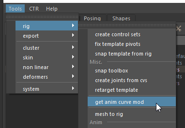

# drive

Connects one or more plugs using animation curves (driven keys).

This modifier allows you to drive plug values via animation curves based on a single driver controller or attribute. It is the core modifier for creating complex, non-linear relationships, such as facial setups, corrective shapes, or mechanical rig behaviors.

## Usage

Writing complex animation curves by hand in YAML can be tedious and prone to errors. The standard workflow relies on Mikan's built-in tools to convert your visual Maya setup into code.

### Basic Workflow

1. **Setup in Maya:** Create your driven key relationships directly in the viewport using Maya's default "Set Driven Key" window, or any custom posing script. You can connect Mikan-generated nodes, custom helpers, or geometries.
2. **Generate the Code:** Select your driven nodes and navigate to the Mikan menu: **Tools > Rig > Get anim curve mod**.
3. **Copy to Modifier Editor:** The tool will automatically parse the animation curves and print the properly formatted `drive` YAML block directly into your Script Editor. Just copy and paste it into any template node using the mod editor.



:::note[UI Generators]
**Posing Tab:** For heavy setups like facial rigging involving hundreds of driven keys, use the Posing interface. It allows you to create curves visually and automatically generates the corresponding `drive` commands for the rebuild process.
:::

:::info[Coming Soon]
We are working on streamlining this process! Future updates will allow you to capture, add, and edit driven key modifications directly from within the Mod Editor interface, bypassing the Script Editor entirely.
:::

## Parameters

### Core Parameters

These parameters define the source driver and global behavior of the modifier.

| Parameter     | Type           | Default  | Description                                                                                                   |
|---------------|----------------|----------|---------------------------------------------------------------------------------------------------------------|
| `node`        | *plug \| node* |          | The driver plug or node.                                                                                      |
| `plug`        | *str*          |          | If `node` refers only to a node, use this to specify which attribute on it acts as the driver.                |
| `<id>@<plug>` | *dict*         |          | Target plug and its animation curve definition. See [Curve Definitions](#curve-definitions) below.            |
| `weight`      | *node*         | optional | Creates a `weight` attribute on the specified node to act as a global multiplier for the driven key's output. |
| `flip`        | *bool*         | `off`    | Multiplies all curve values by `-1` when the modifier is executed in a mirrored branch.                       |
| `scale`       | *float*        | `1.0`    | Scales all key values. This is particularly useful for rig rescaling operations.                              |

### Curve Definitions

To define what is being driven, you must add target plugs directly as keys in the root of the `drive` dictionary. The key must be formatted as `<id>@<plug>`, and its value is a dictionary defining the curve.

Inside a curve dictionary, you can mix **Curve Settings** (strings) and **Keyframes** (floats).

#### 1. Curve Settings

You can define global behaviors for the target curve.

| Key       | Type            | Default  | Description                                                                                                                                               |
|-----------|-----------------|----------|-----------------------------------------------------------------------------------------------------------------------------------------------------------|
| `<float>` | *float \| dict* |          | The keyframe input (driver's state). Accepts a direct output value or a nested dictionary for custom tangents. See [Keyframes](#2-keyframes-float) below. |
| `pre`     | *str*           | `linear` | Pre-infinity behavior (`constant`, `linear`, `cycle`, `offset`, `oscillate`).                                                                             |
| `post`    | *str*           | `linear` | Post-infinity behavior (`constant`, `linear`, `cycle`, `offset`, `oscillate`).                                                                            |
| `tan`     | *str*           | `spline` | Default tangent style for the entire curve (`spline`, `linear`, `flat`, `step`, `auto`, etc.).                                                            |

#### 2. Keyframes `<float>`

To add a keyframe, use the input value (the driver's value) as the dictionary key (e.g., `0.5`, `-1.2`). The value assigned to this keyframe can be:

* **A direct float:** (e.g., `0.5: 1.0`). Creates a key with the default curve tangent (usually `spline`).
* **A nested dictionary:** Allows deep customization of that specific keyframe.

| Key             | Type    | Default  | Description                                                                     |
|:----------------|:--------|----------|:--------------------------------------------------------------------------------|
| `v`             | *float* | `0.0`    | Value of the keyframe.                                                          |
| `tan`           | *str*   | `spline` | Tangent type for both sides (`spline`, `linear`, `flat`, `step`, `auto`, etc.). |
| `itan` / `otan` | *str*   | optional | Specific tangent type for *in* (`itan`) or *out* (`otan`).                      |
| `ix` / `iy`     | *float* | optional | Custom *in* tangent vector coordinates (x, y).                                  |
| `ox` / `oy`     | *float* | optional | Custom *out* tangent vector coordinates (x, y).                                 |

## Examples

Compact syntax:

```yml
drive:
  node: lipsync::ctrls.0@t.x
  chan_face::node@m_stretch_L:
    { -0.3: -1, 0: 0, 0.3: 1, pre: constant, post: constant }
  chan_face::node@m_stretch_R: { -0.3: -1, 0: 0, 0.3: 1 }
```

Expanded syntax:

```yml
drive:
node: lipsync::ctrls.0@t.x
chan_face::node@m_stretch_L:
  -0.3: -1
  0: 0
  0.3: 1
  pre: constant
  post: constant
chan_face::node@m_stretch_R:
  -0.3: -1
  0: 0
  0.3: 1
```
