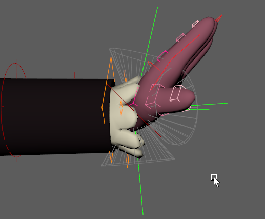

# driver.angle

Calculates the angle difference between a rig's current pose and a defined target orientation to dynamically drive rig attributes.

Like its sibling [`driver.distance`](./distance.md), this modifier is a cornerstone for advanced finaling. However, instead of measuring linear proximity, it acts as an angular sensor. It is perfectly suited for joint-based correctives (like sleeve folding, elbow bulging, or skirt raising) where an effect must trigger when a limb bends into a specific cone
of rotation.


## Parameters

### Understanding the Transforms (The Pivot & The Lever)

The hardest part of this modifier is understanding how the transforms are connected. Unlike [`driver.distance`](./distance.md) (which just measures A to B), an angle requires a center of rotation.

- **The Pivot (`angle_parent`):** This is your base reference frame. Think of it as the shoulder or the elbow joint. It defines the "0,0,0" local rotation space.
- **The Lever (`angle_ref`):** This is the moving part that swings around the pivot. Think of it as the wrist or the ankle. Mikan draws an imaginary vector from the pivot to this moving part.
- **The Trigger Pose (`target_angle`):** This is a specific `[x, y, z]` rotation *relative to the pivot*. It represents the exact pose where you want your effect to be at 100%.

The modifier continuously calculates the angle (in degrees) between where the `angle_ref` currently is, and where the `target_angle` dictates it should be.

### Angle Setup (Inputs)

These parameters define the pivoting system being measured.

| Parameter      | Type   | Default | Description                                                                                                                                                                                     |
|:---------------|:-------|:--------|:------------------------------------------------------------------------------------------------------------------------------------------------------------------------------------------------|
| `name`         | *str*  |         | Base name for the angle system (e.g., `sleeve_fold`).                                                                                                                                           |
| `angle_ref`    | *node* |         | The moving node driving the current angle (e.g., the wrist).                                                                                                                                    |
| `angle_parent` | *node* |         | The base transform used as the center of rotation (e.g., the elbow).                                                                                                                            |
| `parent`       | *node* | `::rig` | The node under which the generated technical groups will be parented.                                                                                                                           |
| `targets`      | *dict* |         | A dictionary defining the angle rules. Each key is a custom `<target_name>` (e.g., `bend_up`) containing both [**Rules**](#target-rules) and [**Outputs**](#target-outputs-remaps--operations). |
| `helpers`      | *bool* | `False` | Forces the creation of visual debug locators and cones (automatically `True` if Mikan is run in debug mode).                                                                                    |

### Target Rules

A single angle measurement can drive multiple rules (targets). Inside a specific `<target_name>` dictionary, these parameters define the mathematical shape of the angular activation cone.

| Option            | Type           | Default  | Description                                                                                                                             |
|:------------------|:---------------|----------|:----------------------------------------------------------------------------------------------------------------------------------------|
| `target_angle`    | *list[float]*  |          | The exact `[x, y, z]` local rotation (relative to `angle_parent`) where the effect is at 100%.                                          |
| `falloff`         | *float*        |          | The size of the activation cone in degrees. If the current pose is further away from the target than this angle, the effect fades to 0. |
| `falloff_tangent` | *str*          | `linear` | Transition curve style: `linear` (abrupt) or `plateau` (smooth ease-in/out).                                                            |
| `weight`          | *float / plug* | `1.0`    | A multiplier for the final value before remapping. Can be a static number or connected to an animatable plug.                           |

### Target Outputs (Remaps & Operations)

Inside each target, you define which attributes are driven and how the 0-1 normalized value is remapped. Also located within the `<target_name>` dictionary, these parameters dictate how the final values are mathematically applied to the rig.

| Option                 | Type   | Description                                                                                                                    |
|:-----------------------|:-------|:-------------------------------------------------------------------------------------------------------------------------------|
| `remaps`               | *dict* | Maps the driven plug to its `[min, max]` output values. Format: `my_node@r.x: [0, 45]`                                         |
| `op` / `out_operation` | *str*  | Global math operation if multiple systems drive the same attribute: `add`, `mult`, `min`, `max`. Default is absolute override. |

## Examples

### Sleeve Correctives

A real-world example driving corrective joint rotations on a sleeve when the arm moves up, down, forward, or backward. Notice how one angle system (`angle_parent` and `angle_ref`) drives four completely different `targets`.

```yml
driver.angle:
  name: sleeve
  angle_parent: arm.L::ctrl.elbow
  angle_ref: arm.L::ctrl.wrist

  targets:
    top:
      target_angle: [ 0, 0, 74.459 ]
      falloff: 35
      falloff_tangent: plateau
      remaps:
        sleeve_top.L::poses.0@t.y: [ 0, -0.18 ]
        sleeve_top.L::poses.0@r.z: [ 0, 39.93 ]
      op: add

    bottom:
      target_angle: [ 0, 0, -86.939 ]
      falloff: 35
      falloff_tangent: plateau
      remaps:
        sleeve_bot.L::poses.0@t.y: [ 0, -0.31 ]
        sleeve_bot.L::poses.0@r.z: [ 0, -48.3 ]
      op: add
```

## The Debug Workflow (Helpers)

Just like `driver.distance`, guessing the correct local Euler rotations and falloff angles without visual feedback is nearly impossible. Use Mikan's Debug mode to construct the system interactively.

### Step 1: Draft your YAML

Write your modifier but leave `target_angle` at `[0, 0, 0]` and `falloff` at a dummy number like `45`. Set `helpers: true`.

```yml
angle:
  name: test
  angle_ref: arm.L::ctrls.limb2
  angle_parent: arm.L::ctrls.limb1

  targets:
    target1:
      target_angle: [ 0, 0, 0 ] # later
      falloff: 50               # later
      falloff_tangent: flat
      remaps:
        out::node@t.x: [ 0, 1 ] # later  
      op: add
```

### Step 2: Build and Use Visual Locators

When built with helpers, Mikan generates a dedicated visual rig. Rotate your rig into the problem pose, then adjust the generated locators:

🟢 Green Locator (Target Angle): Rotate this locator to match the angle of the moving limb. This defines the center of your activation zone.

📐 Wireframe Cone (Falloff): This visually represents your falloff parameter. The effect is 100% at the center of the cone, and fades to 0% at the edges. Select the Green Locator and adjust its falloff channel to widen or narrow the cone.



### Step 3: Copy Values & Rebuild

Once the green locator matches the desired trigger pose and the cone covers the correct area, look at its Channel Box. Copy the `rotate X, Y, Z` values into your YAML `target_angle`, and the `falloff` value into your YAML `falloff`. Disable `helpers` and rebuild.

### The Math Pipeline (Under the Hood)

To effectively debug this modifier, it helps to understand the exact sequence of mathematical operations it performs, which correspond to the attributes exposed on the Green Debug Locator:

1. `in_angle`: The live difference, in degrees, between the current pose (`angle_ref`) and the recorded `target_angle`.
2. `falloff`: The maximum allowed angle difference (the radius of the cone).
3. `out_normalize`: The core calculation. The `in_angle` is evaluated against the `falloff`.
    - If `in_angle` is `0` (perfect match), output is `1.0`.
    - If `in_angle` is greater than or equal to `falloff` (outside the cone), output is `0.0`.
4. `out_weighted`: The normalized value is multiplied by the `weight` parameter.
5. `out[i]_min` / `out[i]_max`: These attributes represent the lower and upper limits defined in your `remaps`.
6. Final Output (`<plug>_out`): The weighted value is remapped using the min/max limits and sent to the target rig attributes.
