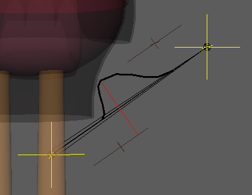

# driver.distance

Calculates the distance between two points to dynamically drive multiple rig attributes.

This modifier is a cornerstone for advanced finaling. It acts as a proximity sensor: it measures the distance between two nodes and compares it to a recorded **Target Distance**. As the objects approach this target, the modifier generates a normalized value (0 to 1), remaps it, and drives target attributes (like corrective shapes, fake collisions,
squash/stretch setups, or muscle contractions).

The shape of this activation area is controlled by **Falloffs**, which define how smoothly the effect fades in and out as the objects move around the target.


*(For specific activation behaviors like collision spheres or stretch limits, see [Common Falloff Strategies](#common-falloff-strategies). To understand the exact math pipeline and how to build this setup visually from A to Z in Maya, see the [Debug Workflow & Under the Hood](#the-debug-workflow-helpers) sections at the bottom of this page).*

## Parameters

### Distance Setup (Inputs)

These parameters define the two points in space being measured.

| Parameter           | Type          | Default     | Description                                                                                                                                                                                                                                                      |
|:--------------------|:--------------|:------------|:-----------------------------------------------------------------------------------------------------------------------------------------------------------------------------------------------------------------------------------------------------------------|
| `name`              | *str*         |             | Base name for the distance system (e.g., `skirt_leg_collision`).                                                                                                                                                                                                 |
| `input1` / `input2` | *node*        |             | The two nodes used to calculate the distance.                                                                                                                                                                                                                    |
| `pos1` / `pos2`     | *list[float]* | `[0, 0, 0]` | Optional local offsets for `input1` and `input2`. Allows measuring from a specific point relative to the node.                                                                                                                                                   |
| `parent`            | *node*        | `::rig`     | The node under which the generated technical groups will be parented.                                                                                                                                                                                            |
| `targets`           | *dict*        |             | A dictionary defining the distance rules. Each key is a custom `<target_name>` (e.g., `compression`) containing both [**Rules**](#target-rules) (`target_distance`, `falloffs...`) and [**Outputs**](#target-outputs-remaps--operations) (`remaps`, operations). |
| `helpers`           | *bool*        | `off`       | Forces the creation of visual debug locators (automatically `on` if Mikan is run in debug mode).                                                                                                                                                                 |

### Target Rules

A single distance measurement can drive multiple rules (targets). Inside a specific `<target_name>` dictionary, these parameters define the mathematical shape of the distance activation curve.

| Option            | Type           | Default  | Description                                                                                                                                     |
|:------------------|:---------------|----------|:------------------------------------------------------------------------------------------------------------------------------------------------|
| `target_distance` | *float*        |          | The exact distance where the effect is at 100% (its peak).                                                                                      |
| `falloff_before`  | *float*        |          | The distance *before* the target where the effect fades to 0.                                                                                   |
| `falloff_after`   | *float*        |          | The distance *after* the target where the effect fades to 0.                                                                                    |
| `falloff_tangent` | *str*          | `linear` | Transition curve style: `linear` (abrupt) or `plateau` (smooth ease-in/out).                                                                    |
| `weight`          | *float / plug* | `1.0`    | A multiplier for the final value before remapping. Can be a static number or connected to an animatable plug (e.g., a collision ON/OFF switch). |

### Target Outputs (Remaps & Operations)

Inside each target, you define which attributes are driven and how the 0-1 normalized value is remapped. Also located within the `<target_name>` dictionary, these parameters dictate how the final values are mathematically applied to the rig.

| Option                 | Type   | Description                                                                                      |
|:-----------------------|:-------|:-------------------------------------------------------------------------------------------------|
| `remaps`               | *dict* | Maps the driven plug to its `[min, max]` output values. <br />Format: `my_node@r.x: [0, 45]`     |
| `op` / `out_operation` | *str*  | Global math operation if multiple systems drive the same attribute: `add`, `mult`, `min`, `max`. |
| `out_operations`       | *dict* | Plug-specific math operations (overrides the global `op` for specific attributes).               |

## Examples

### Complete Setup (Corrective Shape)

A real-world production example driving corrective joint rotations on a skirt when the leg gets too close to it.

```yml
driver.distance:
  name: skirt_N
  input1: leg.L::skin.bj2
  input2: skirt_base::skin.0
  pos2: [ 0.868, 0.163, 4.861 ] # Offset the measurement point

  targets:
    compression:
      target_distance: 3.853
      falloff_before: 0       # Stays at 100% if closer than 3.853
      falloff_after: 1.276    # Fades to 0 when distance reaches 5.129
      falloff_tangent: plateau
      remaps:
        skirt_front.L::poses.0@r.x: [ 0, -73.32 ]
        skirt_side.L::poses.0@r.z: [ 0, 37.95 ]
      op: add
```

## The Debug Workflow (Helpers)

It is extremely difficult to guess the correct `target_distance` and `falloff` values without testing them visually on the rig. Mikan includes a built-in Debug mode for this exact purpose.

### Step 1: Draft your YAML

Write your modifier but leave the distance and falloff values at dummy numbers (e.g., `0`). Set `helpers: on` (or build your template in Debug Mode).

```yml
distance:
  name: test
  input1: A::node
  input2: B::node
  pos1: [ 0, 0, 0 ]   # later
  pos2: [ 0, 0, 0 ]   # later
  parent: A::node

  targets:
    target1:
      target_distance: 1        # later
      falloff_before: 1         # later
      falloff_after: 1          # later
      falloff_tangent: plateau
      remaps:
        out::node@t.x: [ 0, 1 ] # later  
      op: add
```

### Step 2: Build and Use Visual Locators

When built with helpers, Mikan generates a dedicated visual rig in the viewport for this modifier. Pose your character, then manipulate the generated locators to visually sculpt the math curve:

🟡 **Yellow Locators (Inputs)**: Represent the actual measurement points. Position them where you want the distance to be calculated. Copy their coordinates into `pos1` / `pos2`.

🔴 **Red Locator (Target)**: Represents the `target_distance`. Slide it along the axis to define where the effect should peak.

🟤 **Brown Locators (Falloffs)**: Define the `falloff_before` and `falloff_after`. Slide them to widen or narrow the activation zone.



### Step 3: Copy Values & Rebuild

Once the visual locators give you the exact behavior you want in the viewport, look at the Red Target Locator's Channel Box. It exposes the raw calculated values (`target_distance`, `falloff_before`, `falloff_after`, `out_min`, `out_max`).

Copy these values back into your YAML file, disable `helpers`, and rebuild the rig for production.

### The Math Pipeline (Under the Hood)

To effectively use and debug this modifier, it is crucial to understand the exact sequence of mathematical operations it performs. When testing on the rig, these steps correspond exactly to the attributes exposed on the debug locators:

1. **`in_distance`**: The live, current distance between your two input points.
2. **`target_distance`**: The exact distance recorded by the rigger where the effect should be at its maximum.
3. **`delta_distance`**: The difference between the `in_distance` and the `target_distance`. (As the objects get closer to the target distance, this delta approaches 0).
4. **`out_normalize`**: The core calculation. The delta is evaluated against the `falloff_before` and `falloff_after` zones to generate a normalized 0.0 to 1.0 value.
    - `1.0` means the inputs are exactly at the target distance.
    - `0.0` means the inputs are completely outside the falloff zones.
5. **`out_weighted`**: The normalized value is multiplied by the `weight` parameter (useful for on/off switches).
6. **`out[i]_min` / `out[i]_max`**: These attributes represent the lower and upper limits defined in your `remaps` dictionary for each driven plug.
7. **Final Output (`<plug>_out`)**: The `out_weighted` value is finally remapped using the min/max limits and sent directly to the target rig attributes.

### Common Falloff Strategies

Depending on how you configure the `falloff_before` and `falloff_after` values, you can create three completely different activation behaviors:

- **The Strict Peak (Trigger only at a specific point):**
  Set both `falloff_before` and `falloff_after` to values `> 0`. The effect will smoothly fade in as the objects approach the target distance, peak at 100%, and fade out as they continue moving past it.
- **The Collision Sphere (Trigger when closer than target):**
  Set `falloff_before: 0` and `falloff_after: > 0`. If the objects get closer to each other than the target distance, the effect hits an infinite plateau and stays locked at 100%. It only fades out to 0 as they separate beyond the target. *(Ideal for clothing intersections).*
- **The Escape Limit (Trigger when further than target):**
  Set `falloff_before: > 0` and `falloff_after: 0`. The effect peaks when objects reach the target distance and stays locked at 100% no matter how far away they get. It only fades out if they get closer than the target. *(Ideal for stretch limits).*
