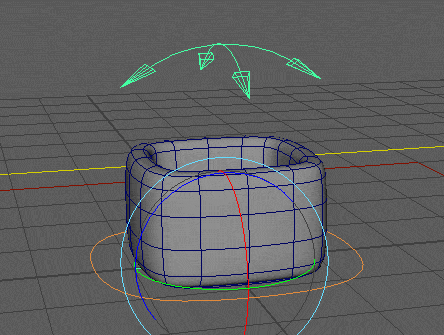

# rig.bank

Adds an automatic edge-banking (rocking) effect by dynamically shifting a node's rotation pivot along a custom profile curve.

When animating an object rolling or tilting on the ground (like a heavy box, a flower pot, or a foot side-roll), a static central pivot feels unnatural because the object penetrates the floor. The pivot needs to dynamically shift to the outer edge touching the ground.

This modifier solves this elegantly: it projects the controller's tilt direction onto a 2D profile curve (the object's footprint) and automatically snaps the rotation pivot to that exact edge point.



## Workflow

1. **The Footprint Curve:** You must model a NURBS curve that represents the base outline or footprint of your object.
2. **Omnidirectional Banking:** When the animator tilts the `target` controller, the modifier calculates the direction of the tilt, finds the furthest edge on your curve in that direction, and moves the pivot there.
3. **Axis Locking:** Because this is a tilt-based edge-banking system, the "up" axis (twist) is automatically locked on the controller to prevent conflicting pivot math. You only animate the tilt.

:::info[Curve Management]
Because the modifier automatically duplicates your input `curve` into the final rig hierarchy, your original reference curve **must** be kept in a separate geometry or guide group outside of the main rig template.
:::

## Parameters

| Parameter | Type   | Default         | Description                                                                                                                                                                         |
|:----------|:-------|:----------------|:------------------------------------------------------------------------------------------------------------------------------------------------------------------------------------|
| `target`  | *node* |                 | The animation controller that the animator will use to bank the object.                                                                                                             |
| `node`    | *node* |                 | The actual rig node (usually a `skin` joint or deform group) that will receive the banked matrix.                                                                                   |
| `curve`   | *node* |                 | The reference NURBS curve representing the object's outline/footprint. The modifier will automatically duplicate it from the provided geometry ID. Use the format `cv_name->shape`. |
| `axis`    | *str*  | `y`             | The "Up" / Twist axis of the object (`x`, `y`, or `z`). This axis will be locked and non-keyable on the controller, allowing banking purely on the other two axes.                  |
| `parent`  | *node* | `node.parent()` | The transform under which the generated technical banking rig will be parented.                                                                                                     |
| `name`    | *str*  | `curve.name`    | Base name for the generated nodes. Defaults to the name of the input curve.                                                                                                         |

## Example

Creating an automatic rolling setup for a flower pot. When the animator rotates the `pot_bank::ctrls` in X or Z, the pivot will automatically shift to the edge defined by the `cv_pot` shape, preventing the pot from clipping through the floor.

```yml
rig.bank:
  curve: cv_pot->shape

  parent: pot_bank::roots.0
  target: pot_bank::ctrls.0
  node: pot_bank::skin.0
```

:::info[Demo Scene]
To see this exact setup in action and explore the generated hierarchy, download the [**`mod_bank.ma`**](https://drive.google.com/file/d/14E2Tqjfh_9lR1Ef_dAQFmqweNolpyoTr/view?usp=drive_link) demo scene from our [Google Drive folder](https://drive.google.com/drive/folders/1tDXJmNxd-3ev1BwvZMm4Gl7tbnJTWJcn?usp=drive_link).
:::