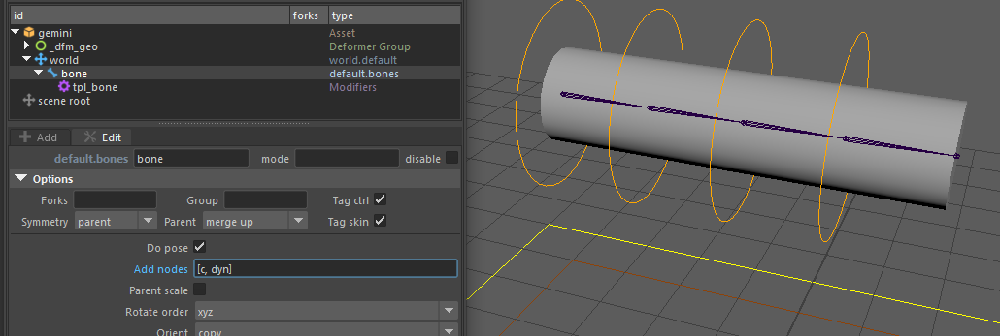
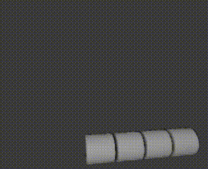
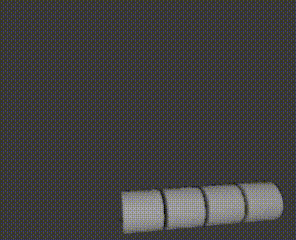

# rig.jiggle

Adds spring dynamics to a joint chain.

This modifier creates automated secondary motion by simulating inertia, stiffness, and attenuation. It is ideal for adding life to appendages like tails, ears, antennas, or loose clothing parts without the need for manual keyframing.

:::caution Requirements
The Maya evaluation of this dynamic solver requires **Bifrost 2.1** minimum (**2.2+ recommended**).
:::

## Usage

To work properly, the result of the dynamics must be connected to a **child of the controller**. The `rig.jiggle` modifier connects the dynamics to this specific child node (parameter `dyn`), which uses an aim constraint to look at a `target` node.

1. **Targeting the Chain:** When setting up a chain of jiggles, the `target` for a given joint is typically the *next* root joint in the hierarchy.
2. **Handling the Tip:** Be careful with the last joint of your chain. Since it doesn't have a subsequent root to aim at, you must target the template's tip object (e.g., `bone::hooks.tip`).
3. **Attribute Delegation:** By default, all activation and tuning attributes are added to the main `ctrl`. However, you can split this logic by assigning the activation to a `ctrl_main` and the dynamic settings (goal, damp) to a `ctrl_dyn`.

### Template Integration

While the modifier can be used on any custom rig, it is designed to work seamlessly with Mikan's default joint chain templates (`core.bones`, `core.joints`, `rig.spline`).

:::tip Auto-generate dyn nodes
To save time, use the **Add nodes** option in your template configuration and set its value to `[c, dyn]`. This will automatically create a transform/joint directly parented under the controller, perfectly set up to be used as your `dyn` node.
:::

## Parameters

### Core Parameters

- **`ctrl`** (*id*) : The controller that drives the joint and activates the dynamics.
- **`dyn`** (*id*) : The child node where the actual dynamics will be connected and evaluated.
- **`target`** (*id*) : The node determining the target position for the spring's aim constraint.
- **`name`** (*str*, optional) : Base name used for the generated IDs and rig components.

### Controller Mapping

- **`ctrl_main`** (*id*, optional, default: `ctrl`) : The controller where the activation attributes will be added.
- **`ctrl_dyn`** (*id*, optional, default: `ctrl`) : The controller where the dynamic tuning attributes (`goal`, `damp`) will be added.

### Dynamics Settings

- **`start_frame`** (*int*, default: 1) : The frame at which the dynamics are initialized.
- **`weight`** (*float*, default: 1.0) : Determines the weight of the spring constraint on the final result (range: 0 to 1).
- **`goal`** (*float*, default: 0.5) : Determines the stiffness of the spring. The closer the value is to 1, the faster the spring will move towards its target (range: 0 to 1).
- **`damp`** (*float*, default: 0.5) : Determines the attenuation of the spring's inertia. The closer the value is to 1, the less the spring will bounce (range: 0 to 1).

## Examples

### 4-Joint Chain Setup

Adding default jiggle dynamics to a 4-joint chain using the `core.bones` template. Notice how the targets shift to the next root, and the final joint targets the tip.



```yml
# Joint 0
rig.jiggle:
  ctrl_main: bone::ctrls.0
  ctrl: bone::ctrls.0
  target: bone::roots.1
  dyn: chain::dyns.0

# Joint 1
rig.jiggle:
  ctrl_main: bone::ctrls.0
  ctrl: bone::ctrls.1
  target: bone::roots.2
  dyn: chain::dyns.1

# Joint 2
rig.jiggle:
  ctrl_main: bone::ctrls.0
  ctrl: bone::ctrls.2
  target: bone::roots.3
  dyn: chain::dyns.2

# Joint 3 (Tip)
rig.jiggle:
  ctrl_main: bone::ctrls.0
  ctrl: bone::ctrls.3
  target: bone::hooks.tip
  dyn: chain::dyns.3
```

#### Tuning the Dynamics

With the basic setup above, no tuning has been done yet. The dynamics will be evaluated using the default values (`goal: 0.5` and `damp: 0.5` for all controllers).

To achieve the exact look you want, you will need to adjust these two main parameters:

- `goal` (Stiffness) : Determines the rigidity of the spring. The closer to `1.0`, the faster the spring snaps back to its target.
- `damp` (Attenuation) : Determines the loss of inertia. The closer to `1.0`, the less the spring will bounce and oscillate.

Below is a comparison of different settings applied to the exact same chain:

|               |                  Goal: 0.2                   |                  Goal: 0.5                   |                  Goal: 0.8                   |
|:-------------:|:--------------------------------------------:|:--------------------------------------------:|:--------------------------------------------:|
| **Damp: 0.5** |  |  |  |
| **Damp: 0.8** |  |  |  |