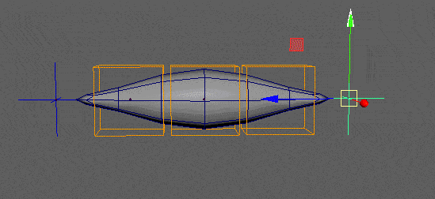

# rig.muscle

Builds a procedural muscle rig that automatically stretches, squashes, and shears between target points.

This modifier is incredibly versatile. While its primary use case is driving secondary deformation joints to fake muscle volume preservation, it can also be used to constrain entire hierarchies (like a simple body rig). It dynamically calculates the distance and orientation between its "tendon" targets to drive the constrained
nodes.



## Usage

Depending on how many `targets` you provide, the modifier automatically adapts its internal math:

- **Simple Muscle (2 Targets):** Creates a straight, linear stretchy setup between Point A and Point B.
- **Spline Muscle (3+ Targets):** Automatically generates an underlying NURBS curve and attaches the nodes along it. This allows for complex, curved muscle behaviors (like a jaw muscle or a flexible tube) that respect the tangents of the curve.

**Proportional Attachment:** During the build phase, the modifier evaluates the initial resting position of each driven node to calculate its automatic attachment ratio. If you constrain multiple objects, they will stretch and twist progressively along the muscle's length, naturally favoring the tendon they are closest to.

## Parameters

### Core Setup

| Parameter        | Type         | Default           | Description                                                                                                                                                            |
|:-----------------|:-------------|:------------------|:-----------------------------------------------------------------------------------------------------------------------------------------------------------------------|
| `targets`        | *list[node]* |                   | The nodes acting as the anchors (tendons) of the muscle. Provide 2 nodes for a linear muscle, or 3+ for a curved Spline muscle.                                        |
| `nodes` / `node` | *list[node]* | `self.node`       | The nodes to be driven by the muscle rig (usually joints or local control groups).                                                                                     |
| `parent`         | *node*       | `nodes[0].parent` | The node under which the technical muscle rig will be parented.                                                                                                        |
| `hook`           | *bool*       | `False`           | How the driven `nodes` are attached. If `False`, they are parented inside the muscle hierarchy. If `True`, they remain in place and are driven via matrix constraints. |
| `name`           | *str*        |                   | Custom name for the muscle rig. Defaults to a combined string of the target names.                                                                                     |

### Behaviors & Switches

Adding these parameters to your YAML not only sets their default value but also **activates** the corresponding math nodes and exposes them as animatable attributes on the generated muscle group.

| Option    | Type    | Default | Description                                                                                                             |
|:----------|:--------|:--------|:------------------------------------------------------------------------------------------------------------------------|
| `orient`  | *bool*  | `True`  | If `False`, the muscle rig ignores the orientation of the targets and only follows their position.                      |
| `scale`   | *bool*  | `True`  | If `False`, the muscle rig ignores the scale of the targets.                                                            |
| `stretch` | *float* | `1.0`   | Default blend value for the stretch behavior (0 to 1).                                                                  |
| `squash`  | *float* |         | *Activates Squash math.* Default blend value for volume preservation as the muscle compresses.                          |
| `shear`   | *float* |         | *Activates Shear math.* Default blend value for the shearing effect. Keeps the muscle shape natural when targets twist. |
| `weight`  | *float* |         | *Activates hook blending.* Exposes a `weight` attribute to dynamically turn the entire muscle effect on or off.         |

## Outputs

When the modifier runs, it generates a technical hierarchy and exposes controls directly on the driven groups.

### Generated Nodes & IDs

For each node driven by the modifier, a parent transform group is generated named `mu_<name><index>`.
These groups are automatically tagged with the **`mod.muscle`** ID (accessible via `<tpl>::mod.muscle.0` in other modifiers).

### Animatable Attributes

The following attributes are added to the generated `mu_<name>` group, allowing other modifiers to blend the math on the fly:

- `@slide` *(0 to 1)*: Dynamically moves the driven node along the length of the muscle (or the spline).
- `@stretch` *(0 to 1)*: Blends the stretch effect on or off.
- `@squash` *(0 to 1)*: Blends the squash volume effect *(only if `squash` was defined in the parameters)*.
- `@exponent` *(-2 to 0)*: Adjusts the pinching/profile of the squash effect *(only if `squash` was defined)*.
- `@shearing` *(0 to 1)*: Blends the shear effect *(only if `shear` was defined)*.
- `@weight` *(0 to 1)*: Master blend switch for the matrix hook *(only if `hook` and `weight` are used)*.

## Example

Creating a stretchy setup with squash and shear enabled.

```yml
rig.muscle:
  targets:
    - point_A::j.0
    - point_B::j.0
  nodes:
    - tweakers::roots.0
    - tweakers::roots.1
    - tweakers::roots.2
  name: muscle

  squash: 1  # Activates the squash system and sets its default to 100%
  shear: 1   # Activates the shear system and sets its default to 100%
```

:::info[Demo Scene]
To see this setup in action, download the [**mod_muscle.ma**](https://drive.google.com/file/d/197tvAY1ziUPVOWhrgZD52Xe8vmJVywhT/view?usp=drive_link) demo scene from our [Google Drive folder](https://drive.google.com/drive/folders/1tDXJmNxd-3ev1BwvZMm4Gl7tbnJTWJcn?usp=drive_link).
:::
