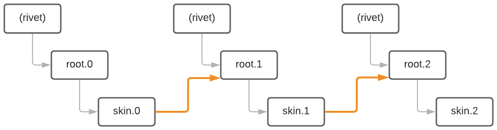
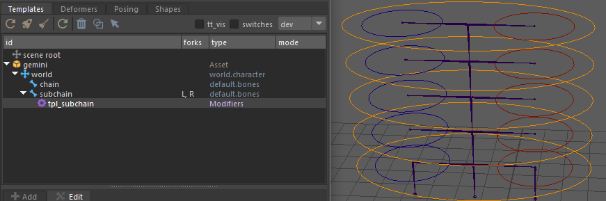
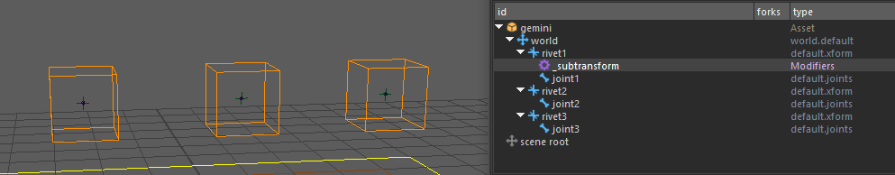

# rig.rechain

> Recreates a virtual FK chain hierarchy over disconnected or constrained nodes.

This modifier allows you to rebuild an FK-style hierarchy virtually, useful for setups like FK joints constrained to rivets, where real parenting is not possible. It supports both a legacy and a new, more explicit method.

## Options

- **`name`** (*str*, optional): Base name used to generate the IDs of the virtual nodes.
- **`weight`** (*bool*, optional): Adds a weight attribute to enable/disable the transformation constraint (default: `true`).
<!-- -->
- **`ctrls`** (*list[node]*): List of controller nodes representing the FK chain.
- **`roots`** (*list[node]*, optional): Corresponding roots for each controller (only needed if controller matrices aren't complete).
- **`nodes`** (*list[node]*): List of nodes to be constrained, typically the roots following each controller.

> ⚠️ Only the local matrix is connected in this method. If using transform hierarchies instead of FK controllers, specify the `roots` list.

> ⚠️ When using default.bones templates, make sure the `nodes` list only includes root nodes. The modifier will not work with other types.

> ⚠️ For riveted joints, make sure the hierarchy is broken and nodes are reparented to avoid unwanted scale propagation.



## Examples

### Multiple subchains driven by a main chain

To animate multiple subchains using a main chain, start by breaking the original hierarchy:

```yml
# Disconnect subchain controllers and parent them to the main chain hooks
#> n: [0, 1, 2, 3, 4]
parent: subchain.L::roots.<n> chain::hooks.<n>
```

Then use `rechain` to rebuild the desired FK behavior:

```yml
rig.rechain:
  roots:
    - subchain.L::roots.0
    - subchain.L::roots.1
    - subchain.L::roots.2
    - subchain.L::roots.3
  ctrls:
    - subchain.L::skin.0
    - subchain.L::skin.1
    - subchain.L::skin.2
    - subchain.L::skin.3
  nodes:
    - subchain.L::roots.1
    - subchain.L::roots.2
    - subchain.L::roots.3
    - subchain.L::roots.4
```



### Virtual hierarchy between riveted joints

Here, joint1 controls joint2, and joint2 controls joint3:

```yml
rig.rechain:
  ctrls:
    - joint1::skin.0
    - joint2::skin.0
  nodes:
    - joint2::roots.0
    - joint3::roots.0
```
