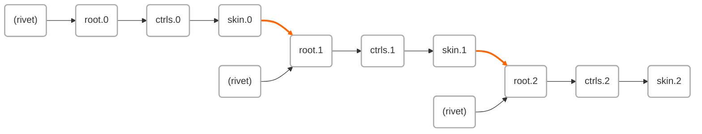
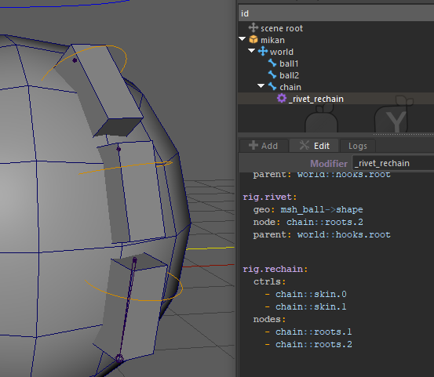
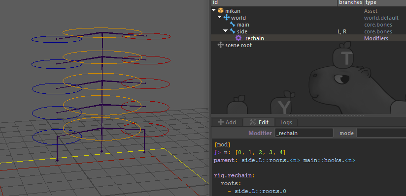

# rig.rechain

Builds a virtual Forward Kinematics (FK) hierarchy over disconnected or constrained nodes.

This modifier solves the classic "Necklace Problem" in rigging. Imagine a chain of armor plates or necklace links: you want each link to stick to the deforming body (via [`rig.rivet`](./rivet.md)), but you also want the animator to rotate the top link and have all subsequent links follow it naturally like an FK chain.

Because each link is already constrained to a rivet, you cannot physically parent them to one another in the Outliner without breaking the rivet or creating a dependency cycle. `rig.rechain` solves this by mathematically extracting the local matrix rotations of your controllers and cascading them virtually down the chain.


```mermaid
graph LR
    rvt0("(rivet)") --> root0("root.0")
    root0 --> ctrl0("ctrls.0")
    ctrl0 --> skin0("skin.0")
    
    skin0 --> root1
    
    rvt1("(rivet)") --> root1("root.1")
    root1 --> ctrl1("ctrls.1")
    ctrl1 --> skin1("skin.1")
    
    skin1 --> root2

    rvt2("(rivet)") --> root2("root.2")
    root2 --> ctrl2("ctrls.2")
    ctrl2 --> skin2("skin.2")

    linkStyle 3,7 stroke:#f60,stroke-width:3px;
    classDef default fill:#fff,stroke:#aaa,stroke-width:2px,color:#333;
```

## Parameters

| Parameter | Type         | Default | Description                                                                                                                           |
|:----------|:-------------|:--------|:--------------------------------------------------------------------------------------------------------------------------------------|
| `ctrls`   | *list[node]* |         | The driver controllers representing the FK chain (the nodes the animator will rotate).                                                |
| `nodes`   | *list[node]* |         | The driven transform nodes (usually the root offset groups of the subsequent joints). **Must be exactly the same length as `ctrls`.** |
| `roots`   | *list[node]* |         | Optional. The local reference spaces for each controller. Only necessary if your `ctrls` do not have zeroed-out local matrices.       |
| `weight`  | *bool*       | `off`   | Automatically generates an animatable `weight` attribute to blend the virtual hierarchy on or off.                                    |
| `name`    | *str*        |         | Base name used to register the generated IDs.                                                                                         |

:::caution[Target Proper Nodes]
When using `default.bones` templates, ensure the `nodes` list targets the **root** offset groups (e.g., `joint::roots.0`), NOT the joints or controllers themselves. The modifier needs a clean transform matrix to inject the virtual hierarchy.
:::

## Output

### Animatable Attributes

If `weight: on` a **`@weight`** attribute (ranging from `0.0` to `1.0`) is automatically added to each driven node in the `nodes` list. This allows the rig to dynamically disable the FK chain cascade on a per-link basis.

## Examples

### Virtual Hierarchy Between Riveted Joints

In this example, we have 3 joints pinned to a surface. We want `chain::skin.0` to act as the parent of `chain::roots.1`, and `chain::skin.1` to act as the parent of `chain::roots.2`. By feeding the controllers into `ctrls` and the roots into `nodes`, Mikan cascades the offsets.

```yml
rig.rechain:
  ctrls:
    - chain::skin.0
    - chain::skin.1
  nodes:
    - chain::roots.1
    - chain::roots.2
```



:::info[Demo Scene]
To see this setup in action, download the [**mod_rechain_rivet.ma**](https://drive.google.com/file/d/1s4nhDL5ON7mjj-B8eYKmyFNZElUThVou/view?usp=drive_link) demo scene from our [Google Drive folder](https://drive.google.com/drive/folders/1tDXJmNxd-3ev1BwvZMm4Gl7tbnJTWJcn?usp=drive_link).
:::


### Subchains Driven by a Main Chain

A more advanced setup: animating multiple subchains using a main structural chain.

First, you break the original physical hierarchy so the subchains can be constrained to the main chain hooks (acting as dynamic rivets). Then, you use rig.rechain to rebuild the lost FK behavior virtually, allowing the animator to pose the subchain controllers directly.

```yml
# 1. Disconnect subchain controllers and parent them to the main chain hooks
#> n: [0, 1, 2, 3, 4]
parent: side.L::roots.<n> main::hooks.<n>

# 2. Rebuild the FK behavior virtually
rig.rechain:
  roots:
    - side.L::roots.0
    - side.L::roots.1
    - side.L::roots.2
    - side.L::roots.3
  ctrls:
    - side.L::skin.0
    - side.L::skin.1
    - side.L::skin.2
    - side.L::skin.3
  nodes:
    - side.L::roots.1
    - side.L::roots.2
    - side.L::roots.3
    - side.L::roots.4
```



:::info[Demo Scene]
To see this setup in action, download the [**mod_rechain.ma**](https://drive.google.com/file/d/1UDUPH0_wBwxQGF9UsdwDM6YmgAkUjvHh/view?usp=drive_link) demo scene from our [Google Drive folder](https://drive.google.com/drive/folders/1tDXJmNxd-3ev1BwvZMm4Gl7tbnJTWJcn?usp=drive_link).
:::
