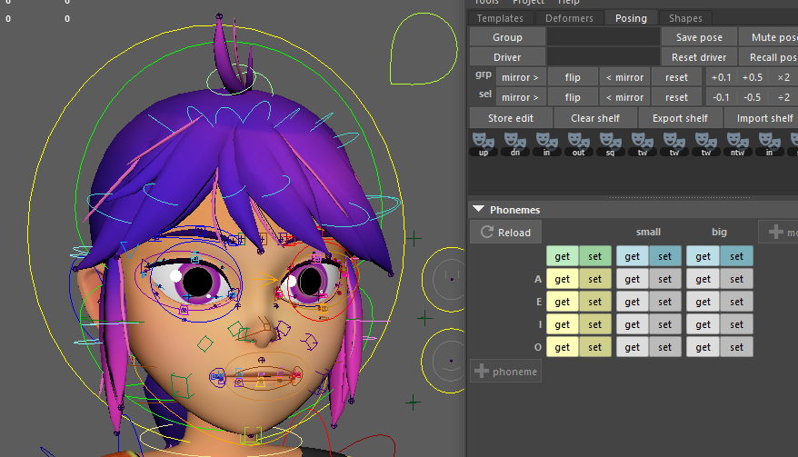

# shape.phonemes

Integrates a comprehensive bank of phoneme poses and variations into the facial rig.

Because defining dozens of phonemes and their variants (modes) across hundreds of facial shapes requires a massive amount of data, **this modifier is not meant to be written by hand.** Instead, it is automatically generated by Mikan's Posing tool (found in the main UI under the Posing tab > Phonemes organ).

This modifier takes that generated pose bank and constructs the necessary math nodes (expressions and blend nodes) to dynamically mix these shapes based on a set of generated attributes.



## Usage

To properly initialize and build the phoneme system, follow this step-by-step UI workflow:

### 1. Initialization

If the template does not yet contain a `shape.phonemes` modifier, the UI will only display an **"Add Phonemes"** button. Clicking it will inject the following hardcoded base snippet into your template:

```yml
shape.phonemes:
  mod: [ ]
  pho: [ ]
  poses: { }
  src:
    - chan_face::node
```

### 2. Configuring Sources (`src`)

Before recording any poses, you **must** verify and configure your `src` list in the YAML. This tells the UI which nodes to scan when you click the "get" button. By default, it scans the main facial channel buffer.

It is highly recommended to add the facial controllers to this list so you can record precise, controller-driven micro-tweaks for specific phonemes without needing dedicated global shapes:

```yml
src:
  - chan_face::node
  - face:::ctrls
```

:::info The Recursive Syntax (`:::`)
Notice the three colons (`:::`) in `face:::ctrls`. In Mikan, a double colon (`::`) targets exact matches within a module. A triple colon (`:::`) is a recursive search: it targets **all** of the child controllers within the `face` module and its sub-modules, ensuring no controller tweak is missed during recording.
:::

### 3. Building the Grid

Once your sources are set, use the "**+ phoneme**" and "**+ mode**" buttons in the Mikan UI to build your matrix.

- **Phonemes (Rows)**: The base sounds (e.g., A, E, I, O).
- **Modes (Columns)**: The variations of those sounds (e.g., small, big).

### 4. Recording Poses (Get / Set)

The UI generates a grid of **get** and **set** buttons for every combination.

- Pose your character in the viewport.
- Click `get` on the corresponding cell to capture the values from your `src` nodes and save them to the `poses` dictionary.
- Click `set` to recall a saved pose back to the rig for further editing.

:::warning Additive Pose Logic
Phoneme recording in Mikan is **cumulative**.
To output a specific phoneme, the system adds the values of the neutral/base pose to the values of the requested phoneme.

- **Consequence 1:** If you modify the neutral base pose later, it will affect *all* other phonemes.
- **Consequence 2:** The same applies to modes (e.g., modifying the neutral `big` mode will alter all phonemes utilizing the `big` mode).
  :::

### Smart Controller Rerouting

A major feature of this modifier is its non-destructive nature. If the pose bank contains data targeting an animation controller (tagged with `::ctrls`), the modifier will intercept this and automatically reroute the connections to the controller's underlying `poses` buffer node.
**Benefit:** The animation controllers remain completely free and unlocked. Animators can dial in a phoneme and still manually tweak the controllers on top of it.

## Parameters

| Parameter | Type        | Default | Description                                                                                                                                                                            |
|:----------|:------------|:--------|:---------------------------------------------------------------------------------------------------------------------------------------------------------------------------------------|
| `create`  | *bool*      | `False` | If `True`, creates a dedicated transform node named `phonemes` under the current node to host the attributes. If `False`, attributes are added directly to the modifier's target node. |
| `src`     | *list[id]*  |         | *UI Directive:* A list of nodes (e.g., `chan_face::node`, `face:::poses`) that the Mikan UI tool will scan to capture and save the poses.                                              |
| `pho`     | *list[str]* |         | List of the base phoneme names (e.g., `A`, `E`, `I`, `O`).                                                                                                                             |
| `mod`     | *list[str]* |         | List of mode variants (e.g., `small`, `big`, `wide`).                                                                                                                                  |
| `poses`   | *dict*      |         | The massive dictionary containing the captured values for every plug across every phoneme and mode. Generated by the UI.                                                               |

## Output Attributes

When executed, the modifier generates a specific set of animatable attributes on the target node (or the newly created `phonemes` node) to drive the lipsync:

- `@phonemes` (0 to 1): The master weight/envelope for the entire phoneme system.
- `@pho_closed` (0 to 1): The hardcoded resting/closed state.
- `@pho_<name>` (0 to 1): Individual weights for each phoneme defined in the `pho` list.
- `@mod_<name>` (0 to 1): Individual weights for each mode defined in the `mod` list.

The system uses mathematical expressions to dynamically multiply these weights together (`master * phoneme * mode`) and blend the resulting values into the rig.

## Example

*Note: This is a truncated structural example. A real `poses` dictionary generated by the UI will contain hundreds of entries.*

```yml
shape.phonemes:
  create: true
  mod: [ small, big ]
  pho: [ A, E, I, O, U ]
  src:
    - chan_face::node
    - face:::poses
  poses:
    # Example of the neutral mode for phoneme 'A'
    A:
      null:
        chan_face::node.m_jaw_open: 0.5
        chan_face::node.m_lip_funnel: 0.2
    # Example of the 'big' mode for phoneme 'A'
    A:
      big:
        chan_face::node.m_jaw_open: 0.8
        chan_face::node.m_lip_funnel: 0.4
```
