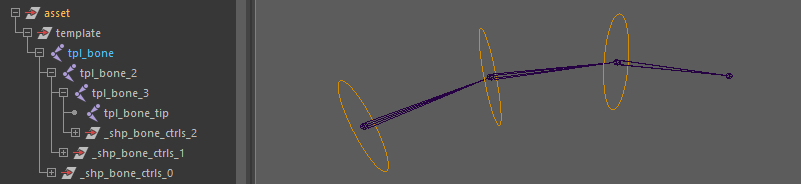

# core.bones

Generates a generic FK (Forward Kinematics) controller chain module from a template chain.

Inheriting from [`core.joints`](joints.md), each controller in the chain is built from a hierarchy of nodes supporting both deformation and animation layers. This is ideal for tails, ropes, tentacles, or simple FK appendages. By default, the structure includes:

- A `root` node
- A controller (`ctrl`)
- A `skin` node (deformation output)

## Structure

The module evaluates the template hierarchy as a single linear chain starting from the module's root. **If there are any sibling joints branched off this main chain, they will be ignored by the build process.**

Every joint in this linear main chain generates a dedicated controller, with the exception of the very last joint (the "tip"). The tip joint does not generate a controller; its sole purpose is to terminate the final segment and visualize the end of the bone chain.



## Parameters

### Hierarchy & Nodes

| Parameter   | Type              | Default | Description                                                                                                                                                                                                                                                                                                                                 |
|:------------|:------------------|:--------|:--------------------------------------------------------------------------------------------------------------------------------------------------------------------------------------------------------------------------------------------------------------------------------------------------------------------------------------------|
| `add_nodes` | *str / list[str]* | `null`  | Injects custom buffer nodes into the node hierarchy. Use `c` as an anchor to define placement relative to the controller:<br/>- `inf` or `[inf]`: inserts `inf_{name}` above `c_{name}`.<br/>- `[inf, pose]`: inserts both `inf` and `pose` nodes above ctrl.<br/>- `[inf, c, dyn]`: inserts inf above ctrl, and dyn between ctrl and skin. |
| `do_pose`   | *bool*            | `off`   | Convenience flag. Injects a `pose` node between `root` and `ctrl` (ideal for driven key setups).                                                                                                                                                                                                                                            |

### Transform & Behavior

| Parameter      | Type   | Default | Description                                                                                                                                            |
|:---------------|:-------|:--------|:-------------------------------------------------------------------------------------------------------------------------------------------------------|
| `parent_scale` | *bool* | `off`   | Enables scale propagation between controllers. This directly affects segment scale compensation on the joints.                                         |
| `rotate_order` | *enum* | `xyz`   | Sets the rotation order on the controller hierarchy. Can be set to `auto` to automatically guess the best axis based on the template chain's geometry. |

### Orientation

| Parameter     | Type   | Default | Description                                                                                                                                                                                                                                                                     |
|:--------------|:-------|:--------|:--------------------------------------------------------------------------------------------------------------------------------------------------------------------------------------------------------------------------------------------------------------------------------|
| `flip_orient` | *bool* | `off`   | Flips root orientation to produce symmetrical translation behavior on mirrored modules.                                                                                                                                                                                         |
| `orient`      | *enum* | `copy`  | Strategy for orienting the rig. <br/>- `copy`: Copies orientation directly from the template joint.<br/>- `auto`: Computes orientation using the Auto Orientation Controls below.<br/>- `world`: Aligns strictly to world axes.<br/>- `parent`: Aligns to the parent rig joint. |

#### Auto Orientation Controls

*(These parameters are only evaluated if `orient` is set to `auto`)*

| Parameter  | Type   | Default   | Description                                                                                                                                                                                                                                                           |
|:-----------|:-------|:----------|:----------------------------------------------------------------------------------------------------------------------------------------------------------------------------------------------------------------------------------------------------------------------|
| `aim_axis` | *str*  | `y`       | The primary axis pointing toward the next joint in the chain.                                                                                                                                                                                                         |
| `up_axis`  | *str*  | `z`       | The secondary axis used as the local up vector.                                                                                                                                                                                                                       |
| `up_dir`   | *enum* | `auto`    | Mode for computing the world up vector. Can be `auto` (geometry-based) or a fixed world axis (`+x`, `-x`, `+y`, `-y`, `+z`, `-z`).                                                                                                                                    |
| `up_auto`  | *enum* | `average` | Strategy when `up_dir` is `auto`. <br/>- `average`: Averages all segment triangles.<br/>- `each`: Computes an individual up vector per joint.<br/>- `first`: Uses the first segment's up vector for the whole chain.<br/>- `last`: Uses the last segment's up vector. |

## Outputs

Once the module builds the rig, it exposes a specific node structure and generates connection hooks for other modules.

### DAG Node Tree

Below is the node hierarchy generated for each segment in the chain, including optional buffer nodes injected via parameters:

```text
[root]
 └── [inf]            <-- Optional: injected above ctrl via add_nodes
 └── [pose]           <-- Optional: injected via do_pose or add_nodes
 └── [ctrl]
      └── [dyn]       <-- Optional: injected below ctrl via add_nodes
 └── [skin] (j.#)
      └── [tip]
```

### Node IDs

Node IDs are returned as arrays, meaning a 3-bone chain will generate 3 roots, 3 ctrls, etc.

- `<id>::roots.#`: The top buffer group of each controller segment.
- `<id>::ctrls.#`: The animator-facing control curve.
- `<id>::j.#`: The structural rig joint. This node is always generated regardless of skinning options and acts as the actual attachment point for child modules.
- `<id>::skin.#`: The deformation tag, usually mapped directly to the `j.#` joint (unless explicitly untagged).
- `<id>::end`: A generated joint at the very tip of the chain with scale compensation disabled. This ensures the final bone segment is properly drawn in the viewport.

Any custom buffer nodes injected into the hierarchy (via parameters like `add_nodes` or `do_pose`) automatically expose matching dynamic Node IDs. For instance, injecting a `pose` or `inf` node will generate arrays accessible as `<id>::poses.#` or `<id>::infs.#`.

### Hooks

When another template module is parented under one of this chain's joints during the template phase, the build process uses these hooks to seamlessly attach the child rig to the correct deformation joint.

- `<id>::hooks.#`: A hook explicitly mapped to every generated joint corresponding to the template chain (except the tip).
- `<id>::hooks.tip`: A dedicated hook mapped to the generated `<id>::end` joint, representing the absolute end of the chain.

## Usage & Rigging Notes

### Decoupling Hierarchy for Advanced Rigging

A core philosophy of this module is to cleanly separate the static transform hierarchy (roots) from the deformation layer (skin joints) and the animation layer (controllers). This ensures the controllers remain zeroed out and free for the animator.

If you need to constrain a segment without locking its main `root` or `ctrl`, you can use the `add_nodes` parameter to inject buffer nodes (like an `inf` node) to safely receive the constraint. Similarly, the `do_pose` parameter inserts dedicated nodes perfect for receiving Driven Keys (highly recommended for facial rigging).

### Procedural Joint Orientation

While the default `copy` mode inherits the orientation directly from your template pivots, manually orienting joints can be tedious.

The `auto` orientation mode solves this by mathematically aiming each joint at its next child (perfect for FK bone chains). You maintain full control over the twisting behavior via the up-vector parameters, which can be computed dynamically based on the chain's curvature (`auto`) or locked to a strict world-space axis.

### Scale Propagation Behavior

By default in Maya, parenting joints does not transmit scale to children (Segment Scale Compensate is enabled). `core.bones` mimics this animation-friendly standard by defaulting `parent_scale` to `off`. This prevents unwanted shearing and scaling issues down the chain (ideal for tails).

However, if you are rigging a highly nested, rigid hierarchy, such as a skull and jaw assembly where all child elements must stretch and scale together as a single block, you should set `parent_scale` to `on`.