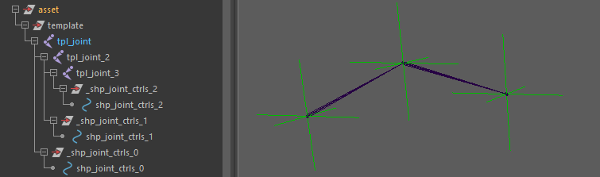

# core.joints

Generates a simple FK joint chain rig module from a template chain.

Inheriting from base rig structures, this module allows building lightweight joint chains where you can choose whether the transformation hierarchy is driven primarily by joints or by control transforms. It is suitable for simple appendages, mechanical setups, or isolated bone chains that require customizable parenting and scale transmission behaviors. By
default, the structure includes:

- A `root` node
- A controller (`ctrl`)
- A `skin` node (deformation output)

## Structure

The module processes the template hierarchy as a continuous linear chain.

Depending on the chosen build options, the controllers can either form a continuous animation hierarchy or remain decoupled while delegating structural transformation and scale transmission directly to the underlying joints.



## Parameters

### Rig Hierarchy & Mode

| Parameter | Type   | Default | Description                                                                                                                                                                                                                                                                 |
|:----------|:-------|:--------|:----------------------------------------------------------------------------------------------------------------------------------------------------------------------------------------------------------------------------------------------------------------------------|
| `type`    | *enum* | `joint` | Defines the underlying rig hierarchy type:<br/>- `joint`: All rig joints are parented under their respective roots, allowing clean scale transmission.<br/>- `transform`: Controllers form a continuous hierarchy, resulting in cumulative scaling behavior down the chain. |
| `unchain` | *bool* | `off`   | Prevents hierarchical parenting between generated controllers, breaking the continuous chain into unparented individual segments.                                                                                                                                           |

### Hierarchy & Nodes

| Parameter   | Type              | Default | Description                                                                                                                                                                                                                                                                                                         |
|:------------|:------------------|:--------|:--------------------------------------------------------------------------------------------------------------------------------------------------------------------------------------------------------------------------------------------------------------------------------------------------------------------|
| `add_nodes` | *str / list[str]* | `null`  | Injects custom buffer nodes into the node hierarchy. Use `c` as an anchor to define placement relative to the controller:<br/>- `inf`: Inserts `inf_{name}` above `c_{name}`.<br/>- `[inf, pose]`: Inserts both `inf` and `pose` nodes above ctrl.<br/>- `[c, dyn]`: Inserts `dyn` between ctrl and the skin joint. |
| `do_pose`   | *bool*            | `off`   | Convenience flag. Injects a `pose` node above the controller (ideal for driven key setups).                                                                                                                                                                                                                         |

### Transform & Behavior

| Parameter      | Type   | Default | Description                                                                                                          |
|:---------------|:-------|:--------|:---------------------------------------------------------------------------------------------------------------------|
| `parent_scale` | *bool* | `off`   | Enables scale propagation between controllers by adjusting segment scale compensation between skin joints and roots. |
| `flip_orient`  | *bool* | `off`   | Flips root orientation to produce symmetrical translation behavior on mirrored modules.                              |
| `rotate_order` | *enum* | `xyz`   | Sets the rotation order on the controller hierarchy (`xyz`, `yzx`, `zxy`, `xzy`, `yxz`, `zyx`).                      |

## Outputs

Once built, the module exposes its generated DAG tree, node arrays, and attachment hooks for parent/child module interactions.

### DAG Node Tree

The generated DAG hierarchy depends on the module's `type` parameter mode:

#### Joint Mode (`type: joint`)

To protect animator controls from unwanted scaling artifacts (e.g., scale applied on buffer/pose nodes), the DAG hierarchy is flattened. Transformation accumulation is handled via matrix connections rather than parent-child DAG nesting:

```text
[root]
 └── [inf]            <-- Optional: injected above ctrl via add_nodes
 └── [pose]           <-- Optional: injected via do_pose or add_nodes
 └── [ctrl]
      └── [dyn]       <-- Optional: injected below ctrl via add_nodes
 └── [skin] (j.#)
```

#### Transform Mode (`type: transform`)

Generates a traditional, standard parent-child transform hierarchy. Only the final deformation skin node is built as a joint:

```text
[root]
 └── [inf]            <-- Optional: injected above ctrl via add_nodes
      └── [pose]      <-- Optional: injected via do_pose or add_nodes
           └── [ctrl]
                └── [dyn]       <-- Optional: injected below ctrl via add_nodes
                     └── [skin] (j.#)
```

### Node IDs

Node IDs are returned as arrays matching the number of segments in the chain:

- `<id>::roots.#`: The top buffer group for each segment.
- `<id>::ctrls.#`: The animator-facing control curve (default shape: locator, color: limegreen).
- `<id>::j.#`: The structural rig joint, acting as the attachment point for child modules.
- `<id>::skin.#`: The deformation tag mapped directly to the generated joints.

Any custom buffer nodes injected into the hierarchy (via parameters like `add_nodes` or `do_pose`) automatically expose matching dynamic Node IDs. For instance, injecting a `pose` or `inf` node will generate arrays accessible as `<id>::poses.#` or `<id>::infs.#`.

### Hooks

When another module is parented under this module during the template phase, connection hooks map to the following locations:

- `<id>::hooks.#`: Mapped across all generated joints corresponding to the template chain (chain[:-1]).

## Usage & Rigging Notes

### Joint vs. Transform Hierarchy Modes

The `type` parameter changes how transformations flow through the module:

- **`joint` mode:** Use this mode when clean segment scale compensation or independent joint behavior is needed. To protect animator controls from unwanted scaling artifacts (e.g., scale applied on buffer/pose nodes), the DAG hierarchy is flattened and transformation accumulation is handled via matrix connections rather than direct DAG parenting.
- **`transform` mode:** Uses a traditional controller-driven DAG parenting hierarchy where transforms, rotation, and scale accumulate naturally down the chain, with only the deformation node (`skin`) generated as a joint.

### Unchaining Segments

Setting `unchain` to `on` disables automatic hierarchical parenting between consecutive controllers. Instead of forming a nested hierarchy following the template chain structure, all generated controllers remain independent and aligned in series.

This is a convenient way to generate multiple side-by-side controllers from a single module without needing to instantiate separate modules for each joint.

* **Common Use Case:** Rigging eyebrows. You can place a simple joint chain along the brow line in the template, and by enabling `unchain`, you get a row of independent eyebrow controllers side by side.
