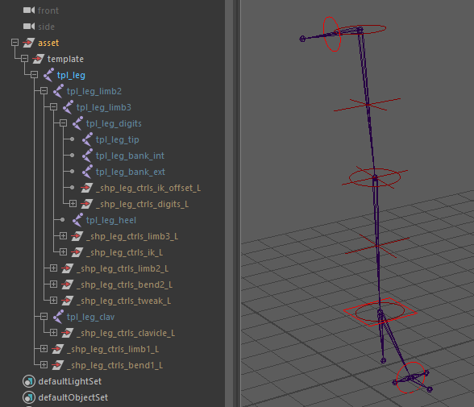

# leg.legacy

Full IK/FK leg rig template module with reverse foot and twist distribution.

`leg.legacy` provides a complete leg rig featuring seamless IK/FK blending. Built on the same foundational base as `arm.legacy` and `quad.legacy`, it ensures a consistent structural configuration across limbs.

This module sets up:

- A stable IK/FK switchable chain with pole vector controls.
- A reverse foot system with optional side-banking for planted ground contacts.
- Automated twist and roll joints for smooth skin deformation.
- Volume-preserving soft IK and stretch mechanics.

## Template Structure

The template uses a point-to-point placement workflow:

- The root of the template (`limb1`) marks the hip position.
- The main chain defines the knee (`limb2`), ankle (`limb3`), tarsus/toes (`digits`), and the toe tip (`tip`).
- A heel joint (`tpl_heel`) must be placed separately and defines the pivot for the reverse foot rig.
- Inner and outer bank joints (`tpl_bank_int`, `tpl_bank_ext`) can be positioned for lateral foot rolls.
- An optional clavicle joint (`tpl_pelvis`) can be placed above the hip. It defines the pelvic pivot and acts as the parent for the leg rig.
- Joints do not need manual orientation; orientation is handled automatically during the rig build based on the `effector_plane`.



### Placing the Template Pivot

- **Knee & Pole Vector Plane:** Any three points mathematically define a geometric plane. In this module, the hip, knee, and ankle guides form the plane used to calculate the limb's primary orientation. Consequently, the pole vector is automatically calculated and positioned directly in front of the knee along this exact plane.
- **Pelvis / Clavicle:** Placing a `clavicle` above the hip provides an independent pelvic pivot. While not strictly anatomically accurate for a leg, this decoupling is extremely useful for exaggerated cartoon animation and silhouette control.
  :::tip[TD Tip]
  You can position this "clavicle" pivot on the opposite side of the pelvis to simulate a sliding rotation (as if the pelvis is sliding over a ball joint). To achieve this effect, place the clavicle guide as far away as possible from the hip guide.
  :::
- **Reverse Foot Setup:** Carefully position the `heel`, `bank_int`, and `bank_ext` pivots flat on the ground plane to dictate how the foot rolls and banks during contact.
- **Effector Orientation (`effector_plane`):** This setting determines how the foot joint chain is automatically oriented:
    - **`ground` (Default):** The foot's twist axis remains parallel to the ground, while the secondary axis aims at the toe tip. This is the best compromise and most stable configuration for bipedal legs.
    - **`auto`:** Calculates axes similarly to the knee, using the plane formed by the ankle, toe pivot, and toe tip. This is ideal for flying or swimming creatures (e.g., a sea turtle) where the feet do not plant on a ground plane.
    - **`x`, `y`, `z`:** The up-vector is calculated on the corresponding plane, with the secondary axis aiming at the toe tip.

:::info[Homogeneity]
After the initial auto-orientation, the module conforms the axes across the chain. This ensures that if an animator selects all FK controllers and rotates them uniformly, the entire chain moves homogeneously in the same direction.
:::

## Options

### General & Setup

| Parameter        | Type   | Default  | Description                                                                                                                                                                                                                                                  |
|:-----------------|:-------|:---------|:-------------------------------------------------------------------------------------------------------------------------------------------------------------------------------------------------------------------------------------------------------------|
| `clavicle`       | *bool* | `off`    | Enables the clavicle/pelvis rig.                                                                                                                                                                                                                             |
| `clavicle_auto`  | *bool* | `off`    | Enables automatic clavicle animation based on leg motions.                                                                                                                                                                                                   |
| `reverse_lock`   | *bool* | `on`     | Enables the reverse foot-style locking system.                                                                                                                                                                                                               |
| `bank`           | *bool* | `off`    | Enables banking (side-to-side) control for the reverse foot.                                                                                                                                                                                                 |
| `effector_plane` | *enum* | `ground` | Orientation vector used to auto-orient the foot joint chain.<br/>- `x`, `y`, `z`: World-space up vectors.<br/>- `auto`: Based on the plane defined by joint positions.<br/>- `ground`: Forces foot orientation perpendicular to the ground (ideal for feet). |
| `space_switch`   | *bool* | `on`     | Enables default space switches on key controllers (IK foot, PV).                                                                                                                                                                                             |

### IK Stretching

| Parameter          | Type    | Default        | Description                                                                                         |
|:-------------------|:--------|:---------------|:----------------------------------------------------------------------------------------------------|
| `pv_space`         | *node*  | `*::space.cog` | Global parent space for the pole vector.                                                            |
| `pv_space_default` | *float* | `1.0`          | Default weight (`0-1`) for the pole vector space switch.                                            |
| `default_stretch`  | *bool*  | `on`           | Enables IK stretching by default.                                                                   |
| `soft_distance`    | *float* | `0.05`         | Soft IK activation threshold relative to stretch distance (`0-1`).                                  |
| `stomp_power`      | *float* | `-0.5`         | Volume compensation power factor (`-1 to 0`). `-0.5` corresponds to an inverse square root falloff. |

### Deformation & Twist

| Parameter         | Type        | Default  | Description                                                                                                                                                               |
|:------------------|:------------|:---------|:--------------------------------------------------------------------------------------------------------------------------------------------------------------------------|
| `smooth_type`     | *enum*      | `length` | Mode for distributing intermediate joints along the limb.<br/>- `length`: Interpolated along the deformation.<br/>- `parametric`: Interpolated at fixed parameter points. |
| `blend_joints`    | *bool*      | `on`     | Enables skinning roll joints at key articulations.                                                                                                                        |
| `twist_joints_up` | *int*       | `3`      | Number of twist joints between hip and knee (min: `2`).                                                                                                                   |
| `twist_joints_dn` | *int*       | `3`      | Number of twist joints between knee and ankle (min: `2`).                                                                                                                 |
| `advanced_twist`  | *bool*      | `off`    | Adds a correction rig for twist artifacts using extra attributes.                                                                                                         |
| `add_chains`      | *list[str]* |          | Adds multiple twist/shear chains for advanced deformation control.                                                                                                        |

### Not Yet Implemented

| Parameter  | Type   | Default | Description        |
|:-----------|:-------|:--------|:-------------------|
| `aim_axis` | *enum* | `-y`    | Not yet supported. |
| `up_axis`  | *enum* | `-x`    | Not yet supported. |
| `up_axis2` | *enum* | `z`     | Not yet supported. |

## Outputs

### Generated Hierarchy (Build)

Depending on the selected options, the final generated control hierarchy logic follows this structure:

```text
(Parent Hook)
└── [c_clavicle] (if clavicle: on)
    └── c_hip (Hip FK)
        ├── c_bend1 (Upper Bend)
        └── c_knee (Knee FK)
            ├── c_tweak (Knee Tweak)
            ├── c_bend2 (Lower Bend)
            └── c_foot (Ankle FK)
                └── c_toes (Toes FK)
(Rig Hook)
└── c_foot_IK (Foot IK)
    └── c_foot_offset_IK (Reverse Foot rolls)
```

### Node IDs

#### Controllers

- `<id>::ctrls.clavicle`: Pelvis/Clavicle control (`c_clavicle`, only if `clavicle: on`).
- `<id>::ctrls.limb1`: FK Hip control (`c_1`).
- `<id>::ctrls.limb2`: FK Knee control (`c_2`).
- `<id>::ctrls.limb3`: FK Ankle control (`c_e`).
- `<id>::ctrls.ik`: Primary IK Foot control (`c_eIK`).
- `<id>::ctrls.ik_offset`: Secondary IK Foot offset (reverse foot manipulation).
- `<id>::ctrls.digits`: IK Toes control (`c_dg`).
- `<id>::ctrls.switch`: The main settings control (`c_switch`). Hosts attributes for IK/FK blending, twist correction, flex, smooth, and reverse foot poses.
- `<id>::ctrls.tweak`: Mid-limb tweak control for the knee (`c_2pt`).
- `<id>::ctrls.bend1` & `<id>::ctrls.bend2`: Upper and lower limb bowing controls (`c_1bd`, `c_2bd`).

#### Visibility Groups

- `<id>::vis.shape`: Display group for the secondary deformation shapes (tweak and bend controls).
- `<id>::vis.offset`: Display group for secondary IK offsets.

#### Skinning Joints

- `<id>::skin.clavicle`: Root skin joint for the pelvis/clavicle.
- `<id>::skin.up` & `<id>::skin.dn`: The upper and lower twist joint chains.
- `<id>::skin.limb3` & `<id>::skin.digits`: The skin joints for the ankle and toes.
- `<id>::skin.bj1 / bj2 / bje`: The blend/roll joints at the main articulations.

#### Hooks

- `<id>::hooks.clavicle`: Maps to the generated pelvis transform.
- `<id>::hooks.hip`: Maps to the hip (limb1) base.
- `<id>::hooks.knee`: Maps to the knee (limb2).
- `<id>::hooks.foot`: Maps to the ankle (limb3).
- `<id>::hooks.default` / `<id>::hooks.tip`: Maps to the very end of the toe tip.

## Usage & Control Mechanics

These mechanics define the primary tools animators use to pose and animate the limb.

### IK/FK Blending & Matching

The module supports seamless IK/FK switching via the `ik_blend` attribute on the **Switch Controller** (`c_switch`).
Unlike traditional 3-chain setups (where separate IK and FK chains drive a bind chain via constraints), this rig is highly optimized: **the FK controllers are the exact same joints manipulated by the IK handle**. The system natively utilizes Maya's built-in `ikBlend` attribute to transition between states, keeping the evaluation graph lightweight and
minimizing node bloat.

- **UI Match:** The rig automatically generates a network node (`ui_match_IKFK`) and message attributes (`menu_match_ikfk`) on the main controllers, ready to be intercepted by studio animation UIs for seamless snapping.

### IK Controller Space Decoupling

A powerful capability of this module is the ability to decouple translation space from local rotation space on the IK Foot controller. By intentionally decoupling the foot's orientation from its world translation axes, the rig separates the transformation behaviors:

- The **parent root** stays aligned to the world ground axis, driving predictable and clean primary translation axes.
- The **IK controller** inherits local rotation axes tailored specifically to the targeted geometry of the foot.

### Clavicle / Pelvis Mechanics (If Enabled)

- **Rotation to Translation Conversion (`auto_translate`):** Converts the controller's rotation into a pendulum-like translation movement, making the joint behave as if it is physically tethered to the hip. Because the shoulder/pelvis area is notoriously difficult to skin realistically, displacing the joint (rather than purely rotating it) often yields much
  better deformation results without relying on complex, constraint-heavy muscle setups.
- **Auto-Follow (`auto_orient`):** If the `clavicle_auto` option is enabled, this attribute allows the pelvis/clavicle to automatically react and follow the translations of the leg's IK, reducing the need for manual counter-animation.

### Pole Vector Auto-Follow

- **`follow_<effector>`:** An attribute on the IK Foot control (`c_eIK`) that blends the PV from its absolute space-switch target to an automated position that dynamically follows the knee's orientation.

### Advanced Deformation & Styling

These systems allow animators to push the silhouette and resolve specific posing issues. The following attributes are exposed directly on the primary `c_switch` controller:

- **Smooth (Spline):** Blends the limb's skinning from standard rigid joints to a bezier-curve interpolation, utilizing the `bend` and `tweak` controls for a "noodle" arm/leg effect.
- **Arc Preservation:** Automatically pushes the bend controls outwards relative to the knee's flexion angle, creating an automatic pseudo-volume preservation during fast animations.
- **Advanced Twist Fix:** Allows animators to manually resolve gimbal flips on the twist joints using the `twist_unroll` and `twist_fix` attributes. If `advanced_twist` is on, independent fixes for the upper and lower twist chains are exposed.

## Rig Authoring (TD Setup)

During the rig authoring and publishing phase, the **Weights Shape Controller** (`sw_leg_weights`) grants the rigger access to underlying structural settings. These attributes are meant to be calibrated by the TD to refine the leg's mechanics before releasing the asset to the animation department, keeping the animator's UI clean.

### Kinematic & Deformation Setup

- **Blend Joints (Passive):** When enabled in the template options, the rig generates dedicated blend joints at major articulations. These are exclusively used by the TD during the skinning process. They act as half-angle helpers to interpolate rotations, providing a smoother gradient for skinning and helping to prevent geometry collapse on extreme bends,
  remaining completely transparent to the animator.
- **Flex Rig (Deformation Offsets):** Exposes `flex_offset` attributes (up/dn, X/Y/Z) to dynamically adjust the positional offsets simulating the physical spacing of the knee joints. This allows the TD to automatically push the knee volume outwards during extreme bends to aid deformation.
- **Twist Distribution:** Dial in the exact mathematical twist distribution values across the split joints for both the upper and lower limb chains.
- **Shearing Values:** Adjust the manual shear weights (`shear_up_base`, `shear_tip`) on the splits. Applying shear directly via skinning vastly improves joint articulation deformation during non-uniform scaling, without needing additional influence joints.

### Reverse Foot Calibration

- **Pose Amplitudes:** Fine-tune the rotational limits and maximum amplitudes for the reverse foot poses (`roll_amp`, `pivot_amp`, and `bank_amp`).
- **Kinematic Offsets:** Adjust modifiers (`roll_offset_roll`, `roll_offset_height`, etc.) to customize exactly how the foot pivots and behaves when the animator drives the `roll` attributes on the IK Foot control.
- **Toe Transform Offsets:** If adding anatomical toes to the reverse foot setup, adjust these transform offsets to compensate for how the new structure alters the tip's pivot behavior.
