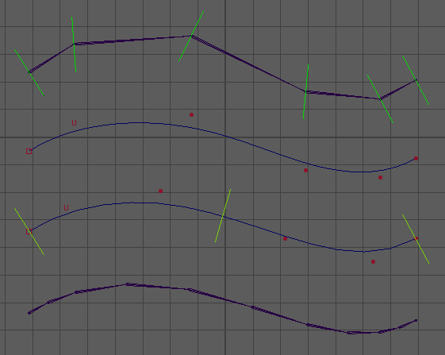

# rig.spline

> Spline IK/FK rig module with twist, stretch, and volume control

## Overview

`rig.spline` builds a hybrid IK/FK rig along a spline, supporting twist, soft volume preservation, and flexible skin joint creation. A good understanding of template chain configuration is crucial to constructing an effective rig.

### How It Works

1. **FK Chain:**

   - Built similarly to `core.bones` except the last joint is also a controller.
   - Each FK joint corresponds to a control vertex (CV) of the FK spline.
   - FK controllers directly deform this base spline.

2. **IK Controllers:**

   - A number of IK controllers are distributed along the FK spline.
   - The start and end controllers are placed at the beginning and end of the spline; others are spaced in between.
   - These IK controllers deform a *second* curve that is reconstructed and skinned from the FK spline.
   - The second curve contains 2× the number of IK controllers in control vertices.
   - Each IK controller affects two CVs, allowing axis scale to influence tangent behavior.

3. **Skin Joints:**

   - Created along the second IK spline.
   - Count and placement are configurable.

> ⚠️ If too many FK controllers are used relative to IK controllers, the rebuilt curve may lack the detail to accurately follow the original FK spline.

## Template Parameters

- `numbers` (*int*): Number of joints to create in the chain.
- `root` (*float3*): Position of the first joint relative to parent.
- `transform` (*float3*): Relative offset applied to each subsequent joint.

## Options

- `iks` (*int*, min: `2`, default: `3`): Number of IK controllers. Final IK spline will have 2× this number in control vertices.
- `tweakers` (*enum*, default: `off`): Adds secondary animation controllers per skin joint.
  - `off`: No tweakers.
  - `chained`: Tweakers follow a hierarchy.
  - `unchained`: Tweakers remain independent.
<!-- -->
- `bones` (*int*, default: `0`): Number of skin joints to create. Defaults to `2× FK controllers - 1` if unspecified.
- `bone_length` (*enum*, default: `cvs`): Distribution mode for skin joints.
  - `parametric`: Evenly spaced along the spline parameter.
  - `cvs`: Based on FK controller CV positions.
  - `equal`: Joints evenly spaced by length.
<!-- -->
- `uniform_ik` (*bool*, default: `on`): IK controller distribution mode.
  - `on`: Parametric placement.
  - `off`: Uniform length spacing.
- `fk_easing` (*enum*, default: `off`): FK influence smoothing mode.
  - `off`: Each FK controller controls a single CV.
  - `in`: First controller affects first two CVs.
  - `out`: Last controller affects last two CVs.
  - `in-out`: Combines `in` and `out` easing.
- `default_stretch` (*bool*, default: `off`): Enables stretch behavior by default.

### Rig Hierarchy Options (from [`core.bones`](../core/bones))

- `do_pose` (*bool*, default: `off`): Adds a pose node above the controller.
- `add_nodes` (*str* | *list[str]*): Adds custom nodes in the hierarchy.
<!-- -->
- `parent_scale` (*bool*, default: `off`): Enables scale propagation between controllers.
- `flip_orient` (*bool*, default: `off`): Flips controller root orientation for symmetry.

### Orientation Controls

- `rotate_order` (*enum*, default: `auto`): Controller rotate order.
  > ⚠️ Avoid changing unless necessary.
- `orient` (*enum*, default: `auto`): Orientation mode.
  - `auto`: Automatically computed (recommended).
  - `copy`: Copy orientation from template.
- `aim` (*str*, default: `y`): Main axis aligned toward next joint.
- `up` (*str*, default: `z`): Secondary axis aligned using `up_dir`.
- `up_dir` (*enum*, default: `auto`): Up vector calculation method.
  - `auto`: Based on chain geometry.
  - `+x`, `-x`, `+y`, `-y`, `+z`, `-z`: Scene-based up vectors.
- `up_auto` (*enum*, default: `average`): Up vector smoothing mode for `auto` mode.
  - `average`: Average of triangle normals.
  - `each`: Up vector calculated per joint.
  - `first`: Uses first triangle’s up vector for all.
  - `last`: Uses last triangle’s up vector for all.
