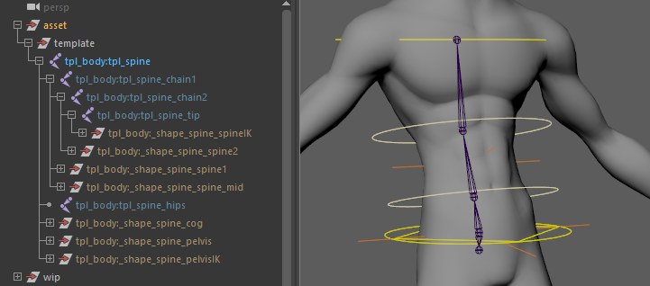

# spine.legacy

Cartoon-friendly spline IK template module with stretch mechanics.

`spine.legacy` builds a flexible spine rig based on a spline IK. Designed to sit between the pelvis and the upper body (shoulders), it acts as the bridge connecting the lower and upper limbs in a consistent way.

This module sets up:

- A spline-IK based deformation chain for smooth bending and stretching.
- FK/IK-style controllers along the spine curve.
- Optional automatic orientation helpers for the pelvis, mid-spine, and shoulders.
- Several modes to control how deformation bones are distributed and how stretch is computed.

## Template Structure

The template uses a point-to-point placement workflow:

- **`root`**: Defines the base of the spine where the spline curve originates. It also sets the pivot for the secondary pelvis control (`c_pelvis`), allowing rotations from the bottom of the spine.
- **Spine Chain** (`spine1`, `spine2`, `tip`): Defines the main spine curvature and the shoulder/neck base (`tip`).
    - The spline IK curve is driven by the 3 segments formed between `root`, `spine1`, `spine2`, and `tip`, acting as the control points and tangents of a 2-span Bézier curve.
    - **Placement Strategy**: Position `spine1` and `spine2` where you want the spine to flex the most. For exaggerated cartoon rigs, space these points further apart to allow broad, dramatic bends. For realistic setups, keep them closer together to maintain a rigid structure for the ribcage and pelvis.
    - **`tip` Placement:** Marks the end of the spline IK.
    :::tip
    The `tip` guide marks the termination point of the spline IK chain. Ideally, it should be placed at chest level, roughly **underneath the armpits**. 

    Placing the `tip` too high up (near the base of the neck) can lead to over-deformation of the upper chest and awkward behavior when moving the clavicles. However, there are no strict hierarchy limitations: subsequent modules (like the neck or shoulders/arms) can be parented here regardless, and their roots can be adjusted independently to suit your asset.
    :::
- **`hips`**: Defines the pivot for the main Center of Gravity control (`c_cog`). It is typically placed centrally between the hips of the leg modules (though its final placement can be customized based on rigging needs).
- **Orientation**: Joints do not require manual orientation; base orientations are calculated automatically during the rig build process.
- **Hierarchy**: The spine module is typically parented under a World template module, acting as the bridge between the lower and upper body.



### Controller & Joint Orientations

- **Skin Joints Alignment**: All skinning and deformation joints are automatically oriented along their respective bone segments during the rig build (`aim: Y`).
- **World-Aligned Controllers (Default)**: By default, the controllers (`c_spine1`, `c_spine2`, `c_pelvisIK`, `c_spineIK`) remain aligned to World Space. This offers clean, predictable translation and rotation axes for standard bipedal postures.
- **Local Alignment Options** (`orient_*`): For non-standard characters (e.g., stylized spines or quadrupeds where world-aligned axes are not ergonomic), you can enable `orient_spine`, `orient_pelvis`, or `orient_shoulders`. These options re-align the corresponding controllers to follow their local bone chain directions instead of the world axes.

## Parameters

### General & Deformation

| Parameter      | Type    | Default  | Description                                                                                                                                                                                        |
|:---------------|:--------|:---------|:---------------------------------------------------------------------------------------------------------------------------------------------------------------------------------------------------|
| `bones`        | *int*   | `6`      | Number of skin joints to create along the spline IK for skinning.                                                                                                                                  |
| `bones_length` | *enum*  | `equal`  | Distribution mode for skin joints.<br/>- `parametric`: Evenly spaced along the spline parameter.<br/>- `cvs`: Based on FK controller CV positions.<br/>- `equal`: Joints evenly spaced by length.  |
| `curvature`    | *float* | `0.5`    | Default curvature strength between the bottom and top of the spine (range: `0-1`).                                                                                                                 |
| `pivots`       | *enum*  | `legacy` | Position of the pelvis IK controller pivot.<br/>- `legacy`: At the root position.<br/>- `spine1`: At the first FK spine controller.<br/>- `centered`: Between the two middle FK spine controllers. |

### Orientation Helpers

| Parameter          | Type   | Default | Description                                                                 |
|:-------------------|:-------|:--------|:----------------------------------------------------------------------------|
| `orient_spine`     | *bool* | `off`   | Automatically orients the FK spine controllers (`c_spine1` and `c_spine2`). |
| `orient_pelvis`    | *bool* | `off`   | Automatically orients the pelvis controllers relative to their parent.      |
| `orient_shoulders` | *bool* | `off`   | Automatically orients the shoulder controllers relative to their parent.    |

### IK Stretching

| Parameter         | Type   | Default     | Description                                                                                                                             |
|:------------------|:-------|:------------|:----------------------------------------------------------------------------------------------------------------------------------------|
| `default_stretch` | *bool* | `on`        | Enables spine stretching by default on rig build.                                                                                       |
| `stretch_mode`    | *enum* | `translate` | IK spline stretch application mode.<br/>- `scale`: Scales joints along the curve.<br/>- `translate`: Translates joints along the curve. |

## Outputs

### Generated Hierarchy (Build)

Depending on the selected options and pivots, the final control hierarchy logic generally follows this structure:

```text
(Parent Hook)
├── c_cog (Center of Gravity)
│   ├── c_spine1 (FK Spine Mid 1)
│   │   └── c_spine2 (FK Spine Mid 2)
│   │       └── c_spineIK (Top Spine IK)
│   └── c_pelvisIK (Pelvis IK)
│       └── c_pelvis (Pelvis FK)
└── c_spine_mid (Mid Spine Spline IK Control)
```

(Note: Hierarchy logic is mapped from the generated controllers in the build process.)

### Node IDs

#### Controllers

- `<id>::ctrls.cog`: The main Center of Gravity control (c_cog).
- `<id>::ctrls.spine1` & `<id>::ctrls.spine2`: The FK mid-spine controls (c_spine1, c_spine2).
- `<id>::ctrls.pelvisIK`: The Pelvis IK control (c_pelvisIK).
- `<id>::ctrls.pelvis`: The Pelvis FK control (c_pelvis).
- `<id>::ctrls.spineIK`: The Top Spine / Shoulders IK control (c_spineIK).
- `<id>::ctrls.spine_mid`: The mid-spine curvature control (c_spine_mid).
- `<id>::ctrls.switch`: The main settings control hosting stretch and visibility attributes (c_switch).

#### Skinning Joints

- `<id>::skin.pelvis`: Root skin joint for the pelvis.
- `<id>::skin.0` through `<id>::skin.<n>`: The intermediate spine skin joints distributed along the curve. (can also be referenced as a list via `<id>::skin.chain`).
- `<id>::skin.tip`: Final skin joint at the top of the spine chain.

#### Hooks:

- `<id>::hooks.pelvis` maps to the pelvis output.
- `<id>::hooks.shoulders` maps to the upper spine/shoulders output.

## Usage & Control Mechanics

### Stretching & Sliding

The Switch Controller (`c_spine_switch`) exposes several advanced attributes for deformation:

- **`stretch` & `squash`**: Float values (`0` to `1`) to manually dial in the intensity of volume preservation and stretching along the curve.
- **`slide`**: Dynamically shifts the distribution of skin joints along the spline curve (range `-1` to `1`).
    - A negative value shifts joints toward the base (`c_pelvisIK`), while a positive value concentrates them toward the top (`c_spineIK`).
    - **Cartoon Squash Effect**: When combined with the squash attribute, sliding the joints locally compresses and expands the volume along the spine. This can be used to create stylized cartoon effects, such as a belly swelling during breathing/eating or an exaggerated chest expansion during a heavy intake of air.
- **Stretch Mode**: Dictates whether the stretch is applied via uniform scaling (`scale`) or joint translation (`translate`). This is particularly useful for pipelines that require strict scale preservation on export.
- **Tangential Stretch Scaling (`stretch_spline_up` / `stretch_spline_dn`)**: Controls whether the scale of the upper (`c_spineIK`) and lower (`c_pelvisIK`) controllers propagates to the spline IK curvature evaluation. Functionally, these end controllers act as the start and end handles (tangents) of the spline's Bézier curve; enabling these attributes
  allows scaling the controllers to extend or contract the curve's tangential influence, altering the spine's flex profile.

### Spline IK Curvature

The `c_spine_mid` controller automatically manages the intermediate interpolation of the spline IK. It includes a `curvature` attribute that dictates the strength of the bezier curvature between the bottom and top of the spine.
