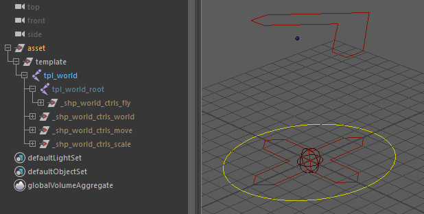

# world.character

Generates the standard global world and root control structure for character assets.

`world.character` serves as the foundational base for all character rigs. It sets up top-level animation controls, top-level spaces, global scaling logic, and structural hooks needed to parent and organize downstream modules (spine, limbs, props, etc.).

This module sets up:

- A consistent **global hierarchy** shared across all characters
- The standard **world / move** (root) control structure
- Default spaces used by all other modules (arms, legs, spine, etc.)
- A stable entry point for animation tools, exporters, and space-switch systems

All other modules (spine, limbs) are built on top of this structure.

## Structure

The `world.character` template is intentionally simple:

- The root joint defines the global position of the rig.
- No joint orientation is required, orientation is handled automatically.
- After the rig is built, all other modules are parented under the world hierarchy.

Despite its simplicity, this module is essential for maintaining compatibility across the entire animation pipeline.



### Placing the Template Pivot

When configuring the template guide in the viewport, the `root` guide serves as the positioning reference for the **Fly** control (`c_fly`).

- Place the `root` guide at the character’s center of mass or balance center (e.g., around the mid-torso / pelvis level).
- This position establishes the pivot point used by animators when making the character float, jump, or rotate freely in air.

## Parameters

| Parameter    | Type   | Default | Description                                                                                                                                                |
|:-------------|:-------|:--------|:-----------------------------------------------------------------------------------------------------------------------------------------------------------|
| `fly_ctrl`   | *bool* | `on`    | Enables the Fly controller (`c_fly`) at the template `root` position for aerial maneuvers. If `off`, `hooks.root` defaults to following `c_move` directly. |
| `scale_ctrl` | *bool* | `on`    | Enables the Scale/Squash control (`c_scale`) with dynamic pivot placement and volume preservation.                                                         |

## Outputs

### Generated Hierarchy (Build)

Depending on the selected options, the final generated hierarchy follows this logical structure:

```text
c_world
└── c_move
    ├── [c_scale] (if scale_ctrl: on)
    │   └── [c_fly] (if fly_ctrl: on)
    │       └── hooks.root
    └── hooks.world
```

:::note
(Note: If `c_fly` or `c_scale` are disabled, `hooks.root` automatically falls back to parent itself under the closest active parent in this chain, defaulting to `c_move`.)
:::

### Node IDs

#### Controllers

- `<id>::ctrls.world`: Global world control node (`c_world`). Includes native uniform global scaling for the entire asset.
- `<id>::ctrls.move`: Primary translation/rotation root control (`c_move`). Can also be used for uniform global placement and scaling on the ground.
- `<id>::ctrls.fly`: Aerial/center-of-gravity control (`c_fly`, only exposed if `fly: on`).
- `<id>::ctrls.scale`: Special scale and squash control (`c_scale`, only exposed if `scale: on`).

#### Misc.

- `<id>::space.world`: Reference matrix transform for absolute world space.
- `<id>::space.move`: Reference matrix transform for move space.
- `<id>::space.root`: Reference matrix transform positioned at the character's root offset.

#### Hooks

- `<id>::hooks.world`: Maps directly to the main `c_world` node. Use this hook when downstream modules (e.g., ground target locators, global props, UI elements) should remain fixed in absolute world space.
- `<id>::hooks.root`: Maps to the generated `hook_root` matrix transform following the character's local animated root (`loc_fly`). Modules that form the character's body (spine, legs, head targets) should be attached to this hook so they follow after `c_fly` and `c_move`.

## Usage & Control Mechanics

### Character Controls Overview

1. `c_world` **(World)**: The master parent node. Translating or rotating this control moves the entire character rig setup in absolute world space.
2. `c_move` **(Move)**: The main ground-level character control. Used to position and orient the character on the ground plane.
3. `c_fly` **(Fly)**: Positioned at the character's center of gravity (based on the `root` template guide). It allows animators to rotate and tilt the character in mid-air (jumping, flying, falling) without disturbing the ground trajectory defined by `c_move`.
4. `c_scale` **(Scale / Squash)**: A dedicated controller designed for localized deformative scaling and flexible squash-and-stretch setups.

### Understanding `c_scale` Mechanics

Unlike standard root controls (c_world / c_move) which scale the character globally, c_scale is a special utility control designed for dynamic animation manipulation (such as ball squashes, impact deformation, or localized stretching).

#### Free Pivot Relocation

`c_scale` can be translated freely anywhere in space without moving the character's geometry or child hierarchy.

- Internal reverse-matrix setups neutralize the translation of `c_scale` on the child elements.
- This allows animators to align `c_scale` directly to any contact surface (e.g., placing the pivot at the contact point on the floor during an impact) and scale/squash the character directly from that specific contact point.

#### Automatic Squash & Volume Preservation (`squash`)

The `c_scale` controller includes a custom `squash` attribute (`0.0` to `1.0`):

- When scaling `c_scale` non-uniformly (e.g. stretching vertically along Y), setting `squash` to `1.0` automatically applies an volume-preserving inverse scale along the perpendicular axes (X and Z).
- Lowering `squash` down to `0.0` disables volume preservation, allowing free non-uniform scaling.

#### Space Switch (`follow_world`)

`c_scale` exposes a `follow_world` slider (`0.0` to `1.0`):

- `0.0` **(Default)**: c_scale follows the local transformations of `c_fly` and `c_move`.
- `1.0`: Blends the position and orientation of `c_scale` back into absolute world space. This lets animators keep the squash pivot fixed at a specific point in the environment while the character moves through it.

### Rigging & Scene Attachment Workflow

When building a full character rig, `world.character` must be built first to establish the global hook targets.

#### Hook Selection Guidelines

When attaching subsequent template modules:

- Parent to `hooks.root`: Attach body modules (Spine, Pelvis, Legs, Arms, Head) to `hooks.root`. This ensures that translating `c_move` or pivoting `c_fly` carries the entire character naturally.
- Parent to `hooks.world`: Attach world-space targets, ground locators, or items that need to ignore `c_move` and `c_fly` motions directly to `hooks.world`.

