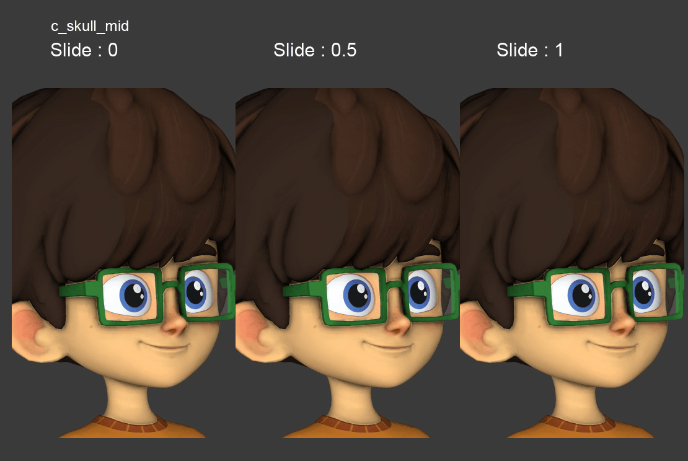
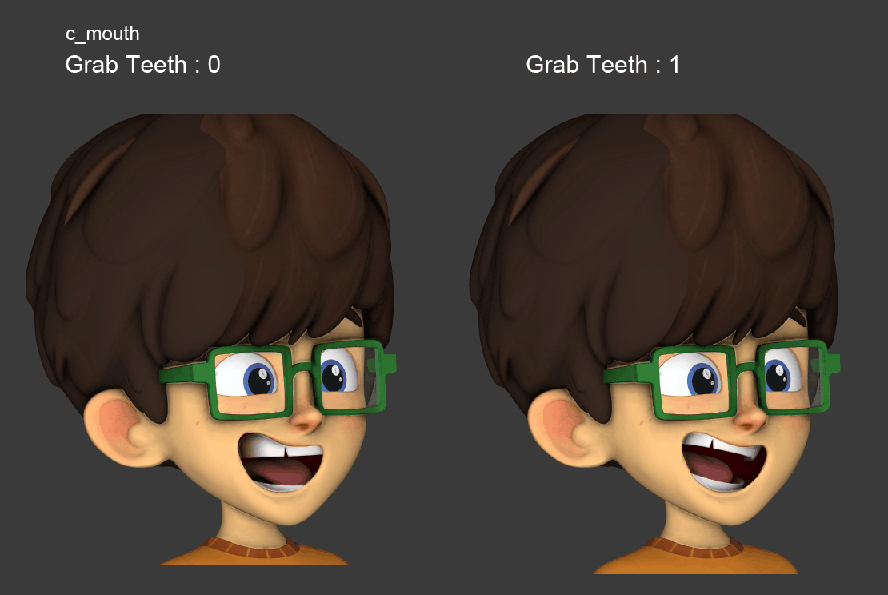
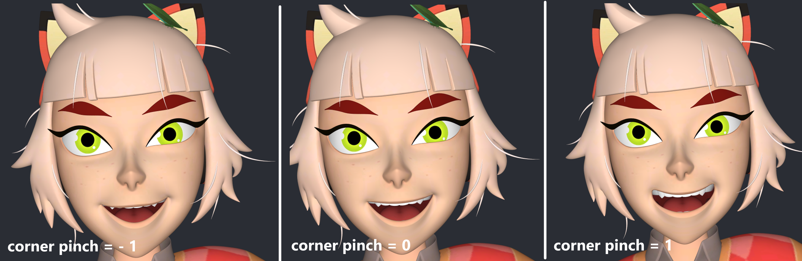
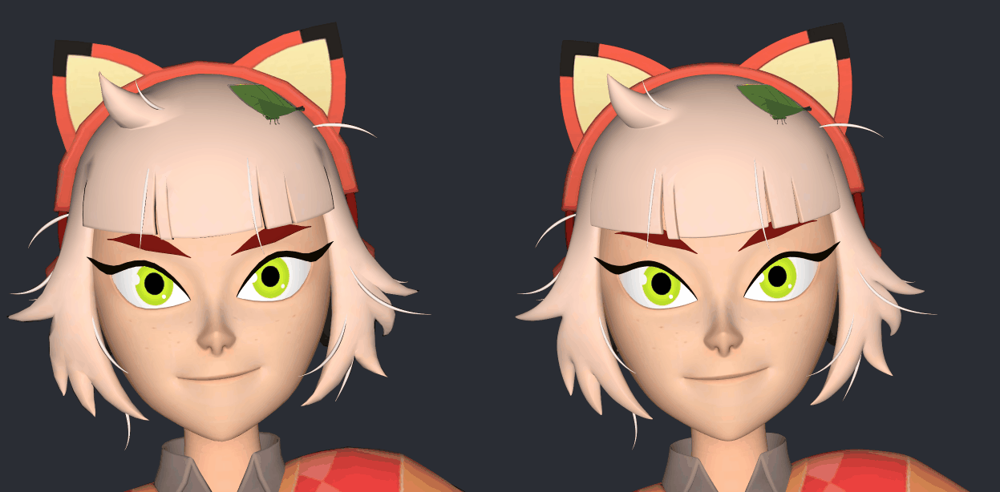
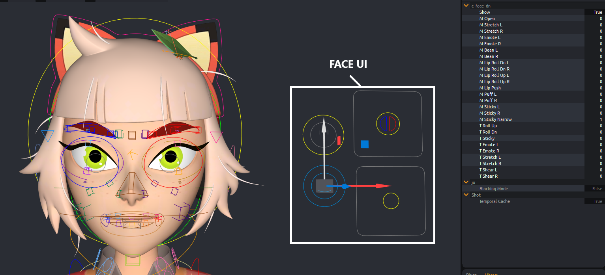
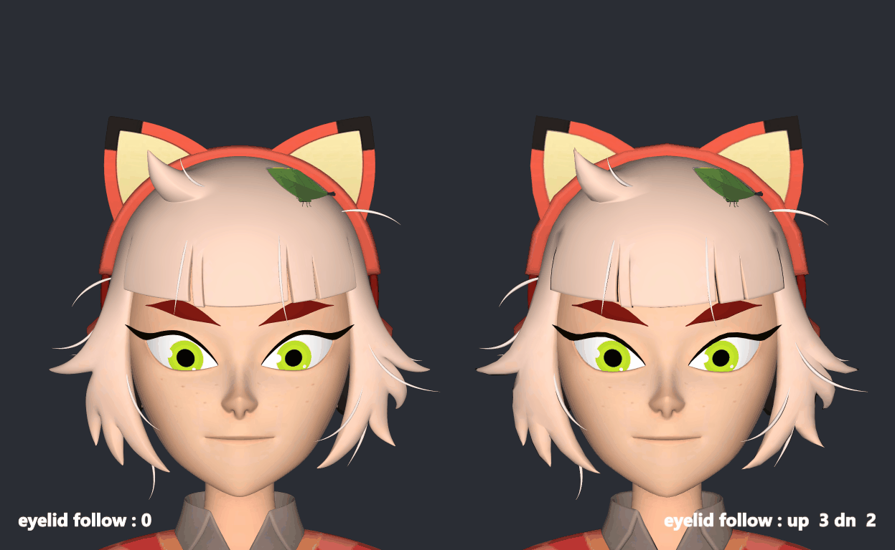

# Facial v1 Controls

## Head & Facial Controls

Right-click on **`c_head`** to display **facial controllers**.

Under **`c_head`**, you’ll find:

- **`c_skull`**, **`c_skull_mid`**, and **`c_skull_dn`**: used to adjust the head and facial silhouette.
- On **`c_skull_mid`**, the **`slide`** attribute controls how the skull follows **`c_skull_dn`**, for example to detach the nose from the jaw

### Main Facial Controllers

- **`c_mouth`**: moves the entire mouth; includes **`grab_teeth`** (separate teeth) and **`corner_pinch`** (lip corners)
    
  
- **`c_nose`**: nose control
- **`c_eyeroot_L`/`R`**: translate/rotate/scale eyes.
- **`c_ears`**: ear offsets (+ **`c_ear_base`** option to slide along the skull).
- **`c_eyebrows`**: eyebrow control with **`follow_skull`** attribute.

## Facial Expressions

Next to the head, you’ll find the **Face UI** and several offset controllers.

### Face UI

- **`c_face_dn`**: lower face poses (smile, frown, lips roll…), sticky lips, teeth, puffed cheeks
  
- **`c_face_up`**: eyes and brows poses (blink, eyebrows up/down), iris/pupil size, speculars, auto eyelid follow
  
- **`c_look`**: gaze direction (attributes: cross and dizzy)
- **`c_lipsync`**: mouth animation (phonemes)

### Offset Controllers

Used to fine-tune expressions:

- **`c_cheek*`**
- **`c_eyebrow*`**
- **`c_mouth`**
- **`c_lip*`**
- **`c_eyelid*`**

### Look-at

In front of the character, you’ll find **`c_look_at`** controls to animate eyes direction.

:::tip
Use the **Face UI** as much as possible to stay _on-model_.  
The facial controls are mainly intended for **fine adjustments** of expressions.
:::
