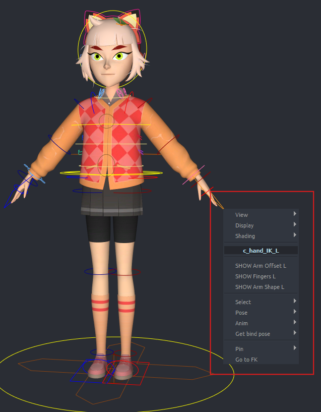
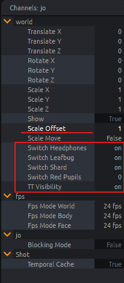
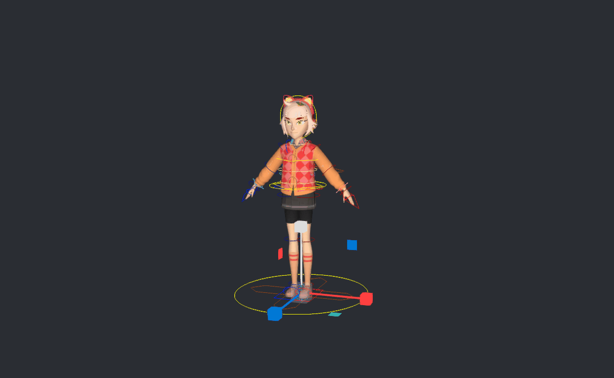
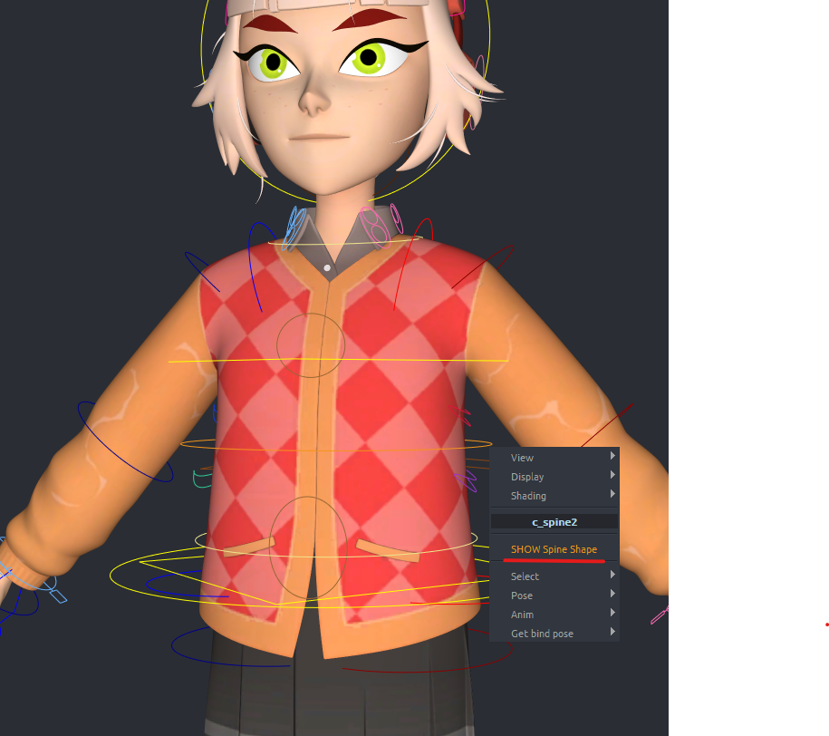
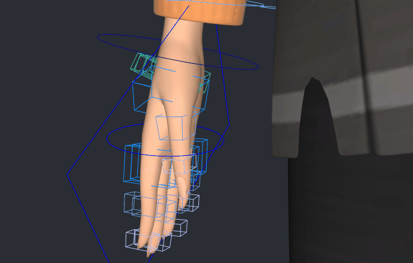
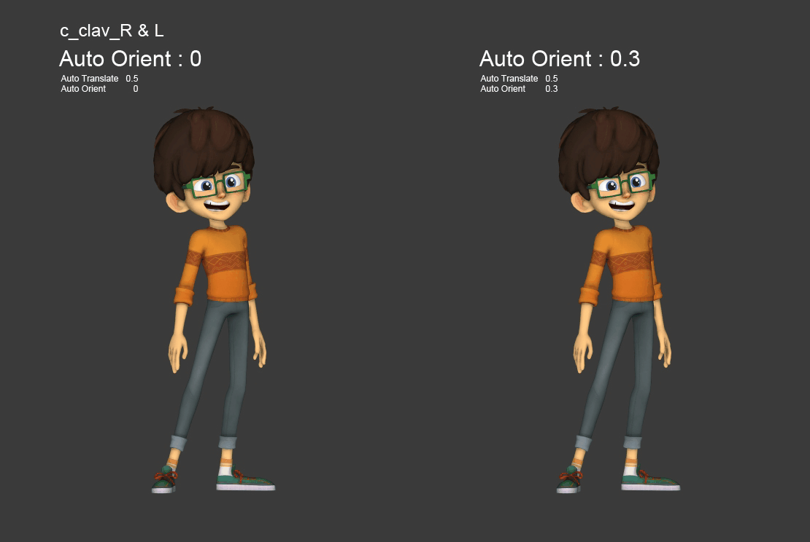

# Biped Controls

## Context Menu (Right-Click)

Before reviewing each controller, note that a **context menu (right-click)** provides quick access to all rig features.

It includes options such as:

- Controller display levels
- Quick selection of controller groups
- **Mirror** or **flip** poses and animations
- Return to **bind pose** for part or all of the rig
- **Pin** hands and feet (to head, hips, or world) via **space switches**
- **IK/FK switching** for limbs

## World Controls

The **World Control** is the main controller of your character.

- All other controllers are parented to it.
- Moving it moves the entire rig.

You use it to position, rotate, and scale the character in your scene.

:::note
It also includes a dedicated attribute: **`scale_offset`**.

This parameter is mainly used for scene-specific adjustments, such as when working on particular shots or sequences that require scale corrections.
:::

This controller also hosts the **visibility switches** for the various modeling elements that make up your character.

Under the World Control, you’ll find the following child controllers:

- **`c_move`**: used to create global motion paths for the character
- **`c_fly`**: functions like `c_move` but with a pivot centered on the character’s center of gravity
- **`c_scale`**: used to scale the character, with attributes to enable or disable squash and to adjust the scale pivot

## Spine Controls

The spine hierarchy is organized as follows:

- At the base of the spine: **`c_cog`** (FK pelvis control). The entire upper body follows it.
- Then: **`c_spine_1`** and **`c_spine_2`** (FK hierarchy)
- For IK:
  - **`c_pelvisIK`**: moves the pelvis independently from the upper body
  - **`c_spineIK`**: moves the upper spine independently from the lower part

Each controller includes attributes to:

- enable **`squash`** and **`stretch`**
- adjust **`slide`** (modifies joint positions to refine the silhouette)

These attributes are shared proxies and are the same across all controllers.

Right-click to reveal two extra controllers for fine-tuning the spine silhouette:

- **`c_spineIK_mid`**: middle of the spine curve
- **`c_pelvis`**: pelvis joint only (without the spine)

## Neck and Head Controls

The neck and head controls are organized as follows:

- **`c_neck`**: FK control at the base of the neck
- **`c_head`**: IK control for the head, drives translation, rotation, and scale
- **`c_head_scale`**: manages head squash and stretch

These controls also includes **`stretch`**, **`squash`**, and **`slide`** attributes, similar to the spine.

Right-click on **`c_head`** to reveal an intermediate controller **`c_neckIK_mid`** for finer silhouette control.

## Arm and Leg Controls

Arms and legs share similar control structures:

- An **IK control** at the end of the limb (e.g., **`c_hand_IK_L`**), active by default
- **Pole vectors** are computed automatically, but can be adjusted via the **`twist`** attribute

### Common Attributes (Arms & Legs)

- Enable **`stretch`/`squash`** (shared proxy attributes, same as spine and head/neck)
- **`min_stretch`**: sets the minimum stretch value
- **`soft`**: smooth transition between normal and stretched
- **`follow`/`pin`**: space switch attributes, also accessible via right-click
- **`arc`/`smooth`**: adjusts limb bending
- **`fix_twist`**: improves twist deformations

:::note
👉 You can **switch between IK and FK** from the right-click menu.
:::

You can also reveal **extra silhouette controls** for limbs, featuring attributes such as **pin root**, useful when animating elbows or knees resting on a surface.

### Leg-Specific Attributes

- **`stomp`**: applies a local stretch and squash on the foot for impact animations
- **`bank`**: tilts the foot sideways, useful for leaning or turning motions
- **`foot_roll`**: controls the rolling of the foot from heel to toe
- Other roll/pivot attributes: manage the position and rotation of the reverse foot setup

### Arm-Specific Features

- Ability to show **finger controls** via right-click on the hand IK control (hidden by default)
- **`c_pinky_meta_L`**: used to progressively move all fingers, making it easy to create a cup gesture

### Clavicles

- **`auto_rotate`**: automatically rotates the clavicle to follow the arm (not built by default)
- **`auto_translate`**: converts clavicle joint rotation into translation, which can help improve deformations, especially on cartoon-style characters

