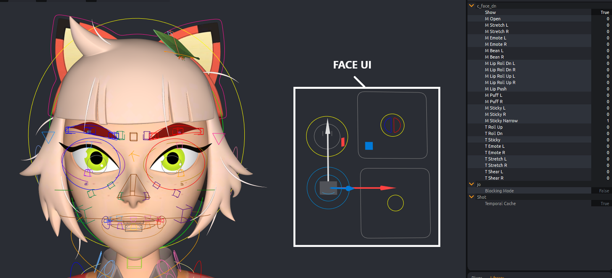

# Mikan Biped Rig Overview

## Context Menu (Right-Click) – Quick Access to All Features

Before reviewing each controller, note that a **context menu (right-click)** provides quick access to all rig features.  

It includes options such as:

- controller display,  
- quick selection of controller groups,  
- **mirror** or **flip** poses and animations,  
- return to **bind pose** for part or all of the rig,  
- **pinning** hands and feet (to head, hips, or world) via *space switches*,  
- **IK ↔ FK switch** for limbs.  

  

## World Control (Global Control)

The **World Control** is the main controller of your character:

- all other controllers are parented to it,  
- moving it moves the entire rig.  

You use it to position, rotate, and scale the character in your scene.  

👉 It also includes a dedicated attribute: **scale_offset**.  

This controller also hosts the **visibility switches** for the various modeling elements that make up your character.  

  

Under the World Control, you’ll find the following child controllers:

- **c_move** – to create global motion paths for the character,  
- **c_fly** – similar to *c_move* but with a pivot centered on the character’s center of gravity,  
- **c_scale** – scales the character, with an attribute to enable/disable squash and adjust the scale pivot.  

  

## Spine Controls

- At the base of the spine: **c_cog** (FK pelvis controller). The entire upper body follows it.  
- Then: **c_spine_1** and **c_spine_2** (FK hierarchy).  
- For IK:  
  - **c_pelvisIK** → move the pelvis independently from the upper body.  
  - **c_spineIK** → move the upper spine independently from the lower part.  

👉 Right-click to reveal two extra controllers for fine-tuning the spine silhouette:

- **c_spineIK_mid** (middle),  
- **c_pelvis** (bottom).  

  

Each controller includes attributes to:

- enable **squash** and **stretch**,  
- adjust **slide** (modifies joint positions to refine the silhouette).  

  

## Neck and Head Controls

For the neck:

- **c_neck** (FK at the base of the neck),  
- **c_head** (IK for the head, controls translate/rotate/scale),  
- **c_head_scale** (head squash & stretch).  

:::note
👉 Right-click on **c_head** to reveal an intermediate controller **c_neckIK_mid** for finer silhouette control.  
:::

**c_neck** also includes **stretch**, **squash**, and **slide** attributes, similar to the spine.  

## Arm and Leg Controls

Arms and legs share similar controller structures:  

- An **IK controller** at the limb end (e.g. **c_hand_IK_L**), active by default.  
- **Pole vectors** are computed automatically but can be adjusted using the **twist** attribute.  

### Common Attributes (Arms & Legs):

- enable **stretch / squash**,  
- **min stretch** (minimum stretch value),  
- **soft** (smooth transition between normal and stretched),  
- **follow / pin** (also accessible via right-click),  
- **arc / smooth** to bend the limb,  
- **fix twist** to improve twist deformations.  

:::note
👉 You can **switch between IK / FK** from the right-click menu.  
:::

You can also reveal **extra silhouette controllers** for limbs, featuring attributes such as **pin root** (useful when animating elbows or knees resting on a surface).  

  

### Leg-Specific Attributes:

- **stomp**,  
- **bank**,  
- **footroll**,  
- and other roll/pivot attributes.  

### Arm-Specific Features:

- Ability to show **finger controllers** via right-click on the hand IK controller (hidden by default).  
- Example: **c_pinky_meta_L** – easily creates a **cup gesture** by progressively moving all fingers.  

  

### Clavicles:

- **auto_rotate** attribute (automatic rotation follow),  
- **auto_translate** attribute (translation behavior).  

  

## Head & Facial Controls

Right-click on **c_head** to display **facial controllers**.  

Under **c_head**, you’ll find:

- **c_skull**, **c_skull_mid**, and **c_skull_dn** – adjust the head and facial silhouette.  
- On **c_skull_mid**, the **slide** attribute controls the follow between skull and skull_dn (e.g. to detach the nose from the jaw).  

  

### Main Facial Controllers:

- **c_mouth** – moves the entire mouth; includes **grab teeth** (separate teeth) and **corner_pinch** (lip corners).  
    
    
- **c_nose** – nose control.  
- **c_eyeroots** – translate/rotate/scale eyes.  
- **c_ears** – ear offsets (+ **c_ear_base** option to slide along the skull).  
- **c_eyebrows** – eyebrow control with **follow_skull** attribute.  

  

## Facial Expressions

Next to the head, you’ll find the **Face UI** and several offset controllers.  

### Face UI

- **c_face_dn** – lower face poses (smile, frown, lips roll…), sticky lips, teeth, puffed cheeks.  
    
- **c_face_up** – eyes and brows poses (blink, eyebrows up/down), iris/pupil size, speculars, auto eyelid follow.  
    
- **c_look** – gaze direction (attributes: cross and dizzy).  
- **c_lipsync** – mouth animation (phonemes).  

### Offset Controllers

Used to fine-tune expressions:

- **c_cheeks**,  
- **c_eyebrows**,  
- **c_mouth**,  
- **c_lips**,  
- **c_eyelids**.  

### Look-at

In front of the character, you’ll find **look_at controllers** to animate eye direction.  

:::tip
💡 Use the **Face UI** as much as possible to stay *on-model*.  
The facial controllers are mainly for **fine adjustments** of expressions.
:::