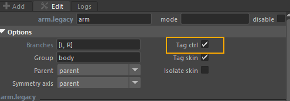
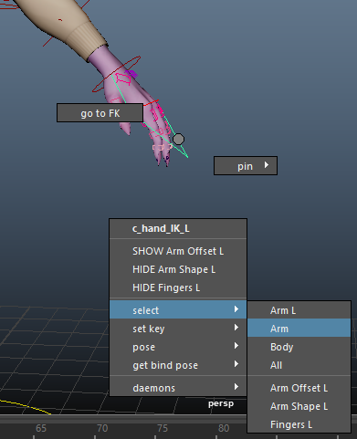
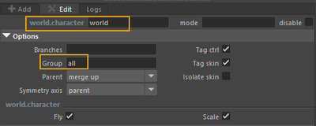

# Controllers and Groups

## Controllers

Controllers are **visual and manipulable handles** that serve as a direct interface between the animator and the internal structure of the rig (joints, constraints, deformers, etc.).

They are automatically **tagged by Mikan** during blueprint construction. Each template module has its own list of controllers.

:::tip  
👉 If you don’t want a template to expose its controllers to animators, simply uncheck the **`tag_ctrl`** option.
:::

All controllers that are tagged this way will then be available to animation tools, such as the **context menu (right-click)**.

## Groups

Groups are **collections of controllers**. They are accessible through the **context menu (right-click)** for animators.

Groups are created automatically during rig build:

- Each template generates a group containing its own controllers.
- Each group is organized according to the hierarchy of the template modules.

When the **WORLD** is created, a global **All** group is generated automatically.

Depending on the module, the **group** parameter provides default settings, which you can adjust if needed.  
Example: the **spine**, **arms**, and **legs** modules can all be assigned to a `body` group so that these modules are parented under the same group.

- The **group** option, if filled in, redefines the parent group of the module.  
  👉 If the given group does not exist, the build will create a new group and parent it to `All`.

- The **parent** option defines how the group is connected:

  - **parent (default)**: creates a controller group for the template and parents it to the template parent’s group.
  - **merge up**: merges the controller group of the module with that of the parent template.
  - **merge down**: creates a controller group for the template and merges the controllers from the parent template’s group into it.
