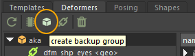
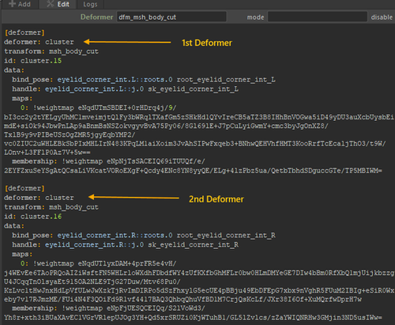
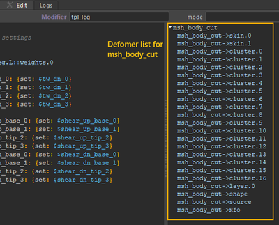
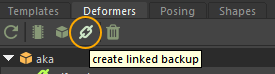

# Deformers

**Deformers** are the commands that attach the rig to the scene geometry.  
They are executed **after** the construction of the template hierarchy and the modifiers.

## Creation and Editing

Deformer commands work in a similar way to modifiers, but they are a bit more complex to create.  
They are only executed **once they are placed on a node in the template hierarchy**.

To create a deformer, you must use the Mikan save functions, available in the **Deformers** tab.

1. Select a geometry (or a group containing multiple geometries).
2. Click the **Create Backup Group** button.

3. Place the backup group and its notes inside the template hierarchy.

:::warning
The root of the deformer group (whose name starts with `_`) contains additional information:  
it stores the path of the selected node to help resolve name duplicates when restoring geometries.  
:::

If multiple deformers are saved for the same geometry, they will be listed sequentially in the notes.

This allows them to be rebuilt in the correct order during the build process.  
However, if the deformers are not connected linearly, you will need to manually update the notes to define the correct inputs/outputs (Mikan does not yet save this information).

## IDs

Since deformer node structures differ greatly between software, Mikan assigns each deformer a **unique ID** based on the geometry name.

Each deformer receives this unique ID when it is saved (or recreated). The ID consists of:

- the geometry name (or full path)
- its tag (see the _Mikan Identifiers page here_ [IDs](https://citrus-software.github.io/mikan-docs/usage/modifiers).)

:::tip
If you select a mesh and open its modifier note, you can see the IDs of all the deformers applied to that mesh in the Template tab.

:::

Because the list of available attributes also differs between software, Mikan uses a **specific nomenclature** for them. This is documented in the dedicated deformer page.

## Linked Backup

When creating a **“linked” deformer group** (chain icon), the group itself receives a unique identifier, which it then propagates to all deformers saved or built within it.

- This mode saves **only the new deformers present in the scene**.
- It first scans the existing deformers already saved in the template hierarchy to prevent duplicates.

The purpose of this mode is to prevent saving deformers that are already linked to a group and to avoid duplicate notes.

This mode is especially useful for handling **character variations**.

For example:

- Original character
- Variant with an added hat

If you select the top node of the modeling hierarchy, Mikan will only save the deformers applied to the hat.  
This way, you can clearly distinguish the original character’s deformers from those of the additional elements in the variation.

:::note
During the rebuild process, Mikan will **automatically link the deformers**.  
Therefore, it is generally recommended to use **classic backups** for your main scenes to ensure that **all** deformers are saved.  
The linked backup mode should be reserved for **specific variation cases only**.
:::
