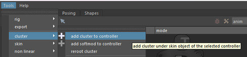
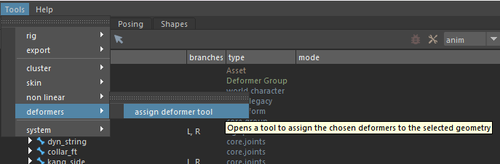

# Cluster

The setup logic for clusters is similar to binding.  
It consists of going back and forth between the template, the generated rig, and the application of the deformer.  

To create a cluster, select an already built controller and assign a cluster to it using the following menu:  

- **Tools > Cluster > Add Cluster to Controller**  

  

Once this step is done, you need to **assign the meshes to the deformer sets**. This can be done in two ways:  

- In Maya: **Window > Relationship Editors > Deformer Sets** (if available in your version of Maya)  
- In Gemini: **Tools > Deformers > Assign Deformer Tool** (opens a window where you can select the desired deformer set)  

  

Next, adjust the cluster’s influence areas on your mesh as usual.  

Finally, don’t forget to **save this information back to the template**, following the save procedure described in the *Deformers Overview* section.  
