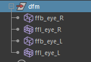

# Lattices (FFD)

The setup workflow for lattices is almost identical to the standard Maya process. The key difference is that we also need to export the lattice geometries, so their naming conventions and hierarchy must be carefully managed. Lattices are usually placed in a `deformers` or `utils` group, parallel to the template.

Mikan will backup the lattice shapes, and will inject metadata into the lattice geometry nodes to allow reconstruction during the rebuild loop.

Lattice deformations are backed up in the same way as the main geometries. Typically, we backup the group in which the lattices were parented.

Finally, ensure that the lattice base is properly rigged or parented according to how the lattice is deformed, to maintain correct behavior. We generally use the modifiers `hook` or `parent`, depending on how the lattice is deformed.
