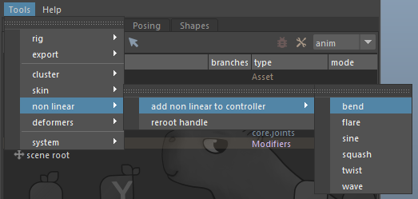

# Non Linears

The setup workflow for non-linear deformers (e.g., Bend, Twist, etc.) is very similar to clusters. The main difference is that non-linear deformers are assigned to a handle (a simple transform) rather than directly to a controller.

This is necessary because controllers are positioned for animators, while non-linear deformers often require a specific pivot point and orientation that differs from animator needs. For this reason, we generally use a `core.xform` template module for their handles.

Once the handle is created, the non-linear deformer is assigned using the **Tools > Nonlinear > Add Nonlinear to Controller** menu. You then use the same menu interface to assign the target geometries to the deformer.



Adjust the bend settings as needed.

When finished, don’t forget to **save this information back to the template**, following the save procedure described in the [Overview](./overview.md) section.

## Connecting the attributes to the Rig

Once the non-linear deformer is set up and the deformers are saved, you can expose the animation attributes to animators by creating a small rig with modifiers.

1. Create a helper node on the handle where you applied the deformer.
2. Add a modifier plug.

**Example:**

```yaml
[mod]
plug:
  node: tree_bend::ctrls.0
  bend:
    keyable: on
```

Then connect the custom attribute to the animation attribute of the handle using modifiers `connect` or `expression`:

```yaml
[mod]
#!-10
connect:
  node: msh_trunk->nonlinear.0@curvature
  op: mult
  inputs:
    - tree_bend::ctrls.0@bend
    - 0.5
```

:::note
Notice the priority defined for the connect note.
Here we want the connection to be made after the deformers have been set up.
By default, Mikan executes in order:

1. Template hierarchy
2. Modifiers
3. Deformers

To ensure this connection happens after the deformer setup, we add the note: `#!-10`.
:::
