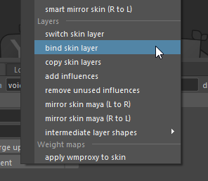
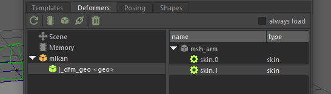
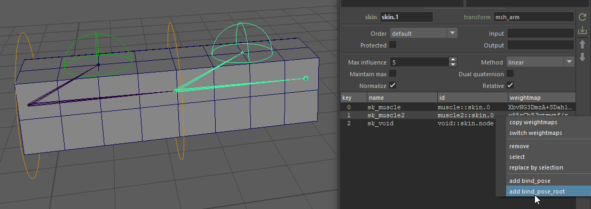
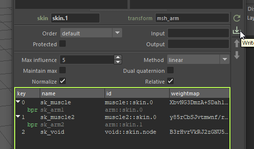
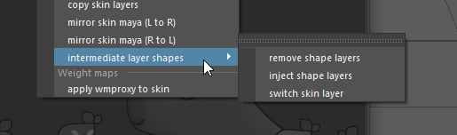

# Skin Cluster

In Mikan, you don't need any proprietary or specific tools to set up your primary skin clusters. You can use all standard Maya binding and editing tools. Mikan's deformer backup system perfectly captures and saves all this data so it can be automatically reapplied during rig builds.

We also provide a set of quality-of-life helpers in the **Tools > Skin**. For instance, our "Smart Mirror Weightmaps" tool allows you to mirror skin weights accurately without needing to reset the character to its bind pose.

## Skin Layers

Mikan allows you to stack and manage multiple levels of `skinCluster` on a single mesh, primarily for **secondary deformations** that occur on top of the main skinning. Much like clusters or wires, each joint in a secondary layer requires its own **Bind Pose** information to calculate deformations correctly relative to the preceding layer in the stack.

### Installation & Setup

#### Maya 2024 and Later (Recommended)

Starting with Maya 2024, you can natively chain multiple skin clusters without any issues. Mikan's save system fully supports this modern workflow out of the box. You can simply add your secondary skin clusters using Maya's standard tools, and Mikan will back them up seamlessly.

#### Legacy Versions (Pre-2024)

Older versions of Maya often prevent adding a second `skinCluster` to a mesh that already has one. To bypass this limitation and add a new layer:

1. Select your **Joints**.
2. Select your **Mesh**.
3. Go to **Tools > Skin > Layers: Bind Skin Layer**.

To make this work in older Maya versions, Mikan uses a system of **intermediate `orig` shapes** acting as buffers between the different skin clusters. This tricks Maya's native tools into seeing only one skin cluster at a time (otherwise, Maya only recognizes the very first one in the chain).

### Bind Pre-Matrix & Bind Pose Concepts

When stacking skin layers, you need to manage the `bindPreMatrix` to avoid "double transformations" (where a joint's movement is calculated twice because it's already influenced by a previous layer). Mikan needs to know how joints in upper layers move relative to the underlying deformation.

Currently, Maya does not provide an easy native UI to manage these connections on chained skin clusters. However, Mikan handles this via its Deformer Data Editor.

**Recommended Workflow:**

1. Do a first save of your skin data.
2. Open the **Mikan Deformer Data Editor**.
3. Input your Bind Pose information for the layer joints.
4. Save the data again. The next time you rebuild the deformers, Mikan will automatically wire all the complex matrix connections perfectly.

There are two modes for managing Bind Poses in layers:

- **Bind Pose:** Use an existing object in the rig. This object must be positioned exactly like the joint to correctly cancel out the transformation.
- **Bind Pose Root:** If no object exists, specify a parent. The build process will automatically create a "counter-animation" object by copying the joint's position.

### Practical Example: Arm Muscle Setup

To better understand these concepts, let's look at a practical example of a simplified arm setup with secondary muscle deformations.

:::info[Demo Scenes]
Download the demo scenes from our [Google Drive folder](https://drive.google.com/drive/folders/1PoF6dzW02ahU9CyAnEMfXfEeoiOwoUot?usp=drive_link) to see the setup in action:

* **Maya 2024+ (Recommended):** [**`skin_layers_2024.ma`**](https://drive.google.com/file/d/1NH2puBCjSf0PFgCgKA3MyVgdRMGUmyfO/view?usp=drive_link)
* **Pre-2024 (Legacy with intermediate shapes):** [**`skin_layers.ma`**](https://drive.google.com/file/d/11Jwar-uIb3DPJL0nFIqTdWl2oC3qs5Lh/view?usp=drive_link)
  :::

#### The Setup

In this demo, we have a base arm skeleton and two muscle controllers parented to the arm bones.

:::tip[The "Void" Joint Concept]
Notice the inclusion of an empty joint left at the center of the world (the origin). We call this the **"Void" joint**. This is a crucial workflow trick for secondary layers: by including the Void joint in your second skin cluster, you don't have to skin the entire arm again. The Void joint acts as a neutral baseline, allowing you to easily isolate and paint
*only* the localized offsets where the muscles actually bulge or deform the geometry.
:::

#### Step-by-Step Workflow

1. **Save the Base Skin:** First, ensure both skinning of your arm are saved via Mikan.

   

2. **Assign Bind Pose Roots:** Open the **Mikan Deformer Data Editor**. Right-click on your secondary layer joints (the muscles) and select `add bind_pose_root`. You will assign the respective arm bones as the root for each muscle.

   

3. **Save Modifications:** Notice that any unsaved changes in the editor are highlighted in a bright green outline. Click the **Write** (download arrow) button to save these modifications to your backup.

   

4. **Build:** Add this data to your template. The next time you build the rig, Mikan will automatically generate the two chained skin nodes, fully wired with the correct matrix offsets, ready for you to paint the muscle weights!

## Legacy Workflow: Managing Layers (Pre-2024)

:::note[Maya 2024+ Edge Cases]
While Maya 2024 and later support native multi-skinning, you might still encounter legacy scripts or older Maya tools that fail to detect which skin cluster to operate on when several are chained. If you run into these compatibility issues, you can temporarily inject Mikan's **intermediate layer shapes** to isolate the active skin cluster and force those
older tools to work properly!
:::

Standard Maya skinning functions (like "Add Influence") usually fail or behave unpredictably when multiple layers exist in older Maya versions without intermediate layer shapes.

### Switching the Active Layer

Because of the intermediate shapes Mikan injects to separate the layers, Maya's weight painting brush can only see one layer at a time. By default, Mikan tools apply to the last visible layer.

To target a specific layer for editing or painting:

- Go to **Tools > Skin > Layers: Switch Skin Layer**.
- This allows you to alternate between the different skin clusters so that non-compatible Maya tools can apply correctly to the active layer.

:::warning[Global Operations]
Note that Mikan's **Save** and **Mirror** functions ignore the current "active layer" display and will process all layers simultaneously to ensure your data is fully backed up.
:::

### Shape Editor Compatibility

The Maya Shape Editor (Blendshapes) is notoriously incompatible with intermediate shapes in the construction history. If you need to inject a blendshape at the very beginning of the deformer graph (before the multiple skin clusters), the intermediate shapes will break the live sculpting capabilities of the Shape Editor.

**To fix this:**

1. Use the Mikan menu to temporarily **delete/remove** the intermediate layer shapes.
2. The Shape Editor will now work perfectly, allowing you to sculpt your blendshapes live.
3. Once you are done and want to go back to weight painting or switching between skin layers, use the Mikan menu to **re-inject** the intermediate layer shapes.

