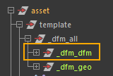
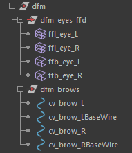

# Wire

The setup workflow for wire deformers is very similar to lattices ([FFD](./ffd.md)). You also need to export the curve geometries, managing their naming conventions and hierarchy carefully. These curves are usually placed in the `deformers` or `utils` group, parallel to the template.

For the rest of the process, create the curves as usual and apply the wire deformer using the standard Maya menus.

A key point is that wire deformers require a reference geometry, which is automatically created by Maya. Make sure to parent this reference geometry in the rig, in the same way as lattice bases, using the same tools (deformers or modifiers).

Finally, remember to backup both the curve deformations and the geometry deformations, typically by backing up the group in which the curves are parented. Do this the same way you would save deformers on meshes.

:::tip
Over time, you may end up with many deformation objects under your `deformers` group. For better readability, it is recommended to organize them into intermediate subgroups.

### Example:

- `dfm_eyes` for lattices applied to the eyes
- `dfm_eyebrows` for wires applied to the eyebrow meshes

:::
