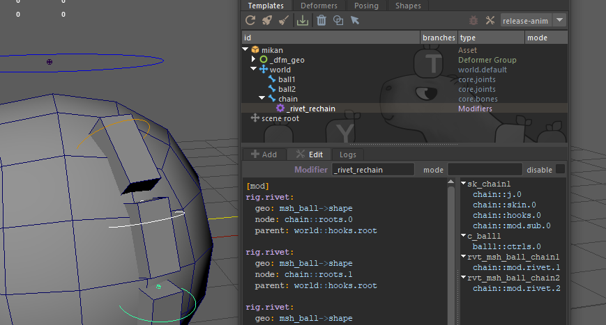

# Modifiers and IDs

## Overview

Mikan allows you to describe rig structures abstractly, independently of the DCC that generates them. A key feature of this system is the use of [**identifiers (IDs)**](#mikan-identifiers-ids) to reference nodes and geometry across different commands and tools, particularly modifiers.

Modifiers are procedural instructions that are executed **after the template hierarchy is built**, enabling actions like constraints, driven keys, reparenting, and more. To reference rig elements within these commands, Mikan uses a consistent ID system. This document covers both concepts: how to **write modifiers** and how to **use IDs** effectively within them.

## Modifiers

### Purpose

Modifiers are YAML-formatted blocks that live in the `notes` attribute of a node (by default in Maya). They are parsed and executed after the hierarchy is built, and allow procedural edits to the rig.

Typical operations include:

- Constraints
- Driven keys
- Parenting
- Plug manipulations
- Custom rig

Modifiers make rigging declarative, structured, and portable across platforms.

### Interface and Placement

Modifiers can be added **anywhere in the blueprint**: either directly on a node inside a template module or, preferably, on a **helper node** for better clarity and modularity.

1. **Right-click** a node in the Blueprint Outliner.
2. Choose “**Add Modifier**” from the context menu.
3. (Optional) If you want to isolate the modifier logic, first create a **Helper Node** using “**Add Helper Node**”, then add the modifier to it.

Once added, a new **Modifiers** entry appears in the Blueprint Outliner (highlighted in purple for easy identification), and the modifier opens as an inline editable text block in the Edit tab at the bottom of the panel.

:::tip
When selecting a node in the rig’s viewport, its Mikan ID(s) will show up in the modifier editor. This provides quick reference to help write valid commands, especially useful when first learning the syntax.
:::



### Best Practices

The modifier system is intentionally open-ended, a powerful sandbox that enables complex, creative rig behaviors. But with great flexibility comes the risk of disorder.

Avoid scattering modifiers randomly across the blueprint. Instead, try to **group related modifiers** together logically, and attach them at meaningful points in the hierarchy, ideally under helper nodes when they represent standalone functionality.

When modifiers contribute to a specific feature or behavior, consider organizing them into **cohesive blocks**. This makes it easier to **reuse**, disable, or remove functionality later without unintended side effects.

We’ll be adding a few guides to showcase best practices and advanced prototyping, for instance, how to build a fully modular eyelid rig using only a few `core.joints` blocks combined with layered modifiers.

### Syntax

Modifiers must be written inside `[mod]` blocks using YAML. Each block can include one or more commands, each defined as a key-value pair.

Example:

```yml
[mod]
parent:
  - weapon::roots.0
  - arm.R::skin.limb3

plug:
  node: hand.R::ctrls.0
  weapon_vis:
    type: bool
    k: on
    default: on
```

- Indentation must use **spaces** (no tabs).
- Use a space after `:` and after `,` in lists or dictionaries.
- Keys can be repeated to allow multiple commands of the same type.

Each `[mod]` block can be configured with **priority**, **loop variables**, or **conditional execution** via special inline comments.

### Execution

- Modifiers are evaluated **top-down** during the template’s execution pass.
- IDs must be valid Mikan IDs (rig or geometry). Raw node names are not supported.
- If a referenced ID does not yet exist, the modifier will be deferred to the end of the stack.
- Deferred commands that still can’t resolve their target will be discarded.

### Branching & Duplication

Modifiers follow the branching rules of the template. If a template is instantiated multiple times (e.g. for left/right limbs), modifiers are automatically duplicated with the correct ID substitutions.

To prevent a modifier from duplicating across branches, use:

```yml
#/solo
```

Mirror-aware behavior is applied automatically for flipped branches (`.R`, `.bk`, `.dn`). Some modifiers may require the `flip: on` option to apply mirrored transformations (e.g. negating translation values).

### Priorities

Priorities are declared using a special comment at the top of the block:

```yml
[mod]
#!<priority_level>
```
- Higher numbers run earlier in the build process.
- **Negative numbers** (e.g., `#!-10`) are highly useful to push a modifier's execution to the very end of the build stack (e.g., after all snapping or deformers are evaluated).
- **Scope**: The priority tag (like iterators and conditions) applies to the **entire `[mod]` block**. Use separate blocks if you need different priority levels.

### Variables

Instead of hardcoding values, you can use modifier variables by prefixing a name with `$`:

```yml
$value
```

Example:

```yml
plug:
  node: button::roots.0
  t.y: $value
```

#### 1. Default Local Resolution:

By default, Mikan resolves this at build time by looking for an attribute named `gem_var_<value>` directly on the node holding the modifier.
- You can manually add this attribute to the node via Maya's Add Attribute menu (ensure the name starts with `gem_var_`).
- If it doesn't exist when the modifier is evaluated, Mikan automatically creates a default float attribute for you.

#### 2. Custom Binding (External Override):

If you want the variable to read its value from a specific attribute elsewhere in your scene (such as a global settings node from a modeling file), you can explicitly bind it using the `#$` comment syntax at the top of your block.
```yml
[mod]
#!~dev
#$scale: geo->xfo@switch_global_scale

plug:
  node: world::ctrls.world
  scale_factor: $scale
```

When bound this way, Mikan bypasses the local `gem_var_` check and pulls the value directly from the targeted plug.

### Iterators

Use iterators to dynamically repeat commands using different values. The iterator loop only affects the specific commands within the `[mod]` block that reference its variable.

Because iterators perform a direct text substitution, you can use the `<var>` tag to replace **any part of your text** (whether you are constructing dynamic node IDs or injecting numeric values).

Syntax:
```yml
[mod]
#>branch: [A, B]

# This will expand to rivet both modules hair_A and hair_B
rig.rivet:
  geo: msh_skull->shape
  node: hair_<branch>::roots.0
  parent: skull::skin.0
```

For value pairs:

```yml
[mod]
#>pair: [[A, 10], [B, -10]]

# <pair.0> replaces the string, <pair.1> replaces the numeric value
plug:
  node: hair_<pair.0>::ctrls.0
  offset: <pair.1>
```

### Conditions

You can conditionally execute an `[mod]` block by adding a condition tag at the top. If the condition is not met, the whole block is skipped.

Check for presence of a node:
```yaml
#? meshA->xfo
```

Check plug values:

```yaml
#? module::template@gem_flag
#? module::template@gem_count 2
#? module::template@gem_level <= 2
```

Check variable values:

```yaml
#? $flag
#? $mode 2
#? $count <= 2
```

:::warning
Make sure the attribute used in a modifier is properly available at build time. A common mistake is forgetting to include specific plugs in the Alembic export, which can cause the modifier to fail silently.
:::

## Mikan Identifiers (IDs)

Mikan uses a standardized system of identifiers to refer to nodes and geometry across rigs and modifiers.

There are two primary types of IDs:

- **Rig IDs**: to reference nodes in the rig hierarchy or template
- **Geometry IDs**: to reference geometry or deformation nodes

### Rig ID Structure

```json
[{asset}#]{template}[.{branch}]*::{tag}[.{key}]*[@{plug}]
```

- `asset` (optional): Name of the asset (used in multi-asset rigs)
- `template`: Name of the template module
- `branch` (optional, repeatable): Branch identifiers
- `tag`: Type of element (e.g. `roots`, `ctrls`, `node`)
- `key` (optional): Specific instance(s)
- `plug` (optional): Attribute or plug (e.g. `@t.x`)

#### Examples:

- `spine::ctrls.pelvis`: Pelvis controller from spine template
- `arm.L::skin`: All skin joints from left arm
- `arm:::ctrls`: All controllers from `arm` and its child templates

The `gem_id` attribute stores node IDs, separated by `;` if multiple.

### Branching and Wildcards

- Hierarchical structure is represented with `.` in forks and keys.
- Use `:::` to include children templates.
- Use wildcards (`*`) to match multiple templates or keys.
    - `leg::ctrls` is the same as `leg.*::ctrls.*`
    - `branch*::ctrls` will get you all controllers from all templates starting with `branch`

### Geometry ID Structure

```json
[{asset}#]{path}->{tag}[.{key}]*[@{plug}]
```

- `path`: The transform node address. If the node name is not unique in the scene, use the Alembic/hierarchy path notation (e.g., `characters/hero/geo/msh_body`).
- `tag`: Type of element (e.g. `shape`, `source`, `xfo`)
- `key`: Specific identifier
- `plug`: Attribute name

Geometry IDs resolve to a **transform/geometry pair**.

### Geometry Tags

- `shape`: First visible shape under transform
- `source`: Shape origin of deform stack
- `xfo`: Transform node itself (useful for plug access)

### Standard Plugs

To ensure cross-DCC compatibility, use Mikan’s unified plug names:

| Purpose    | Plug                                                  |
|------------|-------------------------------------------------------|
| Translate  | `@t.x`, `@t.y`, `@t.z`                                |
| Rotate     | `@r.x`, `@r.y`, `@r.z`                                |
| Scale      | `@s.x`, `@s.y`, `@s.z`                                |
| Visibility | `@vis`                                                |
| Transforms | `@xfo`, `@wxfo`, `@pxfo`, `@ixfo`, `@wixfo`, `@pixfo` |

Unknown plugs will be created as `float` by default.

## Summary

- Use `[mod]` blocks in `notes` for procedural rigging.
- Use Mikan IDs to reference nodes and geometry robustly.
- Branching, variables, priorities, iterators, and conditions provide powerful modifier control.
- Keep plug naming and IDs DCC-agnostic to ensure portability.

For more detailed information on each modifier type, refer to the corresponding reference pages.
