# Shape Editor

The **Shape Editor** is a centralized tool within Mikan designed to manage collections of **Set Driven Key (SDK) poses** and **blendshapes**. It provides a unified pipeline to sculpt, edit, driven-key, and store pose setups directly into Mikan template modules.

:::info Working Scene
All interface screenshots in this section refer to the sample scene available on [Google Drive](https://drive.google.com/file/d/1CTO1OYbdxel6mbV3iUwIjKN33i96Jjpy/view?usp=drive_link).
:::

## Key Concepts

To use the Shape Editor efficiently, you only need to understand two main components:

- **Driver:** A DAG node (preferably a dedicated **Locator**) that holds custom attributes. These attributes drive the shapes/poses (similar to Maya's native *Set Driven Key* driver).
- **Group:** The root template module (typically a `core.group`) that encapsulates all the controllers and pose nodes you want to affect.

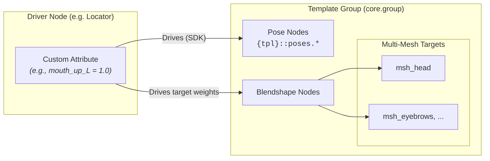

## Technical Scene Setup

To enable automated pose recording and template persistence, your rig hierarchy must adhere to Mikan's structural conventions.

### 1. Driven Key Pose Nodes

The Shape Editor looks for paired pose and control nodes matching this naming scheme:

- **Pose Node:** `{tpl}::poses.{n}`
- **Control Node:** `{tpl}::ctrls.{n}`

:::note Automated Generation
Do not create pose nodes manually. Enable the `do_pose` option on supported template modules (`core.joints`, `core.bones`, `rig.spline`, or `digit.legacy`).

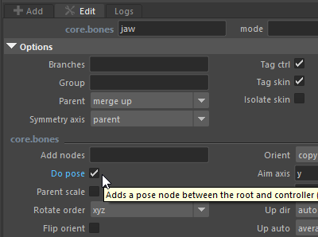
:::

### 2. Blendshape Ingestion Setup

- **Internal Creation:** Generated directly via **Add Sculpt Target** if base meshes exist in the scene.
- **External Ingestion:** When importing shape scenes from external packages, group target geometries under a transform group matching the exact **Group ID** passed to the interface field.

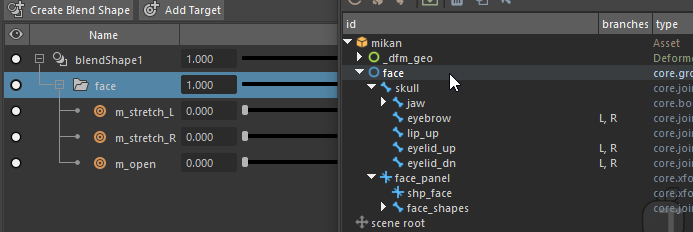

### 3. Driver Connections

- **Facial Rigs:** Driven key distribution across controls is typically handled via the `shape.channel` modifier.
- **Pose Space Deformation (PSD):** Connected via custom network nodes (dedicated PSD modifiers are planned for future releases).

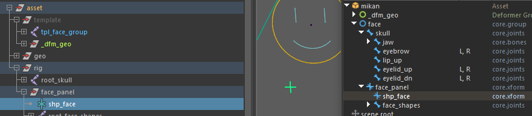

## Step-by-Step Guides

### 1. Creating Your First Driven Key Pose

1. **Initialize the Tools:**
    - Select your driver node (e.g., a locator) and click **Driver**.
    - Keep your driver selected or select any control in your group hierarchy and click **Group** in the Selector Toolbar to auto-detect the parent `core.group`. 
    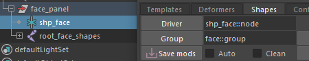
2. **Add a Pose Attribute:**
    - In the **Pose Editor** panel, right-click inside the attribute list and select **Add Shape** (or use the input field).
    - Enter a name for your attribute (e.g., `mouth_corner_up_L`). 
    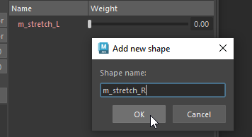
3. **Pose Your Controllers:**
    - Manipulate the rig controllers in the viewport to create your desired pose.
4. **Record the Pose:**
    - Highlight your new attribute in the list and click **Save**. The controller transforms are now recorded onto the underlying pose nodes driven by this attribute value. 
    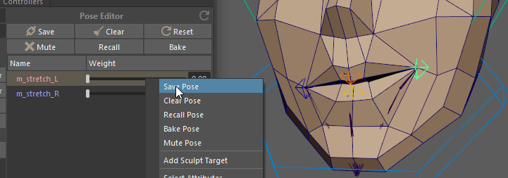
5. **Persist to Template:**
    - Click **Save Mods** in the top bar to record these driven keys into your Mikan template modifiers, ensuring they persist across rig rebuilds. 
    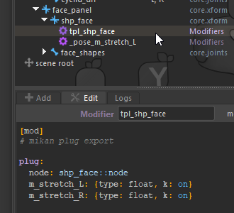

### 2. Sculpting a Multi-Mesh Blendshape

The Shape Editor allows a single driver attribute to control blendshape targets across multiple geometries simultaneously.

1. **Select Target Meshes:** Select all base geometries in the viewport that should receive the sculpt.
2. **Add a Sculpt Target:** Right-click the desired attribute in the **Pose Editor** list and select **Add Sculpt Target**.
3. **Sculpt:**
    * Set your driver attribute value to `1.0`.
    * Sculpt adjustments directly on the generated target meshes or base geometry.
4. **Validate:** Dial your driver attribute between `0.0` and `1.0` to verify the deformation across all connected meshes.

### 3. Fast L/R Pose Splitting with the Pose Shelf

1. **Create the Full Pose:** Sculpt/pose both sides symmetrically on your rig.
2. **Buffer in Shelf:** In the **Pose Shelf**, click **Save Edit** to temporarily cache this full symmetrical pose as a button preset.
3. **Isolate One Side:** Zero out or dampen the opposite side controllers using the SRT scale tools (`/2`, `Reset`).
4. **Save Left Pose:** Record this single-side pose onto your `_L` driver attribute.
5. **Flip & Save Right Pose:** Click **Flip** in the **Controllers** panel to mirror the pose onto the opposite side, then save it onto your `_R` driver attribute.
6. **Clean Up:** Delete the temporary pose preset from your shelf once validated.

## Interface Reference

The Shape Editor window is divided into two main sections:

- **Left Panel (Control Utilities & Pose Shelf):** Selection sets, transform utilities (Reset/Mirror/Flip), SRT value scaling, and temporary pose storage.
- **Right Panel (Driver Management & Pose Editor):** Driver assignment, custom attribute creation, and saving/deleting shape poses.

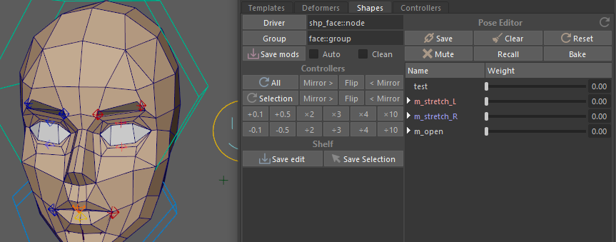

### Selector Toolbar

- **Driver:** Assigns the DAG node that hosts driving attributes for your shapes.
- **Group:** Assigns the active controller module set.
    - Clicking **Group** climbs up the selection hierarchy to locate the root `core.group` module.
    - *Troubleshooting:* If this fails to populate, ensure the hierarchy contains controls linked to valid pose nodes.
    - *Manual Override:* **Right-click** the Group field to choose a specific module manually from the dropdown list.
- **Save Mods:** 
  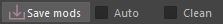
    - **Save Mods:** Bakes all driver attribute creation commands and scene driven keys directly into template modifiers.
    - **Auto Checkbox:** Automatically updates template modifiers every time a pose is saved.
    - **Clean Checkbox:** Purges driven keys associated with obsolete or deleted driver attributes.

### Control Utilities

- **Reset / Mirror / Flip:** Clears or transfers transforms across all controls or active selections. 
  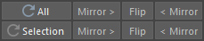
- **SRT Scale Values:** Multiplies or divides SRT values on selected controls. Ideal for dampening or amplifying influence during L/R splitting. 
  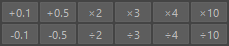

### Pose Shelf (Iteration Buffer)

Acts as a temporary preset shelf for storing intermediate poses during sculpting and testing sessions.

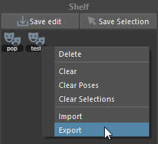

#### Actions:

- **Save Edit:** Caches current transforms for all controllers within the active group.
- **Save Selection:** Caches transforms and custom attributes for selected controls only.

Right-clicking any saved pose button opens its context menu:

- **Delete:** Removes the selected preset.
- **Clear:** Clears all items from the shelf.
- **Clear Poses:** Removes all *Save Edit* entries.
- **Clear Selections:** Removes all *Save Selection* entries.
- **Import / Export:** Loads or saves shelf items to an external JSON configuration file.

### Pose Editor

Manages all shape attributes connected to the assigned Driver node. Once both **Driver** and **Group** fields are set, the attribute list populates automatically.

Existing blendshapes properly organized in matching scene target groups are loaded and connected via driven keys automatically.

#### Main Action Bar

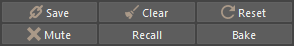

- **Save:** Records controller transforms onto the selected pose attribute.
- **Clear:** Removes driven keys associated with the selected attribute.
- **Reset:** Zeroes out all attribute values on the driver node.
- **Mute:** Temporarily disables pose node transforms for selected attributes (useful for sculpting a shape at 50% weight without interference from existing pose data).
- **Recall:** Re-applies pose node transforms back onto controllers for further editing *(overrides current controller transforms)*.
- **Bake:** Bakes combined pose node deformations and controller transforms directly onto the controllers.

#### Attribute List Context Menu

Right-clicking empty space in the list:

- **Add Shape:** Creates a new shape attribute on the driver.
- **Reset All:** Resets all driver attributes to default (`0.0`).

Right-clicking an existing attribute entry:

- **Save Pose / Clear Pose / Recall Pose / Bake Pose / Mute Pose:** Executes the action on the selected attribute.
- **Add Sculpt Target:** Generates and connects a new blendshape target on selected base meshes.
- **Select Attributes:** Selects attribute nodes in Maya and highlights them in the Outliner.
- **Reset Selected:** Resets selected attributes to default.
- **Remove Selected:** Deletes selected pose attributes.
