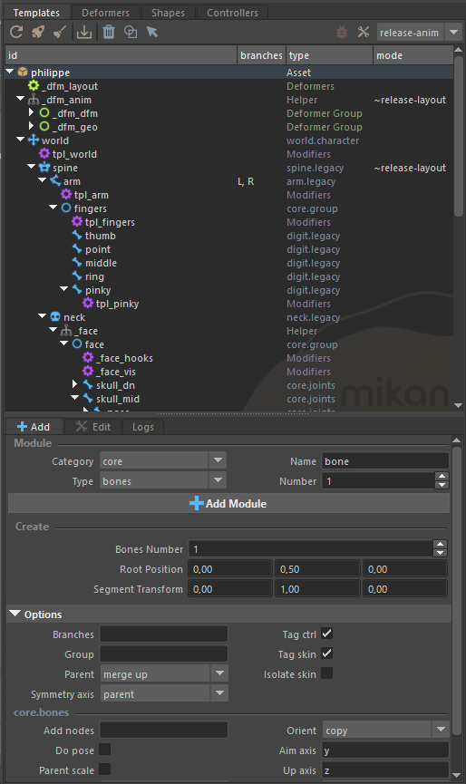
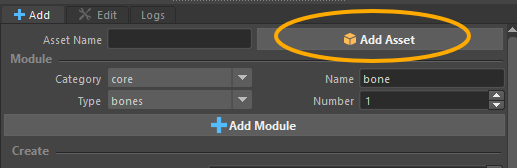
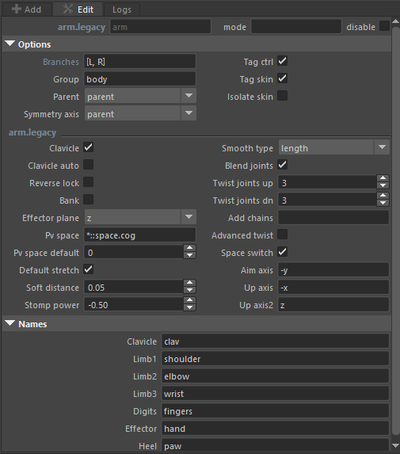
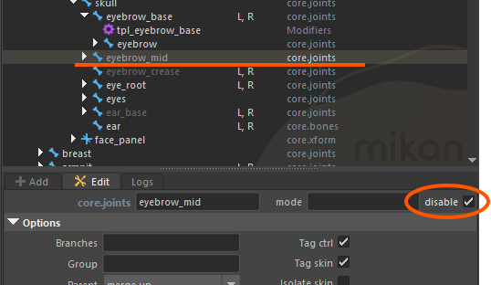
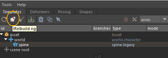
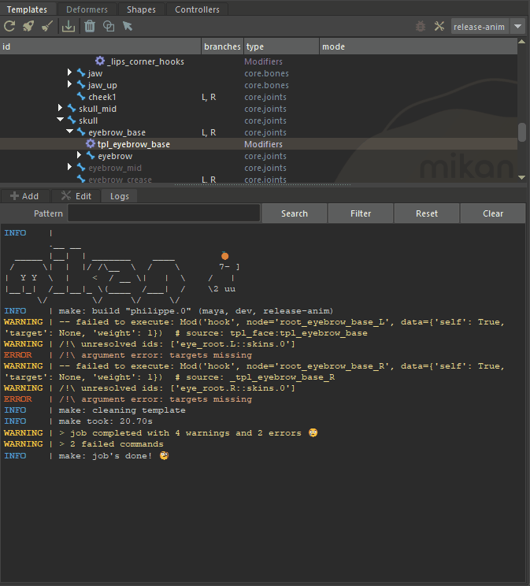

# Template Editor

The **Template Editor** is the **Templates** tab in Mikan’s main window. Under an **Asset** node, the top node of the rig template, you assemble template modules into a hierarchy, which is then used to build the rig.

## Interface Overview

Inside **Templates**, the editor is divided into the hierarchy tree and three tabs:

- **Add:** Create an asset or add a template module. The available creation fields and options depend on the selected module type.
- **Edit:** When a template module is selected, lets you rename it and edit its options. When a modifier is selected, lets you edit its modifier note.
- **Logs:** Review build messages. Search, filter, reset, or clear the displayed log output.

The hierarchy tree (the template outliner) shows the asset and its nested template modules. Double-clicking an item in the tree switches to the Edit tab and also selects the corresponding node in the Maya scene (Maya Outliner).

:::tip
Template elements loaded by reference appear in blue in the Mikan Outliner and are read-only, except for their options, which can still be edited.
:::

## Create an Asset

1. Open the **Add** tab and enter a name in **Asset Name**.
2. Click **Add Asset**. The new asset appears in the hierarchy.
3. Select the asset before adding its template modules.

Assets organize the templates that make up a character or rig.

## Add Template Modules

1. Select the asset or the template location where the new module should be parented. When the **Add** tab is active, you will see the available hooks under which the new module can be parented.
2. In the **Add** tab, choose a **Category** and **Type**.
3. Set the module **Name** and any creation fields shown for that module. Some module types also expose a **Number** field, which lets you create as many modules as you need.
4. Review the module's **Options**, then click **Add Module**.

:::tip
You don't need to set the options before creating the module. You can edit them at any time afterwards from the **Edit** tab.
:::

The available creation fields and options are defined by each template module. If you select a template rather than a specific hook, Mikan uses the template's default hook when one is available.

## Edit a Template

Select one or more compatible items in the tree and use the **Edit** tab:

- Change the item's name in the name field. Referenced items cannot be renamed.
- Expand **Options** to edit common and module-specific rig settings.
- For some modules, such as the **arm** template, the **Names** section lets you rename the labels used to name the generated rig elements (especially the controllers and skin joints).

- Use **mode** and **disable** to control the selected template or helper's activation settings. Disabled template modules appear grayed out in the Mikan Outliner.

## Build the Rig

1. Select an item belonging to the asset you want to build.
2. Choose a build mode from the toolbar menu. Available modes depend on the project; common modes produce rigs for layout or animation. Usually, during the rigging phase, you will build with the **anim** release and **dev** mode enabled (tool icon active).
3. Click **(Re)build rig**. If the build reports errors, open **Logs** to inspect the messages.

4. To remove the generated rig and return to the editable template structure, click **Cleanup rig** (broom icon).

The toolbar also includes **Reload**, **Update deformer groups**, **Delete selected**, **Toggle shapes**, and **Select item from scene**. **Delete selected** removes the selected template or other supported hierarchy item; it is different from **Cleanup rig**, which removes the built rig. **Toggle shapes** shows or hides template controller shapes in the scene.

## Inspect and Debug

The **Logs** tab lets you monitor the build as it runs and review its messages afterwards. It helps confirm that the rig is building correctly and makes it easier to identify and debug problems if the build reports errors.

The **Logs** tab displays the build logs, much like Maya’s Script Editor, but with color coding to highlight warnings and errors. Each warning or error indicates the source of the problem, either the template or the modifier note involved.

:::tip[Jump to the source from the log]
**Ctrl + Click** the template name shown in a log message to select the corresponding item in the Mikan Outliner and open its modifier note in the **Edit** tab.
:::

**Dev mode** changes how the rig is built by skipping the final visual cleanup pass, which is only needed for the rig delivered to animation. It also provides more detailed log messages. **Debug mode** stops the build at the first error.

## Working with Modifiers

Selecting a modifier or deformer helper opens its configuration in the **Edit** tab. The editor provides syntax highlighting, search in the current item or across items, and context-menu help for modifiers. See [Modifiers](../modifiers.md) for the modifier format and details.
